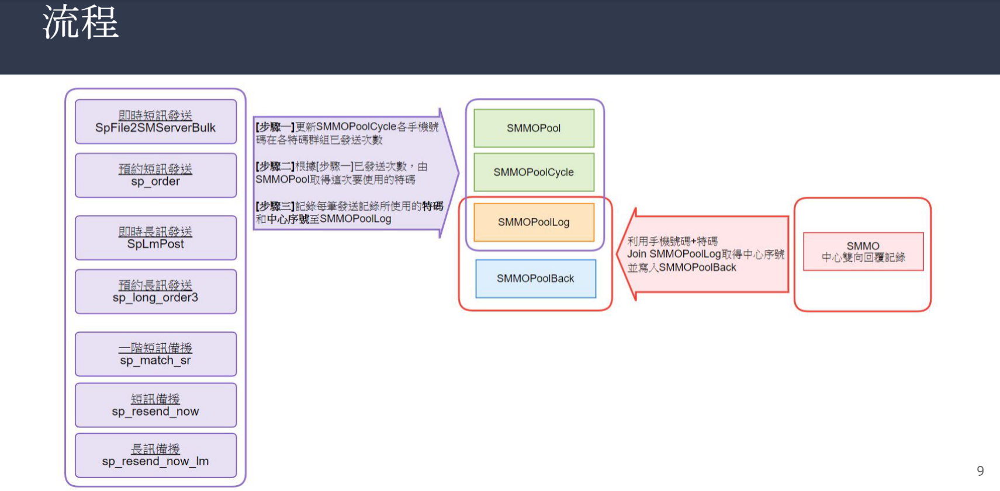
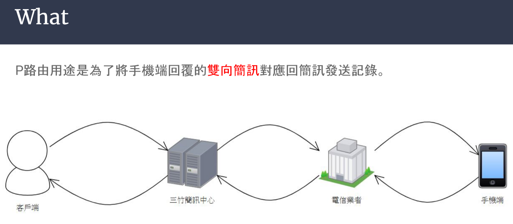

# P 路由測試




# table說明
* SMMOPool 
  * 特碼群組設定
* SMMOPoolCycle 
  * 各手機號碼在各特碼群組已發送次數
  * 資料量大
  * 資料量約980萬
* SMMOPoolLog
  * 各特碼+手機號碼 最後發送記錄
  * 資料量大
  * 資料量約1600萬
* SMMOPoolBack
  * 雙向簡訊回覆記錄
  * 資料量75萬
  * 無清理過期資料機制

## 開發功能
### P路由說明
* p路由為MO的雙向簡訊(目前只有台新在用)
* 雙向簡訊: 銀行發給客戶簡訊，客戶回覆(以此循環)
* 可多個特碼發送給一個客戶 (目前多個的上限為20，超過就會找不到上次發送過的內容)
### P路由測試
* 有寫一隻 P7_1_TestMain 執行後可以去 .34 上看 Syslog Monitor 有無印出sp資訊
* P7_1_TestMain 要確認 groupID、MID，MID可以對照SMMOPool查看對應的MID
### P路由開發
* 在CamelF2S新增P7_1，只有 groupID like TSBANK% and mid like p% 才進入此邏輯
* 新增sp，將原本的sp裡面p路由的邏輯照抄過去

```
查詢用指令
SELECT 'SMMOPool' as '特碼群組設定',* FROM DBexp.dbo.SMMOPool WITH(NOLOCK)
SELECT 'SMMOPoolCycle' as '各手機號碼在各特碼群組已發送次數',* FROM DBexp.dbo.SMMOPoolCycle WITH(NOLOCK) order by stamp desc
SELECT 'SMMOPoolLog' as '各特碼+手機號碼 最後發送記錄',* FROM DBexp.dbo.SMMOPoolLog WITH(NOLOCK)
SELECT 'SMMOPoolBack' as '雙向簡訊回覆記錄',* FROM DBexp.dbo.SMMOPoolBack WITH(NOLOCK)

SELECT 'SMServerBulk',* FROM SMDR.dbo.SMServerBulk WITH(NOLOCK)

SELECT 'SourceRedundantMIDConfig',* FROM DBexp.dbo.SourceRedundantMIDConfig WITH(NOLOCK)

SELECT * FROM DBexp.dbo.CamelF2SGroupIDConfig WITH(NOLOCK)

SELECT * FROM DBexp.dbo.MidSMSourConfig WITH(NOLOCK) WHERE Note like '台新%' or Note like '%台新%' or Note like '%台新'
or Note like '%P路由%'

SELECT * FROM DBexp.dbo.SMGroupRoute WITH(NOLOCK) WHERE GroupID LIKE 'TSBANK%'
SELECT * FROM DBexp.dbo.SMUser WITH(NOLOCK) WHERE GroupID LIKE 'TSBANK%'

--不備源設定切換成0，mid最後面會自動帶入X
SELECT * FROM DBexp.dbo.SourceRedundantMIDConfig WITH(NOLOCK)
--UPDATE DBexp.dbo.SourceRedundantMIDConfig SET SourceRedundantMIDFlag = 1 WHERE SourceNC = '92'

--SMMO MO雙向測試
SELECT top (2) * FROM DBexp.dbo.SMMO WITH(NOLOCK) ORDER BY Stamp DESC
--此測試需要手動新增資料
--欄位需要對應SMMOPoolLog mid = '17218' and dstno = '0900612345'
-- (MID,DestNo) 這兩個欄位相同，MsgID自訂(不能重複) 
--INSERT DBexp.dbo.SMMO (Stamp, MID, MsgID, SrcNo, DestNo, MsgData) VALUES (CONVERT(VARCHAR, GETDATE(), 120), '17218', '20240723020912', '0900612345', '17218', 'P路由MO雙向測試2')
```

## 20240819 p路由bug(陳述式沒有傳回結果集)
* Sp_CamelF2S_PRoute 的 result set 沒有回傳值，Dao 這寫法(ResultSet rs = cs.executeQuery();)會造成沒有結果集報錯
