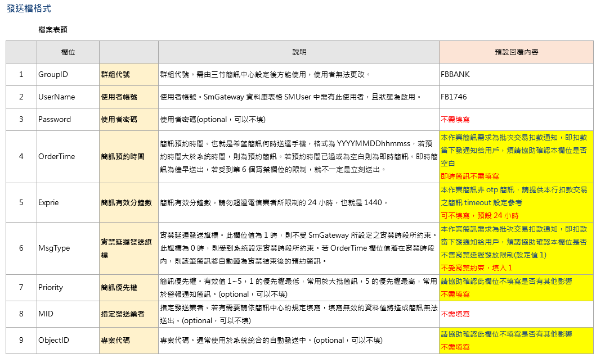
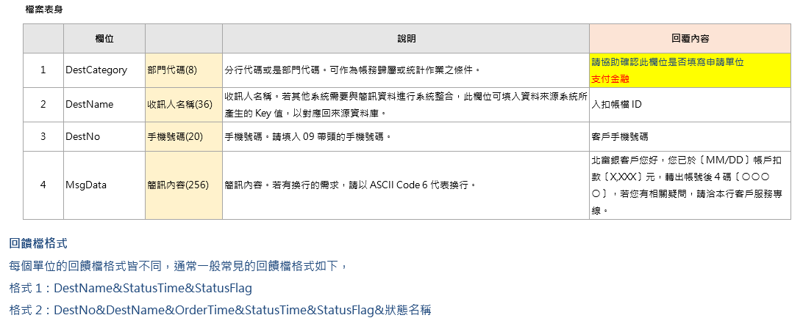

# 開發富邦銀行FTP發送需求FB1746

## 規格



```
* 回饋檔名規則和收檔檔名規則(由富邦命名)和傳檔時間：
回饋檔名規則：ACH_SMS_YYYYMMDD(西元年)_R.TXT，回饋檔傳檔時間每日00:15:00 
收檔檔名規則：ACH_SMS_YYYYMMDD(西元年).TXT

* 簡訊(FB1746)收送路徑for 三竹 資訊如下：
三竹收簡訊發送名單路徑：download/A0000018/mitake
三竹to Fubon 簡訊寄送狀況回覆檔路徑：upload/A0000018/mitake

* 沒有回饋檔資料，需要產生空檔。回饋檔格式如下：
格式2：DestNo&DestName&OrderTime&StatusTime&StatusFlag&狀態名稱(回覆中文)
可參考ViewReplyPhase2_A0000007_WMG176

富邦銀行FTP發送需求FB1746
```