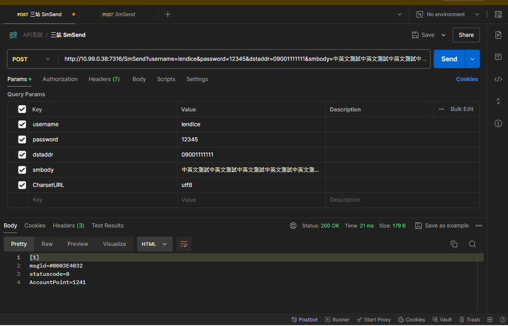

# 20240809_遠傳Sour調整長訊內容超過遠傳限制字數增加log

## 開發原因
* 長訊超過長度會壓 replyFlag = '5'，但沒有log紀錄
* 調整專案 -> SMSourServiceImpl_FET
* commit -> fix: 調整Status壓5印出Log

## 測試方式
* sql
```
SELECT * FROM SMS2.dbo.SMUser WHERE UserName = 'lendice'

SELECT * FROM DBexp.dbo.SMUser WITH(NOLOCK) WHERE GroupID = 'MSG'
SELECT * FROM DBexp.dbo.SMGroupRoute WITH(NOLOCK) WHERE GroupID = 'MSG' AND UserName = 'lendiceS'
SELECT * FROM DBexp.dbo.SMRoute WITH(NOLOCK) WHERE Route = 'B2CMix_GN'
--update DBexp.dbo.SMRoute set Sms = 'F8441', Lms = 'F8441' WHERE Route = 'B2CMix_GN' and Lms = 'F64443' and MobileNo = '09001'
--F4721 F4721
SELECT * FROM DBexp.dbo.MidSMSourConfig WITH(NOLOCK) WHERE PartKey = '2000'

--Mid = 'F64443' 
SELECT * FROM DBexp.dbo.FetSourConfig WITH(NOLOCK)
```
* postman
* 中文長度要達到333字以上，英數要達到1000字以上
