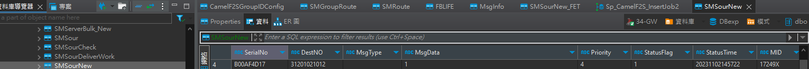
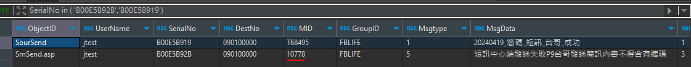
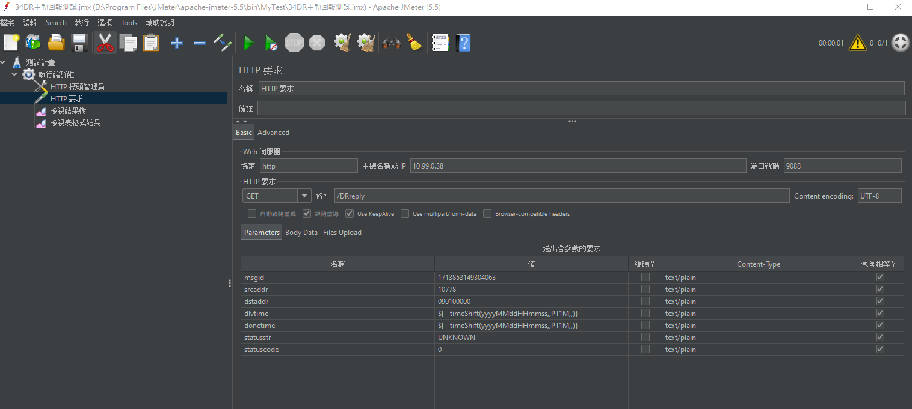

# JavaSour 各業者測試(此測試範圍較大，需完善測試所有功能)

## 調整內容，測試案例

FK...
* Remote .34 need check 
  * ```C:\SMS\FBLIFE\SmGateway\SFBLIFE.exe```
  * ```C:\SMS\FBLIFE\LmFBLIFE\LmFBLIFE.exe```
  * ```C:\SMS\FBLIFE\QueryServer\QFBLIFE.exe```
  * ```C:\SMS\FBLIFE\UnicodeFBLIFE\UnicodeFBLIFE.exe```
  * Maybe need this one ```C:\SMS\QQuery\QQuery.exe```
  * log ```C:\Syslog```
  
* Remote .38 need check
  * ```D:\SMS\FetLmSubmit```
  * ```D:\JAVA_AP\CamelF2S```
  * ```D:\JAVA_AP\CamelF2S_LU```
  * ```D:\JAVA_AP\CHT_Test_Server```
  * ```D:\JAVA_AP\FET_Test_Server```
  * ```D:\JAVA_AP\FET_Test_Server_New```
  * ```D:\JAVA_AP\JavaSmSourMonitor```
  * ```D:\Syslog```

* 更版程式都在 .38 上
```
Dear Arno
請參考中華JavaSour的調整，修改遠傳及台哥JavaSour，並更新到開發環境上。

git@gitlab01.mitake.com.tw:SMS/smsour/cht/SMSourServiceImpl_CHT.git
branch:shortcode_phase1

Dear 俊宏、Arno
        調整完成後，請協助列完整測試案例進行簡碼測試，

        請使用富邦人壽FBILFE測試，路由及特碼相關設定已設定好，

        短訊、長訊、Unicode、即時、預約、一二階備援等等，都要測試，

        目前備援邏輯是：

        中華簡碼->遠傳長碼
        遠傳簡碼->中華長碼
        台哥簡碼->中華長碼
        
 補充一下，測試範圍包含GW端及中心端統計，確認統計的種類及數字是否正常
```

## 測試流程
* 先上.34找 C:\SMS\FBLIFE(此為舊版API)，確認 gw [ip:port]、[DB:FBILFE] 
* 參考舊版API發送文件
* 用到的table

* RedundantMID

## 已知專案順序
* API -> GW -> CamelF2s -> JavaSmSourMonitor -> Sour <--> Test Mock(Test_Server)

## 測試前準備
* This test using DB.FBLIFE，API tools use JMeter(FBLIFE_Old_API.jmx)
* SendAccount 
  * FBILFE.SMUser
  * UserName: jtest
  * pw: 12345
  * GroupID: FBLIFE
1. First to find [GroupID] in DBexp.SMGroupRoute，and then find [UserName](Remember [Route])，if not find can create one UserName.
2. Second to find [Route] in DBexp.SMRoute，there are corresponding(對應的) [Mid] and [MobileNo] here.
3. Check this test the Sour Mock(電信業者模擬端) Conf、[PartKey]，and go find DBexp.MidSMSourConfig have corresponding(對應的) [PartKey]，if not find can create.

* MidInfo 寫入時間 -> 只要發送到gw 中心就會寫入 (寫入時間在中心無法看到)
* 發送成功寫入一筆
* 發送失敗只會寫入一筆，簡訊只想知道最後一次發的特碼是哪個業者
# Focus check [Mid] 

## API發送檢查流程，各業者都一樣(除了一階、二階失敗不同)
* SmSend API -> http://10.99.0.34:4080/SmSendGet.asp
* LmSend API -> http://10.99.0.34:7006/SpLmGet
* UnSend(Unicode) API -> http://10.99.0.34:7006/SpSendUtf
* Find DBexp.SMRoute the [Note] is your Sour.
1. After send response can see [msgid]，and take to the FBLIFE.MsgInfo find SerialNo=[msgid].
2. FBLIFE.MsgInfo can see [OrderID(中心序號)]，and take to the DBexp.FBLIFE find SerialNo=[OrderID(中心序號)].
3. If use [OrderTime(預約時間)]，but DBexp.FBLIFE can't find.
    1. Go to DBexp.LMOrder or DBexp.SMOrder to update [OrderTime]，need before now.
    2. And go back to DBexp.FBLIFE can see the data.
    
## FET(遠傳)
1. The Phase1 error test Directions (一階失敗測試說明)
   1. Go to remote .38 find the ```JAVA_AP/SMSourFET_2000/target/classes/System_Service.cfgBean.xml``` 
   2. open xml can find pushFailRate this is Phase1 process.
   3. [Mock mode] pushFailRate，0:success、10:fail
   
2. The Phase2 erroe test Directions (二階失敗測試說明)
   1. Go to remote .38 find the ```JAVA_AP/SMSourFET_2000/conf```
      1. check this conf like code      
      ```
      ### FET API settings
      fet.api.push.primary.url = http://10.99.0.38:6500/mpushapi/smssubmit
      fet.api.push.secondary.url = http://10.99.0.38:6500/mpushapi/smssubmit

      fet.api.retrievedr.primary.url = http://10.99.0.38:6500/drsiweb/smsretrievedr
      fet.api.retrievedr.secondary.url = http://10.99.0.38:6500/drsiweb/smsretrievedr

      fet.api.smsquerydr.primary.url = http://10.99.0.38:6500/drsiweb/smsquerydr
      fet.api.smsquerydr.secondary.url = http://10.99.0.38:6500/drsiweb/smsquerydr
      ```
      2. Find two folder remote .38，need to check url 
         1. ```\JAVA_AP\FET_Test_Server\target\classes\System_Camel.cfgBean.xml```
         2. ```\JAVA_AP\FET_Test_Server_New\target\classes\System_Camel.cfgBean.xml```
         3. And then check the port maybe like... [6500] or [6600]
      3. Open ```System_Service.cfgBean.xml``` can see [sendScRate(Phase1)] or [sendScRate(Phase2)]
      4. Now you can test，and go to SMDR.SMRedoNowLog to see data、[Phase].

### FET BUG
* The DBexp.CamelF2SGroupIDConfig forget to add new data.
* The DBexp.Sp_CamelF2S_InsertJob2 MID 5 -> 6，and tabel not SMSourNew if SMSourNew_FET
```
-- 遠傳寫入SMSour
	Select @tempTime=GETDATE()
	INSERT dbo.SMSour(SerialNo,DestNO,MsgType,MsgData,Priority,StatusFlag,StatusTime,MID,GroupID,ObjectID,ReCount,UserName,ExpireTime)
		SELECT A.SerialNo,A.DestNo,A.MsgType,A.MsgData,A.Priority,A.StatusFlag,@nowDateTime,A.MID,A.GroupID,A.ObjectID,'0',A.UserName,A.ExpireTime
		FROM @SmServerBulkModel A 
			LEFT JOIN #SMSourCheckTemp B ON A.SerialNo=B.serialNo 
		WHERE B.serialNo IS NULL -- 不需要即時驗證URL的資料才進發送資料表
		AND A.StatusFlag='1' 
		AND A.MID like 'F%' AND LEFT(A.MID,5) NOT IN (SELECT DISTINCT(ISNULL(MID,'')) from dbo.SmsToSMSourNewConfigFET WITH(NOLOCK))
	Set @cinsmsour=@@RowCount;
	Set @einsmsour=DateDiff(ms, @tempTime, GetDate())
	
	-- 非遠傳或要轉導JavaSour遠傳寫入SMSourNew
	Select @tempTime=GETDATE()
	INSERT dbo.SMSourNew(SerialNo,DestNO,MsgType,MsgData,Priority,StatusFlag,StatusTime,MID,GroupID,ObjectID,ReCount,UserName,ExpireTime,Dept,OrderTime)
		SELECT A.SerialNo,A.DestNo,A.MsgType,A.MsgData,A.Priority,A.StatusFlag,@nowDateTime,A.MID,A.GroupID,A.ObjectID,'0',A.UserName,A.ExpireTime,A.DestCategory,A.OrderTime 
		FROM @SmServerBulkModel A 
			LEFT JOIN #SMSourCheckTemp B ON A.SerialNo=B.serialNo 
		WHERE B.serialNo IS NULL -- 不需要即時驗證URL的資料才進發送資料表
		AND A.StatusFlag='1' 
		AND (A.MID not like 'F%' OR LEFT(A.MID,5) IN (SELECT DISTINCT(ISNULL(MID,'')) from dbo.SmsToSMSourNewConfigFET WITH(NOLOCK)))
	Set @cinsmsournew=@@RowCount;
	Set @einsmsournew=DateDiff(ms, @tempTime, GetDate())
```


## TAI(台哥)
1. TAI have some special(特別的) test。
   EX. ``` 短or長orUn簡訊中心端發送失敗 P9 台哥發送簡訊內容不得含有攜碼```
   * This test only send [攜碼] in Param(smbody)。
   * And check FBLIFE.MsgInfo data [MID] not like T%。
   
   
2. The Phase1 error test Directions (一階失敗測試說明)
   1. Go to remote .38 find the ```JAVA_AP/SMSourTAI_3000/target/classes/System_Service.cfgBean.xml```
   2. Find the [Mock模式] and adjust(調整) pushFailRate 0:success，10:fail.
   3. Now you can test，and go to SMDR.SMRedoNowLog to see data、[Phase].
   
3. The Phase2 erroe test Directions (二階失敗測試說明)
   * see this 
      1. GET -> http://10.99.0.38:9088/DRreply