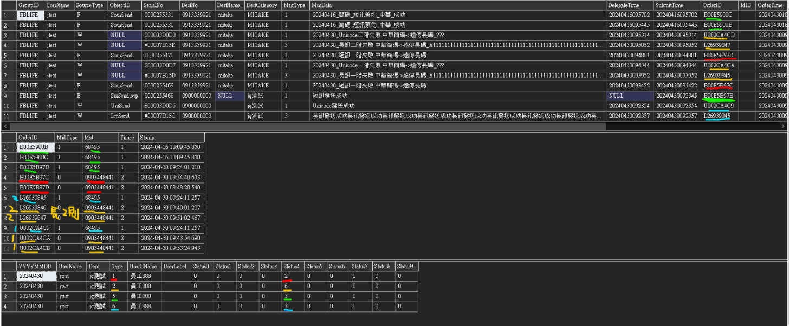
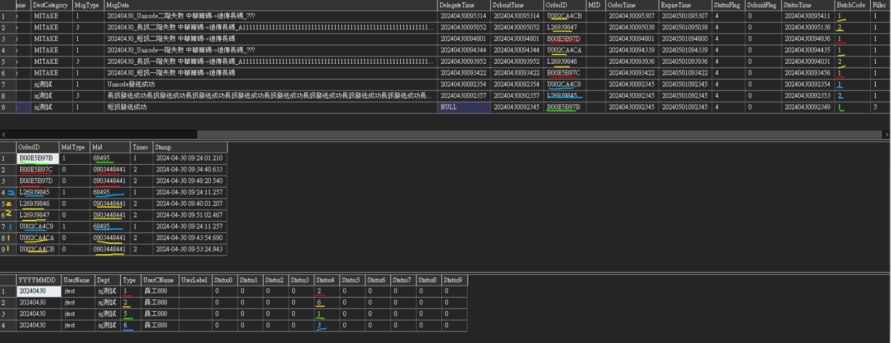
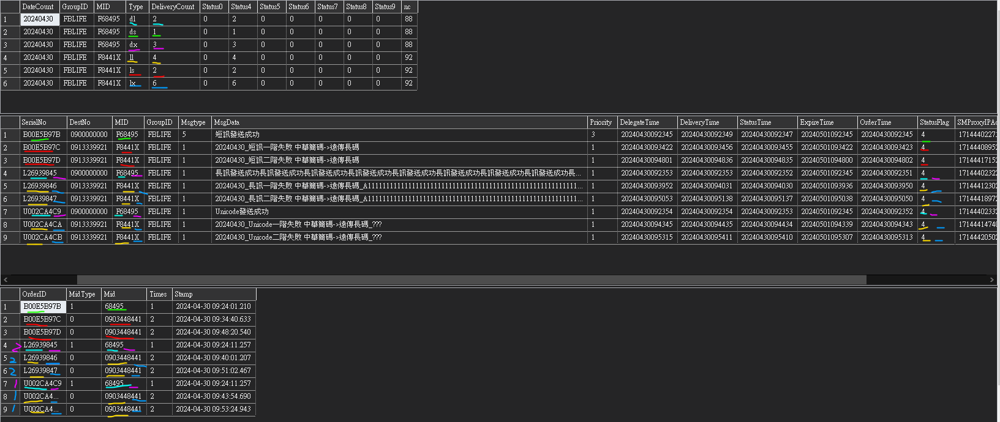
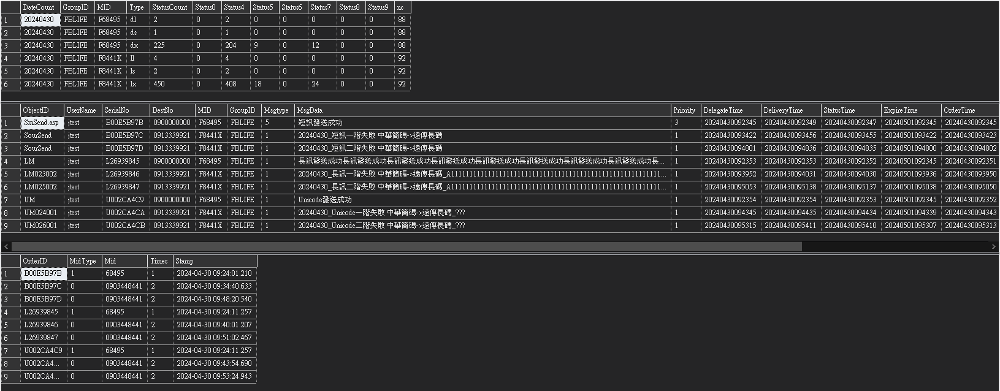
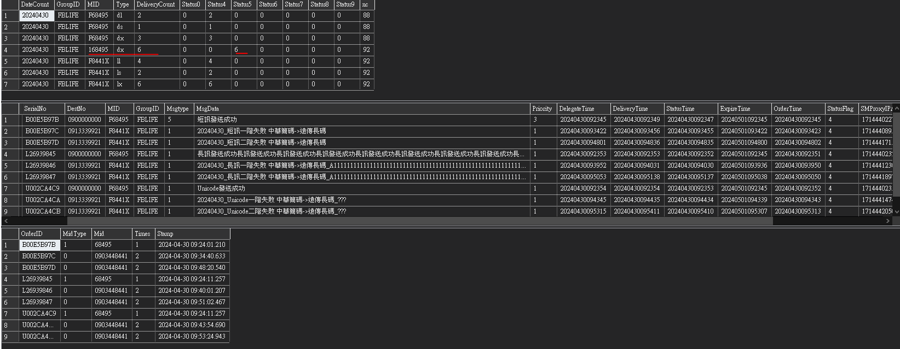
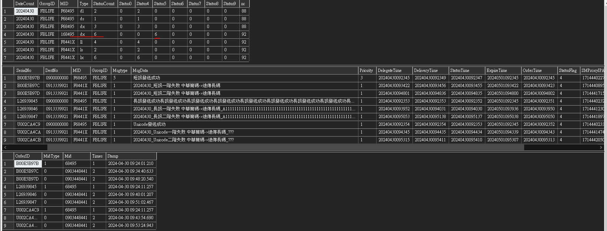

# 富邦人壽-簡碼測試流程

## _Step1: 先到遠端上啟動這些程式，如果有漏再補_
* .34
    * ```C:\SMS\FBLIFE\SmGateway\SFBLIFE.exe```
    * ```C:\SMS\FBLIFE\LmFBLIFE\LmFBLIFE.exe```
    * ```C:\SMS\FBLIFE\QueryServer\QFBLIFE.exe```
    * ```C:\SMS\FBLIFE\UnicodeFBLIFE\UnicodeFBLIFE.exe```
    * ```C:\SMS\QQuery\QQuery.exe```
* .38
    * ```D:\SMS\FetLmSubmit```
    * ```D:\JAVA_AP\CamelF2S```
    * ```D:\JAVA_AP\CamelF2S_LU```
    * ```D:\JAVA_AP\CHT_Test_Server```
    * ```D:\JAVA_AP\FET_Test_Server```
    * ```D:\JAVA_AP\FET_Test_Server_New```
    * ```D:\JAVA_AP\JavaSmSourMonitor```

## _Step2: 找對應的測試帳號_
* 參考 .34 ```SFBLIFE.exe``` 找到訊息如下:

| DB  | UserName  | Password| GroupID| Http |
|---|---|---|---|---|
| FBLIFE| FBLIFE | 86136982 | FBLIFE| 4080 |

* 當時測試帳號為: 
  * UserName: jtest
  * PassWord: 12345
  * 參考 FBLIFE.dbo.SMUser

## _Step3: 發送API準備項目_
* 發送工具 JMeter
* 參考文件: ```\\File-server\share\企業簡訊事業群\簡訊研發部\公用資料夾\【技術文件】\三竹簡訊系統整合介面v1 98(HTTP).doc ```
* API:```D:\Program Files\JMeter\apache-jmeter-5.5\bin\MyTest\FBLIFE_Old_API.jmx```
* TAI(台哥)會需要手動回傳業者端 API: ```D:\Program Files\JMeter\apache-jmeter-5.5\bin\MyTest\34DR主動回報測試.jmx```
### 專案順序
* API -> GW -> CamelF2s -> JavaSmSourMonitor -> Sour <--> Test Mock(Test_Server)
### 群組對應表
1. First to find [GroupID] in DBexp.SMGroupRoute，and then find [UserName](Remember [Route])，if not find can create one UserName.
2. Second to find [Route] in DBexp.SMRoute，there are corresponding(對應的) [Mid] and [MobileNo] here.
3. Check this test the Sour Mock(電信業者模擬端) Conf、[PartKey]，and go find DBexp.MidSMSourConfig have corresponding(對應的) [PartKey]，if not find can create.
4. All Mid and ReMid mapping table DBexp.dbo.RedundantMID

## _Step4: 確認要測試的業者，Partkey_
* [Step5: CHT中華測試流程](#CHT中華測試流程)，這次沒有測試中華暫時沒寫
* [Step5: FET(遠傳)測試流程](#FET遠傳測試流程)
* [Step5: TAI(台哥)測試流程](#TAI台哥測試流程)
* 補充: MID(特碼) 最後面有 X 與沒有的說明
  * 有X: 特碼最後面有 X 備援失敗就不會在轉備援
  * 沒有X: 特碼沒看到 X 備援失敗就會在轉備援會繼續下去(不應該有這情況)

## _Step5: CHT中華測試流程_
* Nothing in here，Wait to test and update information here.
* 參考中華發送流程圖
* 中華ㄧ階失敗需要去調整 CHT_Test_Server (mina-gateway.xml) -> sendScRate 改為0
* ㄧ街失敗會轉備援
* 中華二階失敗需要去調整 CHT_Test_Server (mina-gateway.xml) -> drScRate 改為0
* 二街失敗也會轉備援
## _Step5: FET(遠傳)測試流程_
### 測試先再次確認項目
* Service 啟動
  * .38 遠傳Sour:  ```D:\JAVA_AP\SMSourFET_2000\run_SMSourFET.bat```
> 程式有調整，無須再改 Service Mock模式 ```D:\JAVA_AP\SMSourFET_2000\target\classes\System_Service.cfgBean.xml```

* .38 Mock 啟動前，請先確認 [遠傳Sour的 FET API Settings 是打哪一台]
  * ``` D:\JAVA_AP\SMSourFET_2000\conf\AppSettings.properties ```
```
### FET API settings
fet.api.push.primary.url = http://10.99.0.38:6600/mpushapi/smssubmit
fet.api.push.secondary.url = http://10.99.0.38:6600/mpushapi/smssubmit
fet.api.retrievedr.primary.url = http://10.99.0.38:6600/drsiweb/smsretrievedr
fet.api.retrievedr.secondary.url = http://10.99.0.38:6600/drsiweb/smsretrievedr
fet.api.smsquerydr.primary.url = http://10.99.0.38:6600/drsiweb/smsquerydr
fet.api.smsquerydr.secondary.url = http://10.99.0.38:6600/drsiweb/smsquerydr
```
* .38 Mock port 設定，選一台就好
  * 這是第一台路徑:  ```D:\JAVA_AP\FET_Test_Server\target\classes\System_Camel.cfgBean.xml```
  * 這是第二台路徑: ```D:\JAVA_AP\FET_Test_Server_New\target\classes\System_Camel.cfgBean.xml```
* .38 Mock 一，二階設定，選一台就好
  * 這是第一台路徑:  ```D:\JAVA_AP\FET_Test_Server\target\classes\System_Service.cfgBean.xml```
  * 這是第二台路徑: ```D:\JAVA_AP\FET_Test_Server_New\target\classes\System_Service.cfgBean.xml```
* .38 Mock 啟動
  * 這是第一台路徑:  ```D:\JAVA_AP\FET_Test_Server\FET_Test_Server.bat```
  * 這是第二台路徑:  ```D:\JAVA_AP\FET_Test_Server_New\FET_Test_Server.bat```
  
### SQL 群組特碼指令
* GroupID -> .34 ```C:\SMS\FBLIFE\SmGateway\SFBLIFE.exe``` 啟動可看到群組代碼 [FBLIFE]
* partKey -> .38 ```D:\JAVA_AP\SMSourFET_2000\conf\AppSettings.properties``` 裡面可找到```fet.smsour.partKey = 2000```
```
-- 確認 GroupID 資訊
SELECT * FROM DBexp.dbo.SMGroup WITH(NOLOCK) WHERE GroupID = 'FBLIFE'
-- 確認 PartKey 資訊，找對應的 Mid
SELECT * FROM DBexp.dbo.MidSMSourConfig WITH(NOLOCK) WHERE PartKey = '2000'
-- 確認群組以及對應的帳號，找對應的 Route
SELECT * FROM DBexp.dbo.SMGroupRoute WITH(NOLOCK) WHERE GroupID = 'FBLIFE' AND UserName = 'jtest'
-- 確認遠傳 MID，以及失敗轉備援特碼對照表
SELECT * FROM DBexp.dbo.RedundantMID WITH(NOLOCK) WHERE MID = 'F68495'
-- 確認 Route 發送的 MobileNo 對應那些特碼
SELECT * FROM DBexp.dbo.SMRoute WITH(NOLOCK) WHERE Route = 'SCTEST'
```
### 發送後確認結果指令
```
-- 簡碼發送結果
-- MsgInfo 最終結果 StatusFlag = 4，發送成功
SELECT * FROM FBLIFE.dbo.MsgInfo with(nolock) WHERE OrderTime LIKE '20240429%' and DestNo like '0900%' order by OrderTime desc 
-- MidInfo 特碼發送轉備援最終結果，只記錄最後轉備援的 Mid(備註:長碼為...特碼，只要確認最後五碼對應的特碼即可)
SELECT * FROM FBLIFE.dbo.MidInfo with(nolock) WHERE OrderID in ('B00E5B976','U002CA4C4', 'L26939840') order by Stamp desc
-- SMRedoNowLog 紀錄一，二階(Phase)失敗，轉備援前、後特碼
SELECT * FROM SMDR.dbo.SMRedoNowLog with(nolock) where SerialNo in ('B00E5B976','U002CA4C4', 'L26939840')  order by Stamp desc
-- FBLIFE 中心端 MID 為最後發送的簡碼，SMProxyIPAddr 為CDR序號
SELECT * FROM DBexp.dbo.FBLIFE with(nolock) where SerialNo in ('B00E5B976','U002CA4C4', 'L26939840')  order by OrderTime desc
-- 遠傳 CDR 不同業者序號不同，此序號只能透過時間反推回去是哪一筆 (SMProxyIPAddr = msgid)
-- SELECT * FROM SMCDR.dbo.SMCDRFet WITH(NOLOCK) WHERE msgid in ('')
```
* 遠傳ㄧ階失敗需要去調整 FET_Test_Server (System_Service.cfgBean.xml) -> sendScRate 改為0
* 遠傳二階失敗需要去調整 FET_Test_Server (System_Service.cfgBean.xml) -> drScRate 改為0
> 一階失敗測試說明: Sour -> 電信業者失敗(一階失敗會記錄) -> 轉備援
> 一街失敗會轉備援
> 二階失敗測試說明: Client接收失敗 -> 電信業者收到失敗回覆(二階失敗會記錄) -> Sour
> 二街失敗也會轉備援

## _Step5: TAI(台哥)測試流程_
### 測試先再次確認項目
* Service 啟動
  * .38 台哥Sour:  ```D:\JAVA_AP\SMSourTAI_3000\run_SMSourTAI.bat```
> 一階開關 Service Mock模式 ```D:\JAVA_AP\SMSourTAI_3000\target\classes\System_Service.cfgBean.xml```
>``` 
>  <!-- <bean id="TAIPushService" class="com.mitake.smsour.service.impl.TAIPushService"> -->
>  		<!-- <property name="smSourDao" ref="SMSourDao" /> -->
>  		<!-- <property name="serviceWrapper" ref="TAISmsServiceWrapper" /> -->
>  	<!-- </bean> -->
>
>  	<!-- Mock模式 -->
>  	<bean id="TAIPushService" class="com.mitake.smsour.service.impl.TAIPushServiceMock">
>  		<property name="smSourDao" ref="SMSourDao" />
>  		<property name="serviceWrapper" ref="TAISmsServiceWrapper" />
>  		<property name="pushFailRate" value="0" /> <!-- 0:成功，10:失敗 -->
>  	</bean>
>```

* Mock 啟動前，台哥需要手動打 API 呼叫 Mock 做回覆
  * .38 -> ``` D:\JAVA_AP\TAIReplyService\run_TAIReplyService.bat ```
  * 參考本機 -> ```D:\Program Files\JMeter\apache-jmeter-5.5\bin\MyTest\34DR主動回報測試.jmx```
> API: GET http://10.99.0.38:9088/DRreply 說明如下表格:

|欄位|說明|備註|
|---|---|---|
|msgid|CDR序號|參考 DBexp.dbo.FBLIFE 的 SMProxyIPAddr(此欄位會因為不同業者回應的序號而不同)|
|srcaddr|特碼序號|請參考(DBexp.RedundantMID 特碼備援表)srcno|
|dstaddr|手機號碼||
|dlvtime|dr時間||
|donetime|發送時間||
|statusstr|狀態代碼|參考下面的表格|
|statuscode|回應狀態||

```MtkDeliveryStatus 可參考 TAIReplyService 的 TaiDRStatusMapping```

|statusstr	|Description	|MtkDeliveryStatus|
|---|---|---|
|DELIVRD	|訊息發送成功	|4|
|EXPIRED	|訊息發送於有效時間內無法送達(接收端可能關機或訊號不良.....等因素等致無法正常收訊)	|2003|
|DELIETED	|收到此通簡訊傳送刪除訊息	|2000|
|UNDELIV	|訊息無法傳遞(門號可能為空號或是手機端問題導致無法正常接收簡訊)	|2001|
|UNKNOWN	|訊息無效(無法歸類之錯誤訊息，需經系統判讀)	|2000|
|REJECTD	|訊息遭駁回	|2002|
|SYNTAXE	|訊息語法錯誤	|2000|

### SQL 群組特碼指令
* GroupID -> .34 ```C:\SMS\FBLIFE\SmGateway\SFBLIFE.exe``` 啟動可看到群組代碼 [FBLIFE]
* partKey -> .38 ```D:\JAVA_AP\SMSourTAI_3000\conf\AppSettings.properties``` 裡面可找到```tai.smsour.partKey = 3000```
```
-- 確認 GroupID 資訊
SELECT * FROM DBexp.dbo.SMGroup WITH(NOLOCK) WHERE GroupID = 'FBLIFE'
-- 確認 PartKey 資訊，找對應的 Mid
SELECT * FROM DBexp.dbo.MidSMSourConfig WITH(NOLOCK) WHERE PartKey = '3000'
-- 確認群組以及對應的帳號，找對應的 Route
SELECT * FROM DBexp.dbo.SMGroupRoute WITH(NOLOCK) WHERE GroupID = 'FBLIFE' AND UserName = 'jtest'
-- 確認遠傳 MID，以及失敗轉備援特碼對照表
SELECT * FROM DBexp.dbo.RedundantMID WITH(NOLOCK) WHERE MID = 'T68495'
-- 確認 Route 發送的 MobileNo 對應那些特碼
SELECT * FROM DBexp.dbo.SMRoute WITH(NOLOCK) WHERE Route = 'SCTEST'
```
### 發送後確認結果指令
```
-- 簡碼發送結果
-- MsgInfo 最終結果 StatusFlag = 4，發送成功
SELECT * FROM FBLIFE.dbo.MsgInfo with(nolock) WHERE OrderTime LIKE '20240429%' and DestNo like '0901%' order by OrderTime desc 
-- MidInfo 特碼發送轉備援最終結果，只記錄最後轉備援的 Mid(備註:長碼為...特碼，只要確認最後五碼對應的特碼即可)
SELECT * FROM FBLIFE.dbo.MidInfo with(nolock) WHERE OrderID in ('B00E5B97A','U002CA4C8', 'L26939844') order by Stamp desc
-- SMRedoNowLog 紀錄一，二階(Phase)失敗，轉備援前、後特碼
SELECT * FROM SMDR.dbo.SMRedoNowLog with(nolock) where SerialNo in ('B00E5B97A','U002CA4C8', 'L26939844')  order by Stamp desc
-- FBLIFE 中心端 MID 為最後發送的簡碼，SMProxyIPAddr 為CDR序號(此序號下面會用到)
SELECT * FROM DBexp.dbo.FBLIFE with(nolock) where SerialNo in ('B00E5B97A','U002CA4C8', 'L26939844')  order by OrderTime desc
-- 台哥 CDR 不同業者序號不同，此序號只能透過時間反推回去是哪一筆 (SMProxyIPAddr = msgid)
-- SELECT * FROM SMCDR.dbo.SMCDRTWM WITH(NOLOCK) WHERE msgid in ('')
```

* 台哥ㄧ階失敗需要去調整 SMSourTAI_XXX (System_Service.cfgBean.xml) -> pushFailRate 改為10
* 台哥二階失敗需要打電文回傳失敗狀態(參考上面的電文表格)
> 一階失敗測試說明: Sour -> 電信業者失敗(一階失敗會記錄) -> 轉備援
> 一街失敗會轉備援
> 二階失敗測試說明: Client接收失敗 -> 電信業者收到失敗回覆(二階失敗會記錄) -> Sour
> 二街失敗也會轉備援

## _Step6: GW端、中心端統計簡訊發送數量(簡碼與長碼)，此較複雜要對表_
### GW端統計 (參考: OrderTime 統計流程、StatusTime 統計流程 )
|參考來源|說明|
|---|---|
|FBLIFE.dbo.MsgInfo|簡訊最終結果|
|FBLIFE.dbo.MidInfo|簡訊最後發送的特碼紀錄|
|FBLIFE.dbo.SpSumOrderRange|執行 OrderTime 的區間統計結果|
|FBLIFE.dbo.SpSumStatusRange|執行 StatusTime 的區間統計結果|
|FBLIFE.dbo.SumOrder|執行 SpSumOrderRange 後的紀錄|
|FBLIFE.dbo.SumStatus|執行 SpSumStatusRange 後的紀錄|
|FBLIFE.dbo.SumType2|SpSumOrderRange、SpSumStatusRange 用來區分簡訊特碼類型的 func 參考如下|
> * 1國內簡訊
> * 2國內長訊
> * 3國際簡訊
> * 4國際長訊
> * 5國內簡碼簡訊
> * 6國內簡碼長訊
> * 7國際簡碼簡訊
> * 8國際簡碼長訊
* 序號 B(短訊)開頭都為[簡訊]
* 序號 L(長訊)、U(UNICODE)開頭都為[長訊]

### OrderTime 統計流程 (確認簡訊數量)
> * 以 20240430 為範例如下:
> ```
> --統計資料請先執行 Sp，SumOrder 才會有資料
> DECLARE @return_value int
> EXEC @return_value = [dbo].[SpSumOrderRange] @From= '20240429'--, @To='20240430'
> SELECT 'Return Value' = @return_value
> 
> -- 統計
> SELECT LEFT(OrderTime, 10) AS 日期, StatusFlag, COUNT(*) AS 總數 FROM MsgInfo WITH(NOLOCK)
> WHERE OrderTime LIKE '20240430%'
> GROUP BY LEFT(OrderTime, 10), StatusFlag
> ORDER BY LEFT(OrderTime, 10), StatusFlag
> -- 查看當天發送的簡訊狀態
> SELECT * FROM FBLIFE.dbo.MsgInfo WITH(NOLOCK) WHERE OrderTime LIKE '20240430%'  AND StatusFlag = '4' ORDER BY OrderTime DESC
> -- 查看最後紀錄的特碼
> SELECT * FROM FBLIFE.dbo.MidInfo WITH(NOLOCK) WHERE OrderID IN (
> 	SELECT OrderID FROM FBLIFE.dbo.MsgInfo WHERE OrderTime LIKE '20240430%' AND StatusFlag = '4'
> )
> SELECT * FROM FBLIFE.dbo.SumOrder with(nolock) WHERE YYYYMMDD = '20240430' 
> ```
> 
> * 紅色: 1國內簡訊 (不包含 [簡碼] )
> * 黃色: 2國內長訊 (不包含 [簡碼] )，要確認一下 BatchCode(扣點)，可以推算一筆長訊則數。
> * 綠色: 5國內簡碼簡訊 (只算 [簡碼] )
> * 青色: 6國內簡碼長訊 (只算 [簡碼] )，要確認一下 BatchCode(扣點)，可以推算一筆長訊則數。
### StatusTime 統計流程 (確認 StatusFlag 的狀態)
> * 以 20240430 為範例如下:
> ```
>  --統計資料請先執行 Sp，SumStatus 才會有資料
> DECLARE @return_value int
> EXEC @return_value = [dbo].[SpSumStatusRange] @From= '20240429', @To='20240430'
> SELECT 'Return Value' = @return_value
> 
> -- 統計
> SELECT LEFT(OrderTime, 10) AS 日期, StatusFlag, COUNT(*) AS 總數 FROM MsgInfo WITH(NOLOCK)
> WHERE OrderTime LIKE '20240430%'
> GROUP BY LEFT(OrderTime, 10), StatusFlag
> ORDER BY LEFT(OrderTime, 10), StatusFlag
> -- 查看當天發送的簡訊狀態
> SELECT * FROM FBLIFE.dbo.MsgInfo WITH(NOLOCK) WHERE StatusTime LIKE '20240430%'  AND StatusFlag = '4' ORDER BY StatusTime DESC
> > -- 查看最後紀錄的特碼
> SELECT * FROM FBLIFE.dbo.MidInfo WITH(NOLOCK) WHERE OrderID IN (
> SELECT OrderID FROM FBLIFE.dbo.MsgInfo WHERE StatusTime LIKE '20240430%' AND StatusFlag = '4'
> )
> SELECT * FROM FBLIFE.dbo.SumStatus with(nolock) WHERE YYYYMMDD = '20240430'
> ```
> 
> * 要確認 Status 跟 StatusFlag 是否一致
> * 紅色: 1國內簡訊 (不包含 [簡碼] )
> * 黃色: 2國內長訊 (不包含 [簡碼] )，要確認一下 BatchCode(扣點)，可以推算一筆長訊則數。
> * 綠色: 5國內簡碼簡訊 (只算 [簡碼] )
> * 青色: 6國內簡碼長訊 (只算 [簡碼] )，要確認一下 BatchCode(扣點)，可以推算一筆長訊則數。

### 中心端統計 
|參考來源|說明|
|---|---|
|FBLIFE.dbo.MsgInfo|簡訊最終結果|
|FBLIFE.dbo.MidInfo|簡訊最後發送的特碼紀錄|
|DBexp.dbo.SpSumDeliveryNc_ShortCode_Customer|執行短碼DR客戶對帳的區間統計結果|
|DBexp.dbo.SpSumStatusNc_ShortCode_Customer|執行短碼狀態客戶對帳的區間統計結果|
|DBexp.dbo.SpSumDeliveryNc_ShortCode_Telecom|執行短碼DR業者對帳的區間統計結果|
|DBexp.dbo.SpSumStatusNc_ShortCode_Telecom|執行短碼狀態業者對帳的區間統計結果|
|DBexp.dbo.CountGroupDelivery|執行 SpSumDeliveryNc_ShortCode_Customer 後的紀錄|
|DBexp.dbo.CountGroupStatus|執行 SpSumStatusNc_ShortCode_Customer 後的紀錄|
|DBexp.dbo.CountGroupDelivery_Telecom|執行 SpSumDeliveryNc_ShortCode_Telecom 後的紀錄|
|DBexp.dbo.CountGroupStatus_Telecom|執行 SpSumStatusNc_ShortCode_Telecom 後的紀錄|
> Type 參考對照表:
> * 長碼_國內短訊 ls
> * 長碼_國際短訊 is
> * 長碼_國內長訊 ll
> * 長碼_國際長訊 il
> * 長碼_國內長訊(拆) lx
> * 長碼_國際長訊(拆) ix
> * 簡碼_國內短訊 ds
> * 簡碼_國際短訊 gs
> * 簡碼_國內長訊 dl
> * 簡碼_國際長訊 gl
> * 簡碼_國內長訊(拆) dx
> * 簡碼_國際長訊(拆) gx
> 
* 序號 B(短訊)開頭都為[簡訊]
* 序號 L(長訊)、U(UNICODE)開頭都為[長訊]
### 中心端客戶對帳統計 (Delivery 的統計)
> * 以 20240430 為範例如下:
> ```
> -- 先做統計 Delivery，到 [CountGroupDelivery] 才會有資料
> USE [DBexp]
> GO
> DECLARE	@return_value int
> EXEC @return_value = [dbo].[SpSumDeliveryNc_ShortCode_Customer] @YYYYMMDDFrom = '20240430', @YYYYMMDDTo = '20240430'
> SELECT 'Return Value' = @return_value
> GO
> -- 查看統計結果
> SELECT * FROM DBexp.dbo.CountGroupDelivery WITH(NOLOCK) WHERE DateCount = '20240430'
> -- 查看中心端發送結果 
> SELECT * FROM DBexp.dbo.FBLIFE WITH(NOLOCK) WHERE DeliveryTime LIKE '20240430%' ORDER BY SerialNo
> -- 查看特碼類型(簡碼 or 長碼)
> SELECT * FROM FBLIFE.dbo.MidInfo WITH(NOLOCK) WHERE OrderID IN (
> SELECT SerialNo FROM DBexp.dbo.FBLIFE WHERE DeliveryTime LIKE '20240430%'
> ) ORDER BY OrderID
> ```
> 
> * 參考 Type 對照表
### 中心端客戶對帳統計 (Status 的統計) 數量好像不太對?
> * 以 20240430 為範例如下:
> ```
> -- 先做統計 Status，到 [CountGroupStatus] 才會有資料
> USE [DBexp]
> GO
> DECLARE	@return_value int
> EXEC @return_value = [dbo].[SpSumStatusNc_ShortCode_Customer] @YYYYMMDDFrom = '20240430', @YYYYMMDDTo = '20240430'
> SELECT 'Return Value' = @return_value
> GO
> -- 查看統計結果
> SELECT * FROM DBexp.dbo.CountGroupStatus WITH(NOLOCK) WHERE DateCount = '20240430'
> -- 查看中心端發送結果 
> SELECT * FROM DBexp.dbo.FBLIFE WITH(NOLOCK) WHERE StatusTime LIKE '20240430%' ORDER BY SerialNo
> -- 查看特碼類型(簡碼 or 長碼)
> SELECT * FROM FBLIFE.dbo.MidInfo WITH(NOLOCK) WHERE OrderID IN (
> SELECT SerialNo FROM DBexp.dbo.FBLIFE WHERE StatusTime LIKE '20240430%'
> ) ORDER BY OrderID
> ```
> 

### 中心端業者對帳統計 (Delivery 的統計)
> * 以 20240430 為範例如下:
> ```
> -- 先做統計 Delivery，到 [CountGroupDelivery_Telecom] 才會有資料
> USE [DBexp]
> GO
> DECLARE	@return_value int
> EXEC	@return_value = [dbo].[SpSumDeliveryNc_ShortCode_Telecom] @YYYYMMDDFrom = '20240430', @YYYYMMDDTo = '20240430'
> SELECT	'Return Value' = @return_value
> GO
> -- 查看統計結果
> SELECT * FROM DBexp.dbo.CountGroupDelivery_Telecom WITH(NOLOCK) WHERE DateCount = '20240430'  order by Type
> -- 查看中心端發送結果 
> SELECT * FROM DBexp.dbo.FBLIFE WITH(NOLOCK) WHERE DeliveryTime LIKE '20240430%' ORDER BY SerialNo
> -- 查看特碼類型(簡碼 or 長碼)
> SELECT * FROM FBLIFE.dbo.MidInfo WITH(NOLOCK) WHERE OrderID IN (
> SELECT SerialNo FROM DBexp.dbo.FBLIFE WHERE DeliveryTime LIKE '20240430%'
> ) ORDER BY OrderID
> ```
> 
> * 特碼中華 168495 狀態為 5 TYPE:dx，不曉得怎看?

### 中心端業者對帳統計 (Status 的統計)
> * 以 20240430 為範例如下:
> ```
> -- 先做統計 Status，到 [CountGroupStatus_Telecom] 才會有資料
> USE [DBexp]
> GO
> DECLARE	@return_value int
> EXEC	@return_value = [dbo].[SpSumStatusNc_ShortCode_Telecom] @YYYYMMDDFrom = '20240430', @YYYYMMDDTo = '20240430'
> SELECT	'Return Value' = @return_value
> GO
> -- 查看統計結果
> SELECT * FROM DBexp.dbo.CountGroupStatus_Telecom WITH(NOLOCK) WHERE DateCount = '20240430'  order by Type
> -- 查看中心端發送結果 
> SELECT * FROM DBexp.dbo.FBLIFE WITH(NOLOCK) WHERE StatusTime LIKE '20240430%' ORDER BY SerialNo
> -- 查看特碼類型(簡碼 or 長碼)
> SELECT * FROM FBLIFE.dbo.MidInfo WITH(NOLOCK) WHERE OrderID IN (
> SELECT SerialNo FROM DBexp.dbo.FBLIFE WHERE StatusTime LIKE '20240430%'
> ) ORDER BY OrderID
> ```
> 
> * 特碼中華 168495 狀態為 5 TYPE:dx，不曉得怎看?