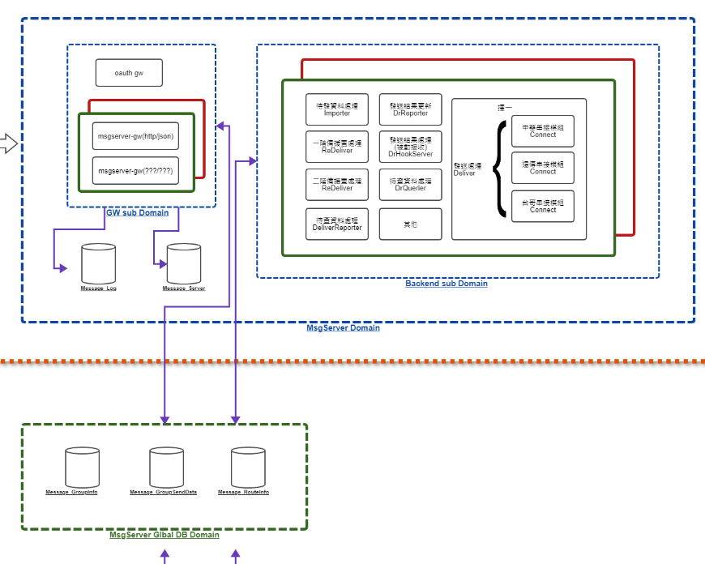

# MMS

## MMS流程圖
.png)
### Common (引用的專案)
https://gitlab01.mitake.com.tw/SMS/message/common
### Client端

* https://gitlab01.mitake.com.tw/SMS/message/apigw
* https://gitlab01.mitake.com.tw/SMS/message/server-backend
### 中心端

* https://gitlab01.mitake.com.tw/SMS/message/server-gw
* MsgServer-gw-mms-common
* MsgServer-gw-mms-json-master (Main)
* MsgServer-gw-oauth

## DB 
* Message_Channel
  * 帶有ApiDeliver都是由api發送的
  * Web發送的會到 MMSDeliverTemp(文字資料)、MMSDeliverAttachTemp (附件)
  * 發送完會執行sp Sp_MMS_ApiDeliverDataSelect、Sp_MMS_DeliverDataResendSelect、Sp_MMS_DeliverDataSelect 將資料join到最終結果
  * 最終結果都會存到 MMSDeliver、MMSAttachments


## 美商怡佳(Darphin)宵禁開發、測試方式
### 開發需求(已完成)
```
新增只針對部門為「C10880」及「美商怡佳」處理宵禁邏輯，

預計改法是在xml設定多一個bean，Processor部分也要一支新的，未來想移除比較方便，Send跟reSedn都需要增加此邏輯，

宵禁邏輯基本上參考VerifyDataProssor，

但俊宏說這有一個BUG，也麻煩修復正確，若OrderTime有中宵禁而往後延，ExpireTime應該也要往後延，

另外，多預留flag來控制是否要執行這段邏輯，我希望可以從DB資料表去update就能開關邏輯，

需求上有任何問題，都提出來討論，需求確認清楚後再開始調整，

P.S. 有改到的porject，都new一個新的branch
```
### 測試方式、流程
* 參考文件: ( API文件/MitakeMMS_API_v1.18.pdf )
* 注意: 本次測試只有測試 API -> Client ( 沒有測試中心端，如果需要請抓取 [中心端] 標題的專案 )
1. 需啟動兩個 Main (包含調整)
   1. MsgApigw-main (API)  (Conf token 時間條長一點)
   2. MsgChannel-main (Client) (Conf 調整如下:)   
```
### jetty settings
jetty.service.listener=127.0.0.1:9999
# curfew settings
channel.backend.curfew.switch = true
### File Server Settings
channel.gw.fileServer.path = C:\\Users\\arno\\Pictures\\
channel.backend.fileServer.path = C:\\Users\\arno\\Pictures\\
```
*
    3. channel-connect-mms.xml (補上這段) ，HttpApiClient 會檢查 [發送GroupID與設定不相符]
```
<entry key="MMS">
    <map>
        <entry key="clientID" value="miutest1" />
        <entry key="clientSecret" value="MTIzNDU=" />
    </map>
</entry>
```    
2. 檢查 .34 DB (Message_UserInfo) 
   1. UserMain 找發送的帳號，調整 UserCategory (改[美商怡佳])
3. 發送前先取得 accessToken
4. 發送後確認位置
   * .34 DB (Message_Channel)
     1. MMSDeliverWork (會有資料)
     2. MMSDeliverHistory (會有資料)
     3. 都要確認 OrderTime、ExpireTime 如果符合宵禁，時間會與發送時間不同

### 補充 20240726 測試方式添加 API、WEB 
* API 發送參考 JMeter-MMS 
  * 需要先取得 token -> API Authorization，取得後調整 HTTP Header Manager 的值
  * call 發送(push)，要注意日期，cID
* Web 發送參考(目前是直接insert db)
* 欄位需要調整的部分(時間日期、CID、JobID)，JobID(兩個需要同步)
* 指令如下:
```
USE [Message_Channel]
GO

DECLARE @jodID int=1020

BEGIN TRANSACTION;

BEGIN TRY
    INSERT INTO [dbo].[MMSDeliverTemp] (
        [UserSeq],
        [SourceType],
        [CurfewType],
        [Priority],
        [ReceiveTime],
        [OrderTime],
        [ExpireTime],
        [CID],
        [JobID],
        [DestNo],
        [Subject],
        [MsgContent],
        [ProjectName]
    ) VALUES (
        1,                        -- UserSeq
        1,                        -- SourceType
        0,                        -- CurfewType (0 或 1)
        1,                        -- Priority
        '2024-07-26 18:30:00',    -- ReceiveTime
        '2024-07-26 18:45:00',    -- OrderTime
        '2024-07-26 19:30:00',    -- ExpireTime
        '123e4567-e89b-12d3-a456' + CONVERT(VARCHAR, @jodID), -- CID
        @jodID,                     -- JobID
        '0987654321',             -- DestNo
        'Test Subject',           -- Subject
        'This is a test message content.', -- MsgContent
        'Test Project'            -- ProjectName
    );

    INSERT INTO [dbo].[MMSDeliverAttachTemp] (
        [JobID],
        [AttachName1],
        [AttachType1],
        [AttachContent1]
    ) VALUES (
        @jodID, 
        'pp.png', 
        'png',
        0x89504E470D0A1A0A0000000D494844520000012C00000180080200000098C1C8B7000000017352474200AECE1CE90000000467414D410000B18F0BFC6105000000097048597300000EC300000EC301C76FA8640000001974455874536F6674776172650041646F626520496D616765526561647971C9653C000070BE49444154785EEDBD077C1CC97DE7DB717240CE9104D3322FC392CB5D6E8EDA20C98A2BD9B2253F27F9D93E9F2D3F3FFBF9F4CE7EE73BDFF9CEF7B1759F3BFB242BD94ABBDAA0CD811BB9CB9C33917398C1E4D0F9FDFF553D830108720112C000607D391C74F574775557FF7FF5AFAAAEAEE6C7C6C6B8EBA5A2A2C25E9A3DA150C85E9A3D2CDE99C3E29D39C58A57B0FF32188C22C144C8601419264206A3C83011321845868990C128324C840C4691612264308A0C13218351649808198C22C344C8601419264206A3C83011321845868990C128324C840C4691612264308A0C13218351649808198C22C344C8601419264206A3C8F09665D98BB387CD23327358BC33E7668B97794206A3C83011321845868990C128324C840C4691612264308A0C13218351649808198C22C344C8601419264206A3C83011321845868990C128324C840C4691612264308A0C13218351649808198C22C344C8601419264206A3C83011321845868990C12832FCD8D898BD387BD83C223387C53B736EB678992764308A0C13218351649808198C22C344C8601419264206A3C83011321845868990C128324C840C4691612264308A0C13218351649808198C22C344C8601419264206A3C83011321845868990C128324C840C4691612264308A0C13218351649808198C22C35B96652FCE1E368FC8CC61F1CE9C9B2D5EE609198C22C344C8601419264206A3C83011321845868990C128324C840C4691612264308A0C13218351649808198C22C344C8601419264206A3C83011321845868990C128324C840C4691612264308A0C13218351649808198C22C344C8601419264206A3C8F0636363F6E2EC61F388CC1C16EFCCB9D9E2659E90C128324C840C4691612264308A0C13218351649808198C22C344C8601419264206A3C83011321845868990C128324C840C4691612264308A0C1321A368989988D6F1A672F43BEAE99F1863E72DD3B07FB8C958EC22B42CAB37117DBDF7D2CB3D172E46C60CD3B47F602C718CF18EECDB7FA97CF05FB4D33F568F7E3BF3E69F6B677E66199AFDF3CDC46217617B2CFCD3F6931F0EF71C1AE97BA6E3F4D1B101FB07C652C65253203C73F40C67E54A5525A19EFA57A3EF801DBC9958D42204BF7774B43FA9A934A89AC67B839D5DF1711A642C5D8CF02563E48C1DC8A367F5EE776FC24AE9A216A16E9949DD56200504B9AFBF3D9249DBE1E9D00C239A4DA754E5465EC7CF9857AC54182467070A3053639C31E98ADF0C2C6A113A04B1CE13B00339FA92B1D73ACE82D2ECF0647A63E33F3875E0EF0EBCF50F87DE7EBFB75DBF59DBFA8B1CDE15E444D90E14C0BB4AA65DBFBC59D422E4797E67756395DB6B87731CECEF3A32D86D0772802C0FF4777EFBD807C7867A43E9645F3CF2DC85E3A746581B72312256AC16CA57DB813C822435DDCE0B921DBC6958EC1D33156EEF3DF56D2E71D285D14CE395F6B33DD1B01DE638A87F3E7BE1F84FCF1E096752F62A68431AC6D9D1413BC0584C802774DEFA6B4249B31D064487BCF609A965AF1DBC99E06FA4E1B430F3799896F9D2A533AF779C9D92D09581B24FAFDCE8951D3D89C85B7DEDBDC9A8FD43015B2BEA9E5CB1DE0E10D8BC293367BEE3D522BDE94B6FA9E14EC1E97337DFE66AD92D484E587FB3E5F362F78480C00BF7B4AE5957596B877374C6C73F18EA3A30DCFB74FBE9691508FE736D69951D602C3EE4D2A6E06DBF56F9E85F96DFF7279EB6BBA9026F42968008019FC3F9F8EA4D151E9F1D2680633C34D2F746DFA584A6D8AB0A2871B81E695EB3AAE4FACB270663615802D5D13C07FBBB7E72F630B4F4ECF055E0396E45B0FCBE86B63AEFD49E5560A95457E0BAE89AA1A99AAA68234323B0A0AB86AEEBA601BFE02513A086200A922CC90EF8C8B2133E922489A224D223509662F5EC668B772989100CF0B90B27DEE9BE6487A7C3294A3BAA1A6EAF69F6C80E7BD56416E745521535114D4543B1D0F0F8D8603834343E3E1A8D8F2792F1543A99C9A4B29AAA1BBA619AD040B6AF170F08BC280AA22C82089D2E87DBE7F205BD81325F6965B0ACBAA4BCBAB4A432D8B2B2C9E3F7C06674AF59C14438736E24DEA52442E06268F8DBC7F7A7736368A650E9F2DED3B0724D69A5C85FD5E616C9450245C5C613C3BDA33D97FABB2FF50D740E83F6E2914436ADC04FF64637063846B7D70D52AC69AA6A6AAB6B5ED3D8B8B2AEA2B6CCE373837EED8DAE0913E1CCB99178978C08C10B9C1CE97BE9D2E99154C25E3599667FC9632DB7545E7153710A45BC48E0C71291646FFBC0C5131D974F75F65E1E088F444075F61633E0CA6B353335215077053F59D358D9BAAE79EDD6B6B60D2DB0EC745FAB2F848970E6DC48BC4B43840925FB66E7F90F7ADBC14DD8ABAE005A809F6BDB54E274DBE1ABB0F017C9344CA85B8EF68C9FFCF0DCA5931DC37DA34AE6634666C135C1CB32E5CAF0D8DC25FF73C066E4BB1094656E9BAB4914DA93FE125FD3AA860D3BD76CDCB5AE656DA32F304DE1C544387396B908BBA3E1172E9EBC1C1EF9D8846EA9A87DB4799D439CD433318505BB4890B1D1B1F8A5939DA7F69FBB7CAA1B74086AB47FBB2670419C5ECB536A39BD9CD367C1C7E1E1641727392D51068746BAB4417E2667EA9CAE717A9657339C9AE29524A7247925C5A9695ECB7286C6D34714F2B29C56932E8FB3B1AD7ECB9EF5DBF66E6A5DD7E4F6BAEC1F980867C3B215A166188706BA5F6D3F0395367BD5351179FEA1A6353BAB1BEDF0742CC04552324AD7F9BE63EF9C3E73F0E2D840D8B8427B34CF511139594CB9083B9FD256ED3504991325A23ADEBA9A4F4388DBB42C1E3469681CC80FA4988EF2C9313E3ECCC786F9C4289F8EF05A067C328993B497AF3CA0DBE76A5BDFBAEB815BB7DDB5099A9182203011CE9CE529C2A4AABC78E9D4C1FE2E6DBA41D841876B7549C5B9F19114F88202FCB2F3336D1B9BFDA576F80AE6F5224543F1D31F9D3FF8C689CEB33D531B7B34A3A9FC649993244EB1378075E8E560450A7D57C50AF3DEDFD3023566EE51BB6BE8AF90DC752CA8B5C291C11FAA292E19E6A3FD42B88B0FF708204B258182A41E728A1A616D456D19E870EF277695D543365FE7706A26C299B37845F8F2E5D32F5FBEE29133625D4DFED2FB1BDAEA7DC10F86BADEE9EF3427B78A9AFD259F59B9C9EF98BECB613E2E12E4E1687FF8F05B270EBE797CA87B7452B533AF3DB06E978BAFA8141A9B84E6662E9DD65E79C9D234580D62F3555A5B3EA9C3567A96ABDF6C96D4C111268BE3FA21B227DE0F225233E821439DC2F00561AC039775757A3582635CBD65C51D9FD871CB8ED58575D419C244387316A908155DFFD6E1B73B23538FEF10A53D8D2B6F2DA9A61ACBEADAF35DE7CE4746E9AF796EAB6E7CA071B5244C73A3626E2F12E4DE70EFD887AF1C39F4C6F1D050A4303371990479979BAFA9165B570A2D2D7C79054811ECDDCA64D4A77F6A7677F18240772A6F36B77E466FDC6C8A323ED70AD5CB2B6B8C3704C4820724355B1EDA935065E5425DC2C02961F8BC101FE1C1675E5953951C52DB86E6BD4FECDAB4679DC7F7319D5E853011CE1CF19BDFFCA6BD387BD2E91935D5A6C5E3F1D84BD30155B1E3437D858F4400151EDFA7D76DBDBB75B5A5DA55504910ABDCBEAE78243DB9523A9A49963A3D351EBF1D2EE0DAF15E9B29E73B36187EE327EFFDF4EF7F7172FFB9742263AFCDC90FEFA357558B5BB6C87BEF9276EE125B57F08100ACC42D4C136AA4A046B3A3DDD275501B987D2ACAF71F17227D82ECE6DC2560FD7010D894CF896746149402B00001D36E309263919550EC6218F4E6F070A5F556C366AB79BB51D16A09501F4EF07A163700A814C1AB43E10227D87EAADBE17654D4944AF28C1E359AC37C9E154B31DE452A4251100CCBBC101A368945405D697D65DD1737EE5857592BF04261BC5ED9019F8E68C8A0B64380BDA049B9AEAC4AC66E8D49CCC9454A4493EF3E77E0C7FFFD85A3EF9CCE24734F88530580FCDC6E71E54A69CF9DD21D778AABD7F0C1125B7B798881F3A5A5F0D7EAEBB34093448886CE8FF70ABD47855087005547779093DD2017DC1665734D295A3894C6844D04C1E190BC2E4789C759E975D5F85CD55E6795DB51E690FD92E812784809640F6E4C0A0B8C17D458D66435DD6A366C323DA51676B4924623E63B95A26911299EEDB934102CF397569508D3D5320A61229C398BB74DA819C6D1A19EA383BDA0C65B2A6B7737ACF0E69A7953E2850DF6F5777C38D45D78260187F3D7D6ED28BDE2B6E10D565734553FF5E1F9D77EF44EE7D9DE89B65F5E7E7EBFB86AB5B861235F5B87BD2F346FA7151059096ED0387C48FF683FD44E21888220BF8002A1525ADA60B5EE365A6F33FD55D8ECBD5A051523E7398FA3A2DCBFB6D4D7E677D7BB1CA50ED12B8A4E2239540B4ACED40D53558D54568DA4B2C3F14C5F2CD593CC0EAB7ADCB45070347E4871067CF249B1FD0361F4B2A02B58472D8CD7E377EFBC7FCB039FBBB3B6A5DA5E351DAC3A3A7316AF0829741A0B79B227B932DE94A6FEBCE37447C11C504DBE92A7566F7149533BF76E24B34E1E3AF3CA0FF71D79FBB49A9DB8DB4EFC8905554D71DD2DE2C6CD7C551534F388923EDE79A10EC12B75B4EB1FEEB706FAC1254E92223940B0D65C7B9FB16AAFE1F0C2A6F4C749C01140282D55F73494DFE19403A2E014055910248197055EE279719A7DC85EBA994D2B639164FB68ECF478E262460D1335425503E35552FCE019E1D2DBE2D0F969A458595FFEE0E7F7EE7E64DBD51A8A4C843367B18B705AA68D772815FF45F779F886F30107F848F39AD52595F66F055C5FBC9954F6ED67F73FF34F2F8E0D4EE8DC969FCF27AE5B0F6D3FBE72C6F2CB43B70429A652C6B9B3C6E993D6C80807E50EAC21D2C18B039B0856E35673C717F492FAAB5D2E582B10ED3944D09E20831425D1298B1E87E487AAA9DB510EB553F8B8E45287E40389DAFB11407BE9ECE868ECD4C0F801D0A46664508A902E01EFFB0F9C162EBC290E5F10A0B64C126BEF056DDE5B76AE7EE2AB0FAE58DF74A5CE990867CEF211211053B23D89886E998DBE60A57BD2C38779AE23DEAE0BBD3FFE87E70FEF3BAE6BF61D4B5B7E4EA7B07A8DB47D07563E672BBF2B00D5998944F652A77AFA8C63A44FD49442294205B57AB5B9EBD793FE6A0DF4466A8FF83013FCA17D9A64433C0CB99EF4FFC4954541F19224BA41903E576D897705545C039E46975C4277A780FCC2F10BBD63EF8CC44EAA7A322F4525C9F71C11CFBD2E86BBE134714D9E60B9FFC12FDC75D727774D71894C84336759897026CC2A5E4DD1DE7DF1C04FFFC70BC3BD13774120C7D0F21B1AA55DBB85152BC1B6AF437EF84C9269E986A5E9267C74DD54342EA5F0694D30328A2B3C58D67F3E30D2212B29BC467064A2C3DA6DB10D5FEC131D70C93009201204FB61F13942499425F081225444A10A8AFAB423CB49938069056581ABF4382BCA7CABAA4A364363D2ED28CBABD130B570E242E7F0EBA3B113855E3115E62FBE235EDC27C10204F38787E837DEBEEE53BFF170635B9DBD8A897036F0636363F6E2EC59DE191D0DC57FF1CF6FEC7FE9B00AFA20D80E301004EF276EDEC27BBDC4A467243FD81754A7E996A21A8A6AAA9A01CB8601EBA036C8A91A9F01F961EF26EA0B25661A9EE84855E7D192A1CBB04C7528CAE6A65FEDA95C1F07415E099125F847D4A4243A64C9091F5026040B050940A2E11F15247848AFB3AA2AB8A9AE7C67A96F952CDA0ECD309491D8A9F6A1174190907674BF02EE15EA144EBD28F51D13F2F71529B54D554FFDC1A7F73CBC83DEC3B8D9847423F18ADFF8C637ECC5D9B38CBBA13BCFF67EFF6F7E76E4ED53F9919FE800C1C057AF911F7E445C778BDDF94904433798161099AA99A9B41E4D6891B81A4DA8C9B49E5174F07E06880FDD0E9F56C5AC2698165834EAC83E1CCFAB9E60BC7A052CFA22833CF6C9708626C85EA3725D82443B154821A8045CAC61C2F195AC9ACA2AC98C9254B434F85A482D88067B5DE0D8137B0BB093AA27C653ED43E387C71317A07D08ED46BC9921487E777D4DE976A72398CA0E6B7A82DCCFE0BDE556E366D357C14587F86C02134B539C8CA54E7C70269B51DAD6B7385C8E9BED36C38DC4CB44381530E1C3FB4E7CFF6F9EE9BB6C4F97486C1BFB3FA53BEF92EEBA5B282DA36B6DEBCB51B80204A628463CA98DC794484C4DA4F52C3EAC8B470288F5E35FCD10528AA4E9447EE065702D11886589BAEAC826E54CC21465EFF880449B881627BB8DEA2D3141C41A291EAB0072D809600DD124C4AB2A6A1AD408B20471C2FA5C639224C246304D3DA90C8F448F8FC54E1BA6EA7294431B52129D5065AD0C6ED48D4C2A3B043568CB1244C9AA68356B6FB194141F1FE22D3A0C95E340FA178FB7F7770EAF5CDF2C3A0ABCE42CB9D944C8AAA39300F7F1E64FDF7FF907FBF2B7E0A96E84E616F9AE7B848606BA8AA8651A4CF02AAA99CAE8F0515570A2447304DB4EEDBDE1A83C78BF8C0A0E107E4027056B055D7325C7BD91416F64C8991C97B329C15079D3C47E49A810C26E2657BA32B5F537BA24A771A508AF01D623736981944065D529BB5D0E9F53068F97BFFD83C226E78B3ED3EF6E68AABCABA1FC76B7A31C76D10DA53FFCE1A5819F27B343A862C452B3FCA5B745A89DA623D8339567E5FA96CFFE9F9F58BD19DDF875C0AAA3B360999558C958FAE7FFF3E5D77FF4AE9ACD3502717C9943DAB65D7EE021A192DCF0285020DA2C5D0227A09BC9B4168EAAE3313595D62048C44B6C954037CB2B30AD0AD00884053C04E840534A86DB6B2F7E58DD7EB074F0A23B36EAC826C01982FC041CBA62470A22F4D5666BB745B179361B1116D65E217AD334543D9B5193592D05CB103FE9CB210724A5016CA368B1D1D8E9D1D829D3543DCE4AA7EC2FF1B65604D7C37AD0216AD5E2C12556B59995AD66A44F001DE6CE928B8C45CF1F692FAB2EA96DA99A583B636E364FC8446813198DFDEB7F7BF6C3978FD8E360C0CA4022FE8074EF7DD2AEDDBCD369CB8F8A812E92ADA0C9178DABA1A8124B6AAA466B9C68EB043C521EF2031E1514086ED0DED03283235D0D67DFA9EC3CEA8E87443A7500B8151217C483B2C00FC1E2AA36C62B6F8993C0E4A3CF189A32009202AD476831424D151C1D688FDCE2271E8D4811FE82E4C6E2A747A3A7A022EA7156F85C35D5255B785E8CA6BA4CCBEE9909D4A220FB8EA347CD9F32542540871EBFBBB1ADEE63C7B84D818970162C9BCC1AED0F7DEF3F3D7DE2FDB334884282A64F4D8DFCE827A4B5EBB0A6456597971FD6202D68E68D13F9A5D2BA61143A3E72942B203BE51508471124255D7BF1A3BA0B1FB8E221FC55C06A1E111E3A3D8C8BEC86EB706FCE5BA5AC7860D4550A8EFA2A71CC867C5AC13562478E9254B52C84C5BC14711BEA15A3E012A1AD08ED469FBBB6A6F456A71C08272E182679140BA702E086CF0B99283D9E8DAA68178F7748B2D4BAAE117CADBD7606DC6C22646D426EA87BE4FB7FF3F4C5E39D34880A04435CB152BAFF41AC8242902A2F07951FF8BD246ACFEE3B9D647DD3830A04F98108890279672AD270665F7004E3C57E47B201563C05CB11D0416FDEEA2CE84D761B8268419D145251D292F6D7D1C7353E36BA59434F1C12E290DD5E57D0EDF0D2E622268BB84D924C21E8696EA9BAAFBE7C77CFD83BE77A7F645AD83A8514B67F207EF08F321D555388EC941EFDF2BD8FFEF2BDB273A6CF07DF6C6DC29B5D8483DD23DFFDEB9FB69FB2DFF1440D4E58BF41BEF77EDEEFE7C8604EFA1305E597C0DE4E2ABFA916772D2C55179259D1CC29B0F9C4ABBE701FCA890AD0E2058759DA9AAADE1C2B5D997295AAA2C3CC39241B2204D4C23C68D086880DCFCB09527497B8408A241158E32CE8B629F7AF6B28BFFDD2E07369650C2BA5BC151F125EFE2B07B60C6173B21DA691E48FE4901E7EEAEEC77FF5FE19EAF06613E12C2A09CB8FA19ED1EFFDF5CF2629100AFF6DDBE5071FCE2B901A25A0E96628921D184D4713D8EF09663A2B05D2FB8144819CA4A6C107E615083140CCBE4675FD17FB377FB5A7F18EB0B7260B0AC4DD4CBC4198FFA01070177ACC79819E179C75564D8FC787E1A3A869CC195B5300565043F1B3A77BBE97D5A2981EF2DFD0389C8784A60DB612F12E0A2936385DD55FFD97B75FFAC13E4DBDEA6479373337AF08C706C33FF89BA72F9FEAA241B43351146FDB2DDD731F3EFC9EF381604EA66981F71B184987A38AAECF567E001E1B2AA23A7D42CFB2AADB0F935AA8AD40B808953BD39B7FADA7765B44721AA437148E4F3FC5819E23B415334A221C1F8CA5C6741019014F0611A041084D44B219A634DC8313BDD10D607F71FB0EA1B111963188B7108D577EB8EFF51FBD3B57531B2F276E52114643F17FFDAFCF5D38D641836028A8C0DDB74B77EEA54361D0700850FF1C0E6546C2594545EB019BA3EB67052857D14856F3BC2FD45BDE738A2EA3B90A56CD9DD1759FEEF196A7B9EB8F615E40ADF13C940A897424141B48656320CB7CFAE8AF64C1D215BEF7A84824497E733AC50D1BE54F3C2E3436616692ECD414FDC5EFBDF9CE731F9950C0CD2DD02E35139C3EC4695D12D72F72A3029704DF6CFFBAE8B91945984E647EF60F3827050DDA0ADC75BBB4E70E5E92D062887919A6351E53A0FE994869B80D81EE321B70575020AD880ABA5AD9755C523370382AF4F26DF1D50F0FBADC2AD636178FFE0AA067ADE94A2431329E18A1636E002A2D528E70A39785C1B3B92E55CB12AA6BF8D232A1BC42FEC4634243236E44365632EA73FFF4EAA1374F90EDE60233C9658F7389A7B9D8B7B9D877B8D8F783DC7341EE9920F7B49F7BC5C99D216A5CECDC74228466C92FFEF98D036F1CA7419408B40377EC44058AA8406A73E800C732A1C8F5D53F2761589C0A354C80E7BD91217FA897D835D825E7AE53563E34E2724373EA46629877480640A961A5B3F1506C90B844CC28F26D6959FEFC9BA2928415767E0AEB6EC13BABA6295454CA8F7E42A8AD83F5F450A93894802F9E3B7CADB7FACC084BE3B227B9F80FB8E4B39C7A9A33429C9581CBCB73BAC02922177572ED3EEEAD00F71C4811D6DB7B2D4A6E2E118229BCF3EC87FB7EBE9FBEDB885A86B865AB74C75EEA03A961410B7070349D4CDB0E90EC7AFD68BA60A297C3F882231DA2A6A0E5C27FD16AB8231CACC86087E72256601EC80A4037D44862349A1C35F0310AEC0BED3F21C027EF06F9EA6A71D56A58801DE05BA8AA961F7954A8ACC479030891B1D88FFEFBF3039DC334783D98292EF52A977C8ED3072060AFBC02885EE2423EEE6D1FB76F31BBC49B4B8487F79DF8C53FBF098D135846055A96B8EE16E9AE7B788703AD072DCC1C1DCF8E86B3DA0D3B4002AA58A36E90E3242DEB0D0F806960D8E23CD54ACDFA187A44EC865932409E40CB30998986E3438A9E4E47F933AFC0996156E1D942C57ECBADD8B79C077458572F3DF8301F0CE67538D031FC93BF7F213E3EFDBB7D3E065060F2452E7B6886FE8DE70C1777DEC7BDB96875781389B0FB62DF77FFF34F92B1DC348A601C2D2DF27D0FF0384E028B6DA8820E8D65A271D52482B437BB31C0E3DA4F0972BC9C493A3371B40A8C9C2B5B99720770AE9A398A6AE1A099A36899F1F8F0B97DEA587B416BB0B109CA353CBD42A0B06B5D81B75EDD6E2CFB08670E5C7CE19FDF98F54D0B4BE7D2FBB0FE89F58759E0E0BA3DDC071CF731AFE2290A378B08E391E4F7FFCBCFFA3B8668108A64A820C9F73F04C533B1181E2A9FA0C074066D62AE140898166F3F4AC17372362190377B43848268051AD260BB4BCB0D168015D1F8B070F91D2779C0034E04E7FB1077DE8685DA1522840F3414A5DBA1E12DE675F8FE2F0EEE7FE9305D9E29CA592E7BCC5E9E84CC89359C638DC2ADD0B94A138257E0E42E814BB4038B899B428486613EFF9D578FBE4B6E0CA04958BCD72BDD7BBF50538301CB02EF371CCAAA507124D0CDE684828799B03ACA83C112A041E80C626D6AC9B9410AD449C1150D1E2A4B8F39A17C01594125555CB35658B19204269F15D12864AC48662480155487D02EF8C577DF6CCFDDAAFD78B02FF4C32B6AA150BCB571812F70C1AF72FEA712DC6331EE9712DCE3A04628EBEC4D083C67BAB8935074D8E145C34D21C2C3FB8EBFFC2F6FD10B0FDF501843912CB6AD8280695AE1A83216C9D2413074FB3904E2CCF93ABCEB4F1610888A3C98BB64E1B974C8397CBC0417B1956B995E9FB575BB3DE3CE95501D4AB274C75EB1A525BF4D6434FAF37F7C75A68D43B51D6F064E82E75CDB39FFE7C007728207CA3630698B73695C53927B28C36D99A243911B7770F620E1C5037606DA8BB367498CD31B1D087FEB4FBF4B1F93C79385027BF316F9A1477859364C2B14C9C61273D30B3A1D5656139359114C05ACB074E062CBD117C119E2AD35D1DAF4AB3DD59B62787B7029C25BBDEF565C78B61E17B17966C5D7DE9ADD757755B9DBE59C3449EC2420FF05C11C1C507FFE8C159D7810F833BFF9D897FFF097F24F3C5DE5FA9A7EEE352777D10E1154AE29C13D62711313BD4DB22B53E1923FE754FBE1181B791517780A5AE876B08062D9F332F784BAA6BFF2C37DF9892AC00884BA3AF9CEBDBCC301AE6F2C3CAF0AA490328E7CE94EB7959BC5D834F82C14CAC42C972096A10AA10B7EDA1A040C9737D5BA2EA35AC3A14C267BF5BE16E20FB1B3948C4CCA3B80577FFCF6F1F74FD3E5ABC17319919BF4B081C549C4D74D3FFB30223839F72E8E9FFC4A29631487D72C2696B9088FBD7BE6C06B763B1EC5E6F6487BEFE64B4A75DD181DCFC692EA3C2B1022C583630C96A5BAFCBA8C0681A66872B15E371D7A49365C626829095A8376CE59965259A705CB6049510D685D5F4B87B432B27E83B871132C501D2663A99F7CEB85C858946E322D0297868F1D20185C89CED5D881AB21D6716295BD4C31339CB9B89A85CB5984E1E1C8CB3FDC475F104F2FB6B86DBBB862A5A19B63E3D97892F68BCCA302A7A0B9BC595F195A21D161B4DB9B8938B0A6BAE4E03943E5C119E6130F0AB444890C41E055ED9A3AC412081A879274FB1EA1A696E60670E178FBCBFFBA8F5EA669E13995E7261DD3E47C1637FD5B2827E01D9C38E58DB13AB412ECC5C5C1B215A1699AFB9ED9DF7B71C00E432DA8A949DAB1C3B0F88554207574D4B44CD1912C6F44C38530CF65C7E5B13301FC610922403B974C434AE1750D4E0A2488CB448723E16C56C121D4D3C80A36334DA88F4877DCC93B9D79E1BDF6E377408A74793AA63990FDF71A6092AED8ECCA231595652BC2F6D3DD1FE4EE41A179B8DDD29E3B2D8F2F14C9C4530BE703C984F578CD6964F1AA56DDE9C520D648F9818365196819DE50EF583180D698CB90BD138F294889185FF05673C85BA8978E8433F08D677AE5E9E1B01B4B5CB5DAB5092BA554A9D150ECB96FBF32F535E3392CCE617193BA7C042E09EED10E5C0D4BE58C29B55C911366FDE2E17965798A50C9AA6FFCF8BD44048729510B10376D169A5BC6E7B72F741A04BEF066BC950954C62BB1839EEA3239E4EA7DAF82CCDB39E1559604A2CB7097438B9A04784E4EC60475AA78C01342C39B0E009C4687B04614ADEDB7091515F95F8FBC73EAE05BD3DE8B87CAA7D7E426CD01237251891BB10357431FE68CC9DB081E4E281855B708589E223CB5FFFCA98F726323A0225A51296DDF114B1991B8B2900A0404013F14B444410C356FD29D1ED27CC295031F958D9C0AA2A35C4A3D34BC2059BEEA6C2E2379219B16B36994630E9AC9E98C0E957F0327578533A6BFD8E0069009E5E5E28EDBF2C36834557BF1FB6F4C7BDBD0E2DC0637E936000FAD6CEE24CF4DEF39117083D983E4E98A02C44A4E585CAD806528C2642CFDD6D31FE44769E3ADF91D3B53CE402892358935D0CD1606A88E4A42EE1E3D466DA5CAEAC71BD763107568E959B1FDE59A580F14CFB86AA9F84338159CF40D754482868E9E7072D6D2AC4EA6F5F1282DFBE8EA026067EC295D0F9514FB401C77F954E7C1DC8366931154AE051BD3059011A107A7D7212830FD3EA79CB183791CABA6BD49584496A1088FBD7BBAE3B43D6D0C5C5AA1A9595BB9666C3C334F6362AE0944673924149B6DACC41847576C4B95D6121BC4195BD2A3CE733F6988B47B71F3DC968B199A42539B9499D3890C7508E7138DABD00AB0571502BB407EB8DC38E234D7430305E57B2F1C0C0F47E826858008AF7086968B3BE1E35E97B87ED23E24CD4B909FD6CB259FE732EFE18D8C428472CEB1D65E5E342C3711C623C9F79E3F007A836534788783DBBA7D2C2BA8D843B0C00AB491450B3E768058A5EA0E0CAEBD43737A89E270247462C07DFA874D43874BC9F4118B5787246150A7B63261C7F08912B0799AA9A6EC349DEE69DD389C8F69E1D8C014191C3FF5D4880E859656813E824818E81C9ED6195A9C37C36D9ED23DC373A693EB08702F04B8677DDCAB5CF2692EF63D7CD8573939558160EDEE9D9C586E87160DCB4D8427DE3BD37DB1DF0E80085B5744CAEAD3E9E98AE1050245E592415B3969A1D95A89CAE6E135B79BA24C57833FCC8E3BCE3F5DDFF94695A10A8B5087243D1699698D8F747ACFFEB821DA85AE9BACB6B4D20AC3E38725B2ED54200B7403E7AAD334C807D87CF26670444992B66DE73D9EFC4F1FBE72645A67A8706B146E1A572670AACC0DB9B88BA83DBD676A3B90E258C739B7D9CB8B89652542680D7EF0F2613A8F3D1A8BD3995EBD29AE903A4F91DC20053CA153A2A9C220480CBE434D9B06D7EE3124071D4D0AF6AD2B62E7EBD51DAFD618DAE2D221A484CA2FDEE7BEF86CDD89EFB4842F620723642A24D3941DC995EB4D190B14BAFDB46415231455A66996135DF275F5E29AB5760671DC60D7C891B7EDA75E2623A7B8DBC91312B3445EC1791F5A6C372728CB4A84670F5DEC3AD7070B7085C020B4FAE648A00634595C05A2C078CBED302571A28706252608632BB6F56DBC0F6AA7F888136E87B399F5BE57D1BF1FAB4C10A49B17134C023AC074C879E9F9DAE3FFD80AC9531312AC210D5E2CDE926D1B33F5AD44A957CD677A0912298D0E93980A1C4614F1BDAB1E6FBEEC39F0DAB1AB74937A53DCBD0A77CB942724AE8EC039D673BE4F712279A7DDE263F98850C9AA1FBD7A944E6B498BE758F33A8D17698DA988A0ADE2EBA92DAFC314D09FD0B544873C3FDEB8BEFBD64FA44BB09F06B70339EA7CF73B95F17E3756F68A2E4352108C5FF29DFC4E73CF3B954A420635A1A020A9E0C00531B96A736CE34E5880D3A17B5C0D7AC6E331253792A6607B382264466D9DD0D6963FE7FEF6C1D307263D3391C7E47C49EE9E14778FCE9591C2E06AF0D813E37D982870CAE0B545C4F21161D7B9DECB27BBEC80652915B599CA7ABCA2572F9E170C9A0259323D8E498D436AB8C98A46D061A2A2D95E2B584A441E3C5C4635495616074C1DCFC57A3DE77ED290208502C94B282CD0A5677DE5E0C68737DC69CA4E3C9119E4339CB1A69BE1A842EF1CDA6B29D4196EDCC43B5D34830CC33CF8C6312573B5DB807296DB18E73E95E2EE26BDA67E8B93896F14E1274E08E293BEDE47B8E05738F7ED8BB3169A679988102EDBE1B74E665264602E044431DDBAD67410E3582CA0CD41CBB0B0718856095FA699F597F56FB847F196D886CF73E3977DE076C84645038A004315BAF755A6C69CBC485C0E49B7E22D1D5AB3BBE3B64F879A37A74D074AF2E30538412AA3C793570C37839C801A7A7D83D084F305D375EDA7BABBCE63FBE26A989C3FCB6D8EE3D3F49F89719F8A738FE3B38220BCE0D7B8C097507E8BB50A5AC83211E1D8E0F8990317EC006769C1F24C0DB99633289E170C4C8DDD389C5C3410FBCB04AAA2B5AB712B4C36978DC8F8C06111934F4A83588F277CD18F73E1A0242D5D768DACDAD9BEEB33436BF6D0220314085ECDDE650610F76F45622A9DD13C27370238438743BC657D7E004D36AD1C7DE7639E332440C116D4B93A8D6BC547ECE516D4DE22BB237F0D968908CF1EBC181A223DDA78F1F84CC30AC38DE3A41715C454B171E8960D628A642D017E82FA59265069D9F39671A626A849B198650819CE3A7A2AA8A5211916A697178657EF1E58B7173C21F91D4F00FE179CC78CA09552D0211EB2F004A9336C69E52BC81BE908670E5C9CF65EC57262398850CD6A27DE3F9B376AC3E54ED7AFC04B4DC38B0F59B226DE9949D20D7EC61D1F2B1D384F2D1B01BB2FF624346A528A747A493E622991F597471AF01E1D4FE7E4A03F6043F17AD299486BD3DEBEE77D3E61D52A5C223F8C0E84F2AF0C59AE2C87F713B69FE9FA775FFD2FF49909CE34D38D6DA13D8F40B370B18A101D40222BAABA80453F591518EDAE3FFBB63B0179820D4230727785BAFDB73BE09BBCA1A918F056ACDB73F47FAED0B3C4219BE648DB8E81F577E32F74032213A85A07DC7026701EB34B27E482C725D55579265D2838A2209803FDEA4F7E646532B420BDFDE11D7FF45F7F4B9225BAC9B55912F31E4D613978C213FBCFDA0A840B2B085017B5247CCA9BFCB8188194D9ED284C24EF0FF5359D7CCD1DCF29107EE2B9BA1DE3AE326DD655BDB903EC3F35EA3414622190B1A2982AAD23F58B49699284EB2F24328A9120CF764E8087B7F8CA2AA1B68E640E72F144FB70DFF5BB8AC5CF9217A1925140847600EAA21EBF52B558EE4C5C0DC3E4E96BB6A14924A9E9DA8BFB1DE938141F5481BC6035EC0E37ED0D917663D1CE02B230137692B1AC18342427360551177692481E5BB284375DF22B670E1C174E2F9A50A17D68AFA2C0393B1CC2CA363C3AD1E1F848F4DC91E96F182E0F96BC08FB3B87BB2EF4DA019C71A856C7418C8B16B42A5507F322C6CDF3BEF1014F64084D12526FF1B2476F7B7478CD9383B2DBB0B7290ED82B938DC9396F64E90E97EE74D3F4E78196AD2C4C5A335B14753A670876D9DCCC7BEDAE35C817286797F1DB4597BC082F1CBF5C5817CDD634616B30673B8B107083D01AB40316E7890E0B860E7203C989B2B9FAC9A1D6FB4645E71CBE0EE33A310D5E4BE59E57B038437699E2D44E7F59C43140D7E10629F40CE3496D1A67585A2654E3FCE874C5E5D35DA1E171BABCFC58DA2284D2F1CCA1FCED41CE707B958A5A2CACF1E22E521DEA86FD760AFA25AA38C080A6D719D42AD62420507405025011D5B3130F0D4175D4122682A00E81C74725EDF00D308D33840C811A69730BE60BD1617878BCEB7CAEBEB3EC58DA228C8CC53ACF4DD445B5920ADD1B80053062F8A05D4FFA2C0A74D3AE8B1295F113EE05E7111474D2115274050296CE1B0AF6DF524CD981ADD60224D1926EAC2E0AD0C22691D474DA4A2E406868C4216C6459D78C73476EF8BDA28B95A52DC2DEF60128237109CA4B9E8B9534C434573C2B26B2625211538A9851F14E00713E53345914B07480EAA81D02784EF5065173A4BCD7525262D09D0B15191344A84E9887213930B9049A3C59C44A747EE58DA068662A4DEE19D2300039555ECE9794E6F3026AA4F6B0C465C7D21661FBE92E55B16B32A6E848046B559DD7740184A7680228107408828C67A47806DF09012BA92322977BE28A2F2453624D07AA0C1967B005ED191A3F762660E20B708B93B6093031C264113A41737600EC86B7A60EBEBB5EF06C2D2B9ED2F051437B1DC1ED166AC9C3258481AEE1D0D0F26C162E61114283B0FD4C6E2E19CE52DD3EC557065E044CA5F00392838BAB1B02BE9B454141821A41A579292EB0BD4FB2330B87A16402F6282D5EE0C217FD8BE421266810E24D429A5C9ED31D902AC84E1B41B0C41BAE8B1692558C0C79C4C9062E8F20F275F5F8EA1C9217F148A2F7726ECE84E5C51216215C95FECEFC9B5EF0C91ACD39695E4ACA54419ABCA20BE81E8963047DC2EA859422C49707160DD915AD5D65278EB7D484D4B7BFA2E8CE1092A32625DB1362DEF0BA6BD2585C7083D7314AE66AC0D9821B4CA4704AD8FC2A8858A8AAE29CF644F7A6614EB4FF97174B5884A303E1F11132B9325C399ECB94549BD06E01E3B53F82BD80239189CEC895A51F3078A8B58263A4C3C7D0FEF1F7F906A5456CB7102B5AB30AFCA17D1A3C37722A38762E000B0B57304C81C49B0E39A0464AC250D59754977DF71553C95B37787B705AD2197DD2BD0AB82AC112DE8F3D6D7445F7A53ED8822E2F2796B00807BA86F22D75909C3B365673E9A3EACB07ABDA0F57761D2FEF3D5D3278C93FD6EB8E8F3AB24941C7A6635E9368EDD8124129820EA1E948FA4BE097B9B7AD29E0382F8CDA0E02AA27106EDA08A740BA4D2D232B74BD5E9D0939A018298E0E79CB34F8449FDBCABFF94C764122F379032BC579185C0E0A4C6526DF9177BBF9327CD9130D0DF78E266229BABC9C10BFF18D6FD88BB3C7E399A6FA3743D2E949AFB99A1534DEF75F3A68775B134B7127C281B1EEC0580F7C0747BA82231DA543974A072E960D9C876F08FA22838E7482E74C4B92A168C702081D0F96ECBA091FEC8E1773E2A4C6371FC0916DDF4BA2201E9857BD25DE71485E1CA4082B95B8AC67A4F23509419ADFC45C0D352177BD59AD25258CDAB232C1AA50CB169CC382FC2A8B964B8664C1E29CA52C7F923E8F9C5FE605C11C1B357B7BE91AA891EE7E607B5915BE1EF86ADCB85D5D1F3712EF52F58486610E740FDB016A0B709DC082D18849088CD734054393D48C3335EE0FF556749F6C3CFD66DB8167561E78A6EEFCFBBEF1011CAA42466C821274834F65C58C46E5318F2E48E0D188ED0082B1692EEFF0EA5D86C34D9C219EC1D0B192EEB72BC9D0CD05F587582661FF5020358A2FA3A7A4CAEAC92D0A1B681042AA683ECF2D59D554B5821A29CF0BE51520459A05E964667460198EE45EAA22CCA6B36383613B0096439E47B73F58E19CF8D8E2CCBD1442D4146F64B0E6F28115077FDE72ECA5E0700719358652342D3EA30A5035C5DE9AF9327D3CB25302B75B707C48A165252A5BC65AB7A004518738ED5AF7BEAAFE0FCB675928DC50A22116A80367A372FFFEF2DC6B6A2C4376C6AB5A31E1640348F9E442642E81B2355DF8624338F99212CE61EB1F3C21D448E9F27262A98A30114D454331BA0C57CA1394DD41DDE1C38FECD1259721CAA6406C05E75F30F01B0C684293BC2069596834B61EFD45F389573DD1213C10A99B6635015CA2399F2E083CC994015F18154E8FBF3D56BD12928C0925F3BB5C7EA9067578F5C4909558DA807868994397ED206A72BADDA6030E05B1989AD0F56655B487DC262139922C6F48954E0CE39C938132D342648EDD33261DD70740A45E1FE79A98A669B87F197AC2A5DA261CEC1E7EFDA7EF6AAA8EB66171AB1E4CB53DD15BBB6DBC6E47A4767BB4F6D668F59658E58678D9EA64A031ED2E57251768913775C1D4ED4A14BA1C6C7318EEF81834234196994005191E691926DEBA9025ECC9248E88EE3157A0A244012AC0E406093D385199293932C16A4F64C8914940DA5012BA10EDF0C109061A33824C4CD3C2DA330183905E70599971E7F825FFC889E0D8A9202CC4FBDCE0CD60BDE8B0702FBAFDC48ED34015086AEF7DB732570DC6A201DCE0E02D7BB3814A5208602A3DF61C39739C2979201A9F479226A61EE0CC4B17AC789CE654696570CFC33B84825FA7B014DB844B55841D677BDE79E1239CBA1ACC41B46A770D96AD8A3B7C86C3AF3B03BAAB44F354A8BE1A25D898296D4B55AE4F8026AB36C74A57A4611B4311F48C087686FB12294A9AE20FF538B2A97449AD89E357508720BF391C993519EC0985DAB166806D4FD2A1EEF480C5FB2203B292CEEB30D2E9CD8C3BBCD50A9C1DA685F872404B4BE18BBEAE7D559DAF550F1E2A03F945BBBDD12E2F2C8C9E098E9C28095DF067C20E41B2648F61ABF12AA70262D6B362CFDB959D6F548333C4B326920F376F1A6BD98A6923A9840C713B41A0B0789503DD3010ADCB21BA9CB9C1E23C6F76B45BE110BEB283E3BC7ECF5D8FED969D579DC489897016DC60669D397CF1E09BF6DB2445D96AD83DEE29D7B0B0B70D0DB5657F8875832182FCFCB5D98A75F1AA8D096F95A2A545252EDB353DF2E5898DBA13E154699DE1C007E70CDC176A5FB0FFBC14FCE00C051E1FAA28D4217C69EE402650E98D0C810E49E2C139F0C94177F8821F7422382C2323C6FBDD4387CA3A5EABEEFBA022D6E3C132050E42BAA5F083FE843734211B71443A7CA3A78320633521416E9886902F7DEC839BBC9E91221DDEF6176BFA0F9483E66D056233B5B97FC33DE00C21897937481A8434B9730FB90E503C09E00C69A66065A5B7C71C1C8405083A9DF25D4FECF6F8E0024DCF521421C9DEEBA588F379FCE2BB6F3CFBBF5E856548BEC3AB6FFB7AA7BF2E4324772D8829A14380EBAB24A4E1A3253DEF55664238B3205E71CC0A2B51D1DCBBE521C583F3F9C1C63EA7E194CDF9313BCC79059AA02A3641310DF9B51CEF8D0C369E7ED3131DC66B845A213FF09CEC36A040D1B3B9819D9872F2C395D79118B1BD1ACE40C0775CE36BAEDDF8A66BF08DA20BDF650D87CA849DA931A79145F9E2D1302E2B5D52DDB3F5914CA00A9C31AEB538C807C80D3BBA79030CD2E9101B6A3C768D94E7B577DFD1DF7F978A3050EAFB93FFF13BB52DD5F8D3742C92798F660539CF2548329ABB696B71A2D3949C337AEC9A9825BA47D3E041BA4D7785B67CB5BB727D1CD6A2B1925FA15EDA70FA2D594912C3E6D3AA08CE2A6FCC730AC60796ED771AD8CA827F240E62E01638E4EE5B3F11AD5945BD34ACB5ABA019118A0F1CCB42D760D2E083DDFAE0B2144F5075FB6101756B9AE8E6E067D89254EEC091826F4C8053BDE41B3E111C3850D6FF51D9F0F1126843E2534BD897438F66A54B6B7A373F880AC4DD31FE89991A71A3F945D34D2D7FA3024E1F1C141643983B2AD46096DDB3144B5584A9C4C4BBAF4487091FB49E19836AC4CA2AE7AFCF6C78AAAF714F084C1024470C8C0F8E74D65EF84030F04DB486C9673452D99B55043305E39325D3EFD2418D68E22412580BFE27EB2B075F34B4F60ECDE5E35151986248077E68EA4163A6698A52AAAC7E70DD9DEDBB7EE9F29ECF5FDEF385F6DD9F851D432D9BE108D8B02CDC97D457A10558F8C98B192285EDA375AB275E8F8192C4DB121E5A52909C9B6F4CD3CAAA13770B79970B0B22B2ACEB4676D98950FCE637BF692FCE9E62D5BF9389E447AF1E1BEA21B78C2CCE5DA1D6EF8C40258D98D28CC16DC1EA7970A4656D29680BC57A3D28366266EE44085A86647E31F428E007E6AD4B108E89FD340EEC04E2A0218A7A8155687716082C59DE90AC6884B0A464A00E8A9543F4463CFCA4784B4130C3AB778FACDA19AF6CD53C0103AA04B24B73F933C1AA78D58A58ED2A58B04451D435C1D4EC7DE9070596FB409424AE4CB07A78CD6E38201C0136264980A8B029E8C4F70DD3D4CE2F34FF2549F0BA69B390B76251F3C2794C24F969EB9DEBEBAE5E1D2D623F85BD347B2097E1325C27C5AA430F0F0DFFF73FFECED9833803976970E5AB935BFF8F2E7486D76522D4CEA08975F1F9BAFE0FC96B5CC16390512C9DDB9F0427035B48A2197019643E9569B951D3A4698005CD10D22A3E856C4B91981EFC054938535168223AD23158D61D6EC55796F5958193C46E56BA7521E8D7C93AB05CC37064E2EEF8181C415652523625A96951530453C7CD0409BB64FD65C9B2063859CDE9859D6DF1E514485F727AE3A7394320516EA7545FE31105F4FB465797F6B31F5B1A3E5A02BFFEFA5F7CF1F647B6D32DAF6429B60997A40807FB87FEDB1FFEE3C5E39DB00C228446DD96AFF608F8A295EBB412B436011F233AF3AF8DA17301AC9AC2C537CDF1C65B7AB63C4CC64C428BC8947377D8E1675CC28DE6F6A11E3C2AD408554DC8EA82416B9178685B8A532321D78E6A85AE9886023592206C0F9558C3FEC00A413021EF440937C889991C181F1AF4380CE203AF1DC71C0349064FD858E371C8D8376DF6F5AA3FFE574B55A9087FE54F3E73F72777D32DAF64298A7049B609A11DA4173CF3822363EC26C37582E667F20EBFBEEAB1614FA5821531B2D63FD6EB4A8E133B8796A110CF88F483D367901934602191B17B6E72A67B23C06960D5D4E530022EDD8BF70348431165480E0F0285A4E43FB003EE845F578556E9F0D0C4BFA1CEB02A6BC84E70809AD3A3E3346A38B9353D20404F039CBFDF69E47DE035E3987B4CC3D2F45C768AD0729D3054435B6E731F2E491142496915CC0B849D0D376C237804D24FD378479874D2E04AA8B67923C3E881889398F60315C84456CAA864C429D10A39DE7542CE03BE70D03248D1EF36FC2EC3ED30707241F2742424EC633FD7000F7D950F4077878820468857266F71CBFDB8A098963531921BAFCD441A8C2BA6845AEA2CD5DED179817882F23509878F8C21061F629AEEF8081826183658C2D53E86C943430E5CA26A4F287A6D21CC10B43CECB0914CAF13D51870EB3EA781F543AC18E3D83191CC310172C50F0EC1C1EF2B85FAB1E4B7847D9D920971413B108E8C1EB8180AA4D5CE89BB14C548C342C24458005C6B8B739568852F8170262382911FD78F263DE5035F6033D425421D353BC7F733A80C508DA03A909FC7698014032ED464D0ADE7BF031EF2EDD6C183C13628541185740D4D16AE0101E31D4B97E1030748EAC01069716D5FD3C11DD2E4C27741BA971D4B52845052F205437869C7FB5C213A4D4F85621F90E79DE918544A61090D01B560899AE2C8241C99382CC026507D839F407560B350234D2942963C9438D77663AB113EA010F850D7479DA194FFE0F31926784B102A759EA02B70A4E0DF680752A12601580392830DA0090ABBC0BEB8811D5191D18DDCD314F6C5B011AF3E7A7B89B224CF471004492A981C5A9F3BC703262E5ABEDA2C716E1806BDF9C2FDBC653853B1B2BE738DA7DE683BF0CCAA0F7FB26AFF4FDA0E3C5D7FF65D4F6C043623CECFFE82AAA9623FAB3167C99A8CADC66B7CA84A419FA02B68E0817F0399812661012407AE12BE7DB806848A6D4E9028EC62EF6BC7322DB0CDB53F7386615AB60A0D03EFD5E610E5894BBF3C589A221479C961BFAD0E4C4657F132CD1916176C4E4B2E3C2218266F1AB517F6AF38FC7CDB473F6D3EFE4A45F749EFF8803315010FE91D1FAC6E3FB4E2D0B3551D47E8FB240A74286AA47D389756393B2604899944DC2656688926C155C2B74B06F768D73C739FAB4105065E14E78F843630D4BDA1014C3FB0AC1BD07C061F0A47B0B7B4F7BB0140772842489FAE431DC35E0BC5E2D51FA158A22C554FE8744DCCB6A02BBCAEC245BA860DCD068B0B34644087386E99A80AF4161C6A876FDE32C196B1BB9C76C892657095F5E7DFABBDB8BF50876091E00FF1C9E0B930C7B9202FB3693F5783CA0907B3419902250B347AE319299691E35929617FE86D1B5889CB29057BA7703CBABDEFF5038A0767884B1A34D16D4F288882D33D71E997074BD4130A6EEFC4D3D686222859B8483774C9F3808824B7D17C77C8E1D3C90D432C8C89F0C065A0C64CC33474FCD0A7194173E005AA3A8F823FC406176C4C00FF4067AC99AB842D2C90663C197071693263725C91D3AAA4A92697C948E9B89C4E886A06AA09D824E60593170C4E500D31A39129CFB31228363F81DDF59D3FEC66C0E10145C95747E1D2BB3CF64CA4CB8625397614E2BD74A2A3E34C0F0DF2B259B671CC1BC4314E74CD8D4045E4AE5065AF818FEAD137135938C10954913C0147C39AD2B69D25356DAE6C8ACBC455DC1EAB7B96273A8C43C9FC156405EE040E81BC9E1EBB3AE620650B02492BCACF30F13D02694D0469812FF28D0F54F49CAAEA3C52D9751C16CAFBCE940D5C088C76B913216F64884C2D39261AAA2991D1F416079E5337A0E4C27718E66ABCB30332D5EB965C2EC9ECE9313ADA717F9E87BAE8DE27775D63C23536767416DCE0F0A217BFFBE6CFFFD72BB00CC997DC5ADB2F9FA95F03D77B6E9AEC79438C7478FB3F2C4F0E3B25D151DB58BBF9B62D5B6EDFD2B8B2DEE3736A86D27DA1FF7BFFF1B933072F82B9A0C95866C65FD9B9F349C55B06CBE4101CB4C17CF8D8DEF558E1C2434F1C2A9F5915C7CDE1F003D30C8C7557741FF78507686F30390F7A2E96EDE32184E7876F98CA042A42CD9B22F56BF16D53E4680E09C7BE414994DB744610ABB4AACA5DA5252EED9DB7F5F7DF63CF132E3AE062D84BE07074414D41B93B679D33A029AC56F256D9AAE4862FF56EFF9D8EC7FF3CF01B7FFDE8BD5F5AE7AE1FE98BBE7579F0CD8C1259BB71FDEFFED5D7DA36B49A60AD643F7762AC1A2AA55049CB793ED5E0351CD4B604A00A843A244EFD080D5A4B909574FDB9775B8EBE181CEE147595B681EDF6307E4890AE210A110CCD3B3ED874EACDC6D3FB705A00389C854F2D43D3112AE73412F2FDF1D0FCC34A2878D5548A8A1270799DAE8296C8F260C98AB0CC9FBF5F64E9829674A8EA5C4E904E8C00873A0B22CE8B11528EBC75FA2F9EFBE8EB2F1FFAE3B74EFEE51BC7FF9F5F1CFCDDEED10F1A56D47EE58F3F57521EA0FD78B04B69FFF9C0580F2EA38EF16B7E6E1BCE319038F481A0404554746CE6395391A613AF425B17E487DD51782EE496AC91FB143C17851FD8020E2108500695F79E6E38F316DE5FC54A02CEE90A0D455023CD879967041ED630CC4482E42DE20D78965F9B70A98A3058EE77E43A48412A5AC2A968BA597037694E20971EA5A51BAAA225343D6382F511A2A9DE8FCEFF7D2233B465CF8647BE740FD11BCA0EEA6C959D4744359B7786E00917BF3324C9C73B2B38F20E9A5E9958D3A93782231DE437F8113399172D67B5EADF9C2ABD235EB227EE6E56600D4A4FB044B7C94B1676611235C34EA503176B2F7E28904A415EDEB43C2271E1813F16D8CA545410613EFB826581E5778B821F1BBBFE891C8B58FF1EE91FFBBFBFF4D774FE5FB08FF2ED03F50FB597067DCEDCFDC3F986DAD1EDEB7E6FFBAAAF8E0D8FFEFBDFF8CF5D6786712A3EF841107B373F186EDA000D2AB048D8D0B920B3B3DC18565613530A4E7101E548D3A9D74B072E606A49FA01578352B22BE16DCB387DBA2C199260722921DBE3B0549020C7971999A863ECA360E2920BF721423305B17FC3BDA196CDB03B9C361C070EE6924DB783CE7D8C5B5D03D8A2ACC415D092C68F7F2824E354DB8F7EE9BEDFFAE6AFD00DA6A588FD14F6D2EC59AA9ED017F406CB037680B3D4A8CBD078459DFAEAF3F9038B77CEBC34F04A323B5A5953F5C82FDF219149C9D0B44CBDA2E7A4847316DA56A6E9FCE21EFA8F4D41680742EA2150DE7BA664F0525E81E0E8823B124D5F1EA9DF395E5391A876A72A1DE97239535E926AD81A69BC2DDCB43DDCD01A5DB17574D7D7523B1E5A0D3BD27C00375873F9806F7C00F5637B40AC9CD3D7EF9022E963802DB4688C5726E6B3A86EACB49796114B55842E8FABAA7EA2DCD2E24E5391544D9BF31AE935E039219CE8E818DA07CB773EB477DDCE967C0F8D27321C1C6ECF1B1FAC868616FEB25881E4E16D3D1E87E955F49E225DA4C407F256D9EDF1B62787EBABE26552D62B6AB260801F233B619B997E402EE01ADDDEF8A77EF7B62DB76F80AB00F900477064E275E7DE73A463D0C8CCEB101A87C9AC8837305065D4D14E8F6158E67884236FD4024449AC6DAAA2CBCB89A52A425114EA5B6AEC00CFE949879674E886A12EE0139FE8F32CFD6CCF3389CCB03F50FAF8971F767B1D396768803F91940CDA1D41A3568E66B7D84037A8D25711F2BC2FDCE74C4670097FE14A37A4D63C3C54EE4DCB7CBE3A9DFF1402E7CC679478583FF8CB7FF4A9DAA66A939C2DAC074F587FF65D49C5B98CA90E010D1FC2143FF6214C4DD5B94898D6EA21E8F64E2A79970D4B558440C3CA5AB8F074D90037187183FD679582B7BDCE3FE00C43F1CBE77A9F87E55BEFB875CB9E0DB6F1F1BC373A1C18EB42EB21E9312CECA1C17D161FBAC1E3D014489D65F9C203F4160BA45AF2182BEE1EF5FB15D008F6C04C15DE54E072740CBE53D2AC3EF57B9F76799C7821C8052A1DBCD878EA0DF4870279E2844CA40AF9441FC2A4EF4B263A9C74E560773DAD0891FC6B7FB8B2CA92B2EA523BB08C58C222AC6FADA183D7D0CE0D3E3BEA854568162EE493D7A414B0CEF53E1B8A5F72B95D0F7EEE6EB7CF05D60356C61B7A59DF595153719954C3D48917E52F1E30ADAA61B706055D23D37910B5599CAF261BACC331B4F43C3F166806A694B133DDCFDCF1896D8FFDF203B053A10E5B8EBF6CCF650C87C71CC22F70897496102A455847928447D355834BA78538791933A1A6A9CA17B8FE81298B96252CC2CAFA8AF29A8972313BEAB3B0CA676617B07B0600538B67064F75FD18AAA61B6F5BB77EFB9A0967383EE01DEF472B2466059E90CC46B3B880A4E55325EAAAA4A4A8C383F59E0A4574CEAE4483AAC1E5C1D706A2873EFBDB4FDCFDE4ED70909C0EB1A2DB7AE4858A9E13F4C623E408E48B2D45FAEA72F08AF6EB5361274BCBC2DA389F9AB849D8B2B6519217A8F77B2159C2220C94F81A56D4DA018E53421E3D25C3E5CA6617B47B06D58696F77ADFD821F0CCF77C6A8FC329A311E13D43B5ACFF3C6FD07B65686D8A0EF605695C44CE5037A1654B17799C5B5F57511D046740E7A958660C9C67568B7F74E11F1461E86B7FFAD47D9FDE4325053F900100D1C6D3FB5A8EBDE41FEB257D3F93A548A626A07DA7A66EE8AA2E4743BC0AE941045158B1AE892E2F3396B00845495CB9A1C50EF09C967428610F2EE8864246CFC0A55F18D0F2D4F8F1CE1FA87AF2D63B37ADB8A5D9EE26C5F9DABADD8910A68F080FEC2C67F18B057083C4F9E0329923980C3C22DE4BF61874FDAC8022692C7661DF89BFD41D23BFF9175FF9F4AF3F2A3BE45C7F298EA7090EB5B71E79BEF1F45BEE38DEA3B625883744F06F16FB4EA54C4A8794C9E1111CBA4612112CF337ADAA27312C3796B00881551B57E4C74F98AA981EC43B8750EEA6B3AA49AEEB8201CDA1FED0A14BFDAF064A7D773EB64B2077A361BDACA4C83D37F40510C4C70BEC51948B01F2A060BE860CEAD15510092C62D2794E725F4F5733081A8E34307EF4D5237F12CA1E7BEA0F3EFDEB7FF654794D99A11B241B70689BA4662BBA4FAC3CF8F39A4B07E46C8ABAC4BC1455D58AC72C4E511CD131926D485D6B4D452D999A79D9B1B445D8D45657515B060B546FE9FE0079B71E5C459D0E255D48676898DAE99E9FA5D5F06DF7DF5AD35845EB60F053C9F065472641B641335317478D9446AFE93C5447C92222A919818810005DC89EEB1C8E0BB921F0622871F9B5637F76A6FF5FEEFFFCAE3FFB1F7FB0EB816D922462B7999D33E42EE2850F561C7EAE64E8128F9507CC20D85DCF6A9ACA0BF1A48CF966276FF5A615CB6FD42865698BB0A4B204EA7E7680E7B2A35E2DE6820574861905BE890A160828FEC3F1CBBD231FD53655EDBC770B98137186BC3339EE0FF5524102783F60215BACD3812AA0A364E8604E481AB17E9C633FD79C1665D3E1272F42BE5E40871965FCC3737FFFDAD13F0DB624FEED7FFBADAFFFD5D756AEC7EB05B5533C30C9136F64B0F9F82BF5E7DEC5F7A2E2AB934D3D835D6BDED828548F6101906471DDB6D57479F9B1B445288AC2869D6BED00D877CA911EB0C7B241B370E15B86E00CFB42076179DBFDABDD7ECC5BB470D3C4A9A2A8D9618D147B20C862B18044914796143A6CC55E0515519CB40A050A0AC506A12B789D9E300F8E5DB38CCE91775E38F0FB47BAFE7EDB23757FF14FFFF6CBFFE6B355F595901FB4B20075515157AB3A8F361F7FD9150FE919DDD44DD1D48289414817152A544457E64BDB65C7D21621B0EED65581323F2C60279CC927BB4A2D038B76B8C0A98C42EB380B081F4DF5EA46B6AC490CD469901E1AB933654F5E4AC3D00C2B5E8D1423A5FD90F8C0044D121183331981C28226115678AA14476062FED5EB062E067589C73B7FF8DC87BF7329FAFD07BEB2FEDFFDEF3F7CF4A9FB3C3E7741ED940B8C76814B7484872D4E706763BE7418F6A60759B5B17559DEA6A72C7911D6B554E77AAE71E823784295D4480168162EF03D438857D592BAA17252C6599A1B76CC73A296E569AF23019A61C5A891829ED001A655BC394EBD316D84412550CEA66A2F7E48DBAE541465AB92D7FDA2AB2B41257242223374F8D2B79FFFE87706CC673EFF4777FEF1DFFDCE2D50C92CB897E88D0EB576ED77E8697083B266BF821264BCF9F6F5CB6FBAD13C4BFEC49C6EE7963D1BEC0094F17167AA1727200145C2A54DA795057E75010EF0E2AC9432CA89F60D2E00EAA23C0E3CB181D002D648313DF0C11620CA4F4A2BF8766EA838A004794C8627320C2EA874105F358762B03857A9465F603C87409485527CE9E8EFCB2D67FEF0EF7EF5D12FDF2FC9525E8725F181A6C16365D15E4C36F190E5D5A5EB77ACA10759962C87D265F3EDB714D6481397CB4D7C9B34581EA7EA463A3B218605401464484838D129F005CF9E12F39A58C4A71670024F228F79058FAF1BD8FC8B67700634323886C88F5C7AA8279359559F0B8CE27BE6480E624AEB768E7BAB71C8E89C93976234D5F7DEE9BF3D3EF4779FF9FD3B3EF73B4F48B298D3215733763E90C4016E7497B55BDB6A96E3134C799683081BDBEA566F5A4116ED1AA912F2E2225C51D24DAA69B48766BE2D1ECD5B125DBA9109C52ECA92DB5E69332976F04BB449369FC019E3BD6FF07EE00321462A309C1286E35C8950DDF90FDA0E3C5D7BE923A885A24BA475538EABDD1669BE7B0CF548461CCC0744880214999707DE78EFC25FDDFBD4DA6D0F37E11C925091809F4C833E920F5B0AA2B0E3DE2D62C184EBCB8FE5204287D3B1F3BEAD2839829E92E397CA89CD639F1F544793697ABB62BE4CAA1051704492DDA1C4058D8FD8ABC0EA7555C0DE763B01A47040798030A688736E81C627543E211688119D1FC6CF83F7AB3FFF5EDB81676A2E7F04CBB81D260827281044AB617778CDA706658FB10019061180E2FA43478E76FDD3EA7B1D8E20CEE646D2484B50A4B6A96AC36D131DE0CB92E52042009A85F4996B7AE9E2972BB4E4C43CCD5945CB6417A48786E7142D7E71E015F87697EA68DB44629292F6C446D1BE0ABC31D40CE99C2BF3A74395547A314F6821641A657D67561E7AB6FAF24147069A7C60EB6000C4439257FFAFF9E4207CEC598FA908E6198806AAA627DB5FBD18F9B9A73A03C5A6FD438E5BF76EAA5CA60365F2609DC35E9C3D8B6A3E8F1FFEEDCFF73DBD1F16E084A0A653FFC8A5D2CDC3D498E01C25492C0B7AE17B5E5D221C5CC0776B0B26A745DA7DC7FFA94557443475CB8C57B5766D7BDC90710E0C5A54C05F81B7E8BB38ED5573090E494B64B01794F85D5E30B49A4B07AA3A8FC202919FAD3DC019D0AAB7C41A6E0FFB6AB3E812E7DF0752E8B58022321A4F198635F08B75D133D53879540EB7D7F57BFFF9AB6BB6AEB4C333A088F31ED94BB36799784260C7BD9BDD3EFA78A165197CF46C95A148B04CD6F0BA6E2452D97955200007374DA8FFE2ED357F7DC6DF90E14CB0774803BE79BBBAFD10795F051927895565BC718FAFACC0C509CB9B2B144DA043D2F09C4DB3FAF2A1EAF6C33401982688107B415568FE6DFD8D2EA882520592ADE901E617521691C6422A8BB773A1A4B27B8C27B2A26D534BCBBA463BB07C593E226C5DD7B47A4B41F74C7F20D513B4AD8D00256E3A33EF3DA5605800885D721B0DBBC705078E2447C3B6CCEA8E234DA7DE7025F11E34B6CF48CAC05365ED1996268CEF8641374807A9D2222038D2013E903C3D842BA0820075CEE67BC66EFDCDAED54F0E051A339864542C66DD3C037981BD2C9810CB4AA6B3AAA663B4A2E56D8EF25029C8D5484551D8F5E0AD856FFE59AE2C1F113A5CF2ED0F6F97C8CBEBD0E4353172B2C654C5BC339CB8E4580CCFA1C54F033A138BABDA18ABDA144715904E3FBB4976F0D9CAAE63A2A6508F0440CBD07659189A1BE0FC0C62CD10AFA8652B3B698C44921657B222B5F9D7BA573F3144DEC468CB0FD33CFF48A25312ED29B4A1A16E178B24A9CE8A9460BF251F695C5DBFFEB6E57C7B30CFF2112170CB8E55ADB74C8C9E49F694A67A279C215819547EE2C90C7C534D922DE70B28D145A7D9F6C830583C544AD1FAD1CC79676ABCE1CCDB2DC75EF24487703B522925D3CE5389CC0D58BFA307E371AA252FC4852A83C200DFBEB8E18B7D656DA905961F4537A01C4CC2029486C9548636103025D08238536D28D0A24660D5EE87B715BEEC6019B3AC44E80D78EE786C271DDF04D7D554C4F1E37579674851557D011A87009ABCC97B2A95F55FECABDC1827160F6BA1D0172069C1E18ED623BF28196A279BE268527BBEB339024A18FB9C71EEA63E41D7E084B15C70982DF78D7AAB1513EFDACF771E4C03CD79280713C98C6E97869803E98140FC72392CE087E3EA56546FBB7B23D963F9B3AC44086CB9E3965C539E38C3AE924467192CE49D217C67B26A8ADC39C455F309D5A1B74AD9F054DFCA87479C411CD28DE2802F4170A6A38DA7DF088C7543182C736E6F1B9AA4931322120CDD1DC307D8F1CCC9B0ECD21529280E165E7E006439519D05E5207DC6058015A6268C1FAB33D2322CD3957B1ED97E8DF79F2D33969B08FD25BEBB3EB96BC2196A62F848EEEAE6740846008DC3ACB210770EA90E658FBEE2C1912D5FEBAEDE1285660FACC1628117E44CB2EEFCFB8E4C0C2402CDC2391C43830A2408BA2A2B492241D4009408B267E1A6669D02396DC87C05CA4112B4DD60B2BB34DE4EDC20F9DFB0B276E7035B71879B83E5264260EB9D1B566D6E258BE80AD2FDC1E8B94ABCB8B95216AEBD695AD038CC17C6F30A151C2C6063ECA9BE359F1A7406E8534EE8173CD191AACE63C418711A6C6CCBCD8533B41F5E840B6C1AF4292A8AC3A717DE885B78483524D71CC00CB08C8C143E5C0F6D072C2821C1027FD7355F03BAFC5886228496E17D9FBD83CE3D8345ADC1878FD62BE36ED061BE060A16809D3489B4A6932955F23FCC0F606FF005C2832659E39EF09A4F0F4A6E1C17467F28EB3BEB252F6C304C2E8D0FDA521DDE5092F29E108C1DA2A6CB805D1F2E1250FB4824C95D4172E2F44E4DF46C353EF8822BF0FF9A2D6D3BEEDF82BFDE342C4311021B77ADDB7CC72D64119DA112F2848FD493877D270C1002A0C05822AD83D5A358E7DD36B1E8076D585CF5E658DD2E1CB40971823D4A4ABAA2E7246FEA609274BCF58DD54BD1CDE44FC61224439AB8D5A6C425D225530414558352CF208F514110F3FB8A4B0345E7635F79E026E914CDB33C45E870C90F7C7E2FBD96D413444F5727BB4A61618AD654558F2516E8A605407588A3EAEE08BB6AF05921E200F8C068B707E7FF43FB84B4CCE19852439235B78F1E090E9E1E736AE922CC9FAB6A98CFB43B94AEC1FCD685D0A106258C95145801FF77DCBB65E73D37971B0496A70881951B9AEF7CE236BA0CD7DBC84A631F36694947A1D6A84140090DFE7021750892F0552875B74538D01A895052D381117CA28F46AF4F4CC87BA38027CC04720FE3F15C66DC911870F1F86A167BDD02800A8CDB350E7B15C4CE73F14BE5D1B355B04057433BF0935F7DC4E95E9E53AA5D83652B42B8DEF77CFAF696B50D3404FF52FDC1F0E17A7444932BA5F00D6D9585D421A681B3EA37453CE52A3147ACA3FAC2FD64F66BBA01B9DB7E9DE049D09DF19BE79265F5A624D3580D45183B1D841A696126CC2B548150F3A7590D60060B961A718F7ED85438A4E9E12FDCB366CB2CC66A2F1B16A308410699A432D213693F3170F6C36EF85C3AD63FD8194EC5B3D66C1C0494AC8FFECA7D74B24A7AA5C78FD7253A266E1B52A87190B1FC934BEB79036320534894B4A4ED94F0BC33159595140920375814E45E2188074A07ABB3BE328C12E0B9B1B381E4109D18926C309F28AA0EB95AA84048055C0B5313C63E6CCC8EF8EC7282E3D66D5BF5F053F7922D6E3AC46F7EF39BF6E2EC49A7D3F6D2ECF178A67FBD4E623C7DF9F8C0F9033DDD67864087E34371F88CF545073BC2431DE14424ED743B4C5E9FA154AA1A2BA2A178F7F93EA235BC6DA8863DBED6A8E4D1884BB437A34BE00935C390654914E6BD6C82D805D182CA61F802999883AC8BD6AED23C0162A69C43B2A459BE07A210834CAD0DB1C001C00DCA6ADA1F824C00783D8BCEA7626D923CCE719DC7BF06F98342B916C776E0E4720D4A079E8B9CAA091D68CA5F027F89F737FEFCCBAD6BED574DCC875DCD8462C5BB883C2168A0FBECF0472F9E6B3F3E908C66CCC94E0F7C603AA1F49C1B39F0D2B9BE73617D662F039524F1912FDFD3B486BEC3002D3233EC1B79BF99D682AEF4872A94DCB1D402DC3FA4C68777EDE8834D689CA6884FFAE59874F6B346B40787D36F3E52B746F1047109C23C377CAC347CC907177FCE9D21E429C400DFE9AC8A3DCF931588D191116A63FB9BC85CE9183D6CF0C853F76DDEB39E6E7313B2584468E8E6C5C37DA7DEEB4CC7275E503E2D6A46EB3D13EA3C36AA2933D261456DD927BFF690C78F33BE50138C9DAB0A1FAD23C5F0241B84300075A7683C95C9AA54A393943AD798F694F836D868CB53B0781D888245DE3E46B1A03A3ADE48AC1C4FDBD2D262E76BD5D9880C45C01C9E1F2A90946DA9B48277230AFA42018808A2D3E2CEE1B75BD5982BEF8737DF7ECB135F795098FFDAC7A265519C395CB6CE5383EDC7FACD194E4F6871A35DB1DED36333DC7ED39E75F77FF60E9CE30B95868F0E840E3426EC7152536D10EC06AC074A713ABE945A95FDDB5C82474D8D3A69E51330455997DDF9E44C18EFF58083C41DB991317002F01D6EDA088D43AA05F817EDF6820E0D15DDD15C9D1F669D89CFA924E873BA531408BE5E1547DF6F2EBC355F5957FEA53FF8253A59DE4DCBA21061682076191438B9FE0957D0E37796D7052AEA83DE1297402454C870676CAC674673634229FBC0E7F76EDE63DFBE076BD0D3F2F0BED6CC901F2CE14A13842D20316049F95B88F60F730589514D4A91CBF9BBD296E6F2692E2FFD0DE2BBE274678D4332C119E2D9E1195BAA3B30BCEA3643C2F935E8090D1E2AEB7DAFE2C6CB99FCBEA412315178D96B01A24058173E521F395D032B2008DF0E97E3F35F7FF2E6EC112D841F1BC321F6D7C79CCCE78115D10F07C707F119B33C2E9F5CB7BAACACCE2BBBF0CE32B4006323E9C18B91646452653558E1DDFDF87A9777460F5FF75E1EF89BDFFF167C9310FA436F53ACE1F10B8E922C8EE4BCC2E8A9613A1C52C0E7769017C44EB5ADEB07BD51DF07E5177E5E8FE3C8E09F69865AB6F46DBA1FF561616532E0D6E19BE8F1FAC0C4A65521A392496E304A8CA5FEFC7B551D47F0772C7D78C969AC7E72A86137BE17FEFA4E8EE6097CE390B4545627C300AF3810E664F44CF5E0EB6DB939477083073E7FE767BFFED8952FDF5D8AF3C4DC48BCC5F784897026363AA957CA1374AED95D57B7BAD4E5738892001FA75BAE6A09AEDD5357523DA90F2A164E8DF4E03BD66742D3AAFA5FFDC6E7FDF6902834CC546F70F8AD95F87EDFE95C01B52455D523B1D434A5FBF583F3EEC6BA3DDDFBAAE8702D88DC941DD1DA3668C6C1326C011EEC863D211ED9259BA864726A788A8230DCB6335ED58A6920DE49CF8A975FAC1D3854969312D97536C06E500525B506FB060F60FF6683254EA2B30C9A8246764281503179EC5771EE6DBAD1CD4CF145181D498333B4031C07926BDE54E12F9F32732E029A6CD95CE5F4145C368B1BE98DCEFCE6E1F6BB373FF9B5077363BBD11862172B46DE693554348E697508408D14DA39F42E225D7F3DD68A7BE1175A649FFBFC33F599B003FB45206C59F1CA966479036E412C58124013B6B1DE003C28D0ED006190F4C2995896EEF4F6AFBF3BDF38C49E929478E9B9BAFEFDE5A43A30D333CB6F47FA93D3F6644DD31452787EE9FEC0D01B2BB58433DF19D3B4BAFE73BFFB98BFE4E61A237A358A2C42D3B052936B98814A77690D348DA6C757E62AAB9FD4884F8CA75565167714F63E71DBFD9FBB53C83D7008DF915335A3EF359BDAD49B1679A86D66B2EA782C95CE60AFE974D6F6311093C7A3872FF84FFF4B53BC17DFEC4DD699AA2730D2B6D3141D180D5925CFDDD3464EC97292895BF0D4F04CCCACBFA27FE37D8AB70C966D1D66C44BBFA8ED7CBD5A57442C17AE1939FD118E64120708D50485BC75679A3CC118F19ED0E06BAB94B027AFC0F29AD22FFCFE93B52D50103090A28BD054339324E4AF7053855C8D40051DEF6BA36635F8D8811900F59F4F7CE5BEDD0F6D2321AA2F7CD669F4836653177811EC751A2B84ED00F08450E9C22120B9BB94D734571B72340B4C10EA7EDD6F579DFE61537210476FC25940E4A0BDE1D5BB53A5B578B09C1B94E648847844DEF2384C19CF8B805158C9B286DECD0F28DE525B87BC65A842E71B55179EAECF8CA37FC6545F2509B8BF65298A06F20307489F8A00EC9F0B11ACECA877F095D5A043F23BFEF705BD9FFBDDC7D7DE7AB377C614526C119AD6944E51D9F1316F1D901C22BE113B071EC1989DC9BABDAECF7CFD135BF7D27739A109E24D8BC3F5032FAD899EAE9EA14BB4ED8FACBF9ABDE6E5073A8F767A417E975FAC519312AE81A3A102A5E1D5BBC28D98123C3471830E091A84F83B39C60D018780A8A185E9751A5035A5E924C7B51215CDBD9B1FCAFACAC1A311B162260C1E2E3DF5DD66F0D5D7682242490495F3481C8734E0894D233FD80D8E880A1C7879757A10BBA069AC2E8FF3D3BFF9C8F67B3791CD18364516A12080894CBA8A1F7B0B5E53F442DDC2EED7F1E6BA6099FFA97FF3C95B76D0373013833384E8D9AAFE17D70E6157CD55BD016C0AC9350C9C4A38124BA7B32A690BE14F851B9365941FFC490DBB2EBD507BE23B2D636702B4DD858781A243760EAEBD6364E576BB3F861C05A4426B8F7305392A0FAE75B20EE10FE8B0A9E7D647536575B04C74883FC47A3CA77FD0D4F16AB59290C933F8139900854E32AD4001944AD3B3A69931013D6BB2C06786FCFD2FADC1172783C3275B4153FC89AF3E70E7E33BA7ECC510BFF18D6FD88BB3672EC6E9F191A1643639519F847A5A79837F8A32F380450CB7470B6F547803AE960DB574BAD199901F1FE8F1B9576E68E96F1F0C0F47205A300C52F6F399617F76C4E70866E5804A5534B5B8272158074609DE40D30DF0CC5010E436C25D0491B3743E39E8EE7DB7F2F24BB5A1730143C3D710E1BEE490E082FA37DC3BDEB421AF40FAE57542D511B6987B3305054261A5E1BB992011765A35973F59D1E8C8269DA9084D01A4C150C548872FD6E591DC86BB4C1365AC6B64B25A2295C928283F72F6535348D3AFC59DA1034DE3276AC78FD5D1F1D97443D9293DF695FB1FFAE25D33E90E5D8AE33F6F24DE228B9017F84C428D8FD9EF6405A089E80D3A3DC1E91F2A4B84B3BD6743F80C7A8ECAC692C6359557DAC4D528CC2C5FD0D3B6B1A5BF6388E8104013846F35E24E7496E96987EC5345B78E0DC589C39325DC100D11B6368C9C14454E94C0C7084A5C0E5F0874BD55D5F97A75E84240CF903B75B01F9829D8AA2045EB56F76F7A2059D184EB730A04DC0ED325C36173B1CC257840D0A120E0C38AB4588155B0A43B3C89CA6648833B3E26E0EB84E127DC381B7140D981CF5B38D4AC10CFE88A01D57E3C0572AC2B321C4FC21086DE6A0B1F6E50C6BC4616C7C4D14381023FF12BF73DF2E57B65C78C6E483011CE82394934E830DC9FC8DF6600734C46B3DE1297CB5BF0924D423AA6741C1BC9C427A6B2874BBCEAD68660C52C7ABAA764962FE85DB5A975B06B243448EF3712EBC42E4B29DD1F48B497833D59A62088162F59583D03A3428746DEB189D3DBC30A7C8982921262838EF10BC1C18FAABADEAC1A38501EEF731B1A911F79F503393897F5570CADBD6378D52ECDED477F4222A40A845AA8C7694E544CE71E3CAA44FC21796898468ED19B920CFE50F195B992E3F6E354E407D310A02E1D3A1B4C0D61DFA6E401AF6890C3E4C90720432CC8AEB18F9A20BBF094C9E1E1BFC3E578FC57EF7FF84BF7CC5081C0CD26C2E28F98310DF3E24743A0431AA438DC526D5B09D44B61012EA59635A223A9C14B914205022555BEDD8FDDE2F4CCE27505D38E6C080D8DFFCBDF3E7B72FF393B4CA0DAC0B25FB4649FE228CB384AB3B25F11DD1A9DAD1DB46764252DE9D0E22E35EAD2130E3D2B91FBEF687E60C4F8277714D51D186FB825DCBC49F1944030AF35FABB4332736D36B2FB3C82F169A02E4500E70DCB181D8916969CC94875FBA1D2FEF3A201F94C5EA1417E4389C9A6AB2AE55B31EE6B8E3ACBD3900985B3B6998A98E82A1D7967851276933ABC7D0E6EAFEBC95F7FE8DECFEC9166F396CF9B6DC44CF14508C4C7D2E7F70F80D2EC700ED9293A3C1258829AD5F14EC6C445474449D87AEFAA86D5B37B91F2D5322B1A8AFFF41F7E71F08DE357DCFA2756887FE1836E8F082CB71EB7452BC60DC85613124279C18757DCC168FDEAF186F5D94005D92E67A174930555601E7C857D5A15F1A531B60C39CB340DCDB4D2D9C06857DDD0A94072187C2124B6508A80E0341C81ACA33C03CD66F08DB0464FCB99615F66C88F0F881528D05FEAFBCC6F3FBAE7D11DD7BEE774254C84B3600E133D7839D27D627416371B78AE6D4BFD2DBB9A677B81AF9159E944E6F96FBFF6F6B31FE9D77C9E902A87325533F66FF86D888E94A73C5CDA12296FD54ACA45A72C48504F9BD801B6056FE9942C8FC32023AD174C813690808C2664B2BCAE42BB56375403A48967C0F3B29EA918EFAC1EBBE04D870BA458787E1822811C79E74FA8AC2FFFC2EF3FB1E58EF5D771564C84B3600E130DF21BBC38DE772E5C3884ED6A8029B76EA859B7AB79E6CD8C3CD7CE2C4DD1DE7A66FF4BDF7B33159FE82B9A846D8653B0575ABCA04BAEB4AB24EEAF89061A52DE725D74E2AFA03010A028080E497488BC0C1E831704CE0D753CD9C466D915729E5740F1D00A3034435774256B6632BCAEDBF1E7DC1E047987962A8BF454862FFB5321C104A747B699414A576F5EF1D9DF7D6CE586663B3C4B980867C1DC261AEA81A1BE44DFD9507A72C36F0A4E8FB4FAD6C6E6F53533BF2D51C8C76696699AC7DF3BF3B36FBD38DA8FCF1614807D838628A39E2C0375C70B262FC01A5D722A0E5FC6154CB9CBD39EB2ACD30F2B89C9D28A2C02864D17C0CA79917738798F9773B9044142415E87BB982D90BD706AA60EDA43A767E806AC41B9C12973BCA641D554A4A30FF2698114C3EF929E0D2447CAA33D81C4904B4D901E54C0F68D53808266F783DBBEF2479F933CB3BE799B87897016CC47A2B34975B4271EEE4F64126AE1AD0841E49D5EB9ACD657D51A685A597FDD563BC3CCEAB9D0FFD36FBD78E1687B5E3C6893507F730586AAD6273D70E268858620A3084587298247C30E53F26F427B79E861C0E941DB4F96F015D9D8C642410A2278485984262E583004A92601B2DFF540D38C0A03A111E1993AAA0E16A8F0E86600C40201DADA334C41D544DD9E8ADF0637C694C076A6434B7BD321F08A81E45020312C5CF15A198FCFFDF8571EF8E4D71EF1FA3D4B510C4C8493D014231D574087D85B6359925374FB1C9EA053768960370B9359B1F1C4CBDF7FEBBD170E2AF9F7FB12F3551C5ED0E170E55A55F690DB0B13364D64652FE617A8CD83154BA22949267C935169B01EB628D817B6A1F2034DE2ED7FF20DFFF19BACC703A2C427812503F947D485DFA03A68DAE1683E22B9C9AA03E881AEC04E1238434D173403BC22599B17248D9DE3FCA991A6C163A5B1BE2995E8FA15B55FFE834FEF7A609B483A42990867CE2215E1B559B078754D3FFCD6C917BEF3C6489F9D4B60AA607CE00313DEAA819A4DE3C14653809A27CAA09029760EAECF2963EF0B713CC0E49F0953A462433D2BDD3C27C349E444387579325711DE95E0CE448A38F1290812DC237CE33227389544EDD8F9EAB18BD0568443E6ABA3D02ED879DFAD4FFDDEA79A56D109B51026C299C344F8F10C740DFFE23B6F1C7BF7349DE20DEC943A40A88B8E97340D566D48F8AAB1A1C8D11615FC031791170E07AE4F06055E5D7ED35020A409554DBB6BC196402EDA99C633855C393071503813F808AA1218E9AD1C3AEF4DE39086C2D660794DE9A7BEF6C8FD9FD90B75517B15818970E63011CE0825A31C78FDF8EB3F7A6FA86784AE013BA552D42477B8AC75BC6E75D65F0AC609522C900202DE8FD8EC75C922CF64B14DC30D1E3E777C58C0D4126F0F071575D53FDE5F3178D1131BC3EEA8C90E70DBDE4D9FFBFA93AB36D217D14D828970E660DDCA5E9C3D375B469F3E72F6D51FBD7BF8CD13D9B442D74C48D1E9895534476A56667C65160F8D22684BE533D6D6876DBC8B8F0205E69B79203FC53F3E503674D91B1BA5634A0B1D604D53E5835FB8EBB607B7BABD2E7BD5646E3621DD48BC4C84B300E28556E29983175FFBD777DA4F751B85132E1229EA0E77BCAC2152BD221DA834F12E05C95B742A13FA5B5452BC427EF0B164251D08F7978E747A1221FE0AF979039EDD0FDD7ADF67EFAC6EBC564E3211CE1C26C259908F37194B1F7AF3F8BE67F60F758F4ECA4022454372A40255B1AAD644692D78486AD9F0AF507E4597622ED5283EB2C083BB73A5A281506F30D4EB4CC70A07CA501C2EC786DBD63CF885BD2B3734D32ED06BC0443873980867C19478C74722FB5F3EB2FFE5C385B7F521376905152AA58A279028AB8F9737401DD590E8C359936E212EBC14F3DAC364C25FD09869CA4ACA1B1D09867BA1E629A9F6B39A85F2931CD29A2D2BEEFDA53DEB77AE71B8A63EDD322D4C8433878970164C1BEF687FE8A3578F7EF4DAB1B181703E33898DD365748C596F69A2B42E595A9BF59690F7E682792FB41AF3D799BA3EDE32A0DAE98987FC914150A0239BA0AE0FB728488DC329AFDADCBAF7C95DE003AFD6FC9B1626C299C344380BAE116F6868FCF05B270FBE717CA06368525B11C01C46551A92AC7882A960552A580DB2849AAA29E0835A28C8DC45985B35E62FAD5DE7B42C51579D99843B11F24547E0DBA1A47813FB3CF1C7C2962B69FBADBD75E59E4777ACDDD6465F2F372B9808670E13E12CF8D878E3E38933072F8214DB4F77679293DF6C93738CF85F10358727EB0966FCE550530565EA0E374814D6C3AF542EF8956326C29C7C1589A8C8D5058D899AE2C826A1BDE74E86DDC971472621690AA6878A6EB2EE0581AFACAFD871F7E63B1FDB5552E3BF8E21F21426C299C344380B6618AF9AD57A2EF61F7BEFCC990317867BC78CDC94C113140A92170DD9A93A3DAADBAFB803F0AD3ABDA84919C7A35A38CA863EA67E0D25925E1F389269C047D035D098A4A471E6984C1C3EB020A91951D788F060FB69B40780EB5BB569C5EE07B66DBD7363557DB920080B96CFA69AD213A382EC16FD553CBF70F14EA158F13211CE8259C50B190B8EF1F2A9EE53FBCF5D3AD9353E1299FE9D8A7941C25F549200FE10E4078E51979CA04F6843C20707888B12FC0495469425D660715C9960EA82A183F0A09E29EA0AC88F2CA8B01EC79E15AA0EFF4E151EE0F1B99B57376CD9B3FED6BD9B5AD63414BE327E61F259193A13F9E05BEAD82541F6FA363C1ED8FEE5F1D8C41B8B670B13E12C58F622CC639A66742C16EA8F9DFCE8ECC5E3ED43BDA3536BAA854CBA1C0503416DF94C5111F9F91ADB4CA73A4010856099BF654DE386DBD66EBC6D5D535B3D7D7FE31416209F8D4C6CF4F97FABF41FB3C382547AD7EF6BCD0FD9C1D9C344380B6E1E1152205EC8EA443435D03574E944C7C5931DBD9706C686C3D914BE6AC6DEE8E329501DEA6B7A8D4D8B2889FE125F6D53D5CAF5CD6BB6B6ADBCA5B9AAA1C2E1BCD6F43C0B90CFD9C153234F7FDD52275C9FE82997EFFCBFA4DACD7678962C45BB62229C057318AF6198896872A46FACF7F240CFA5BEFECEE1D181B1D8782293CA5E7B728D19C2F3BCEC94BD7E77794D1908AF69557DF39AC686D61A08CEFC4EC302E4B3327A71E4A7BF65666376982054DEE2BAFBCF04EFF4B307594AD2183A66264785D216B17A236FDF80B5598A76C544380BE62F5E4DD553897434140B0F8F8F0D8D8786C62363D168389E8CA64096A9641A94A9EB063E220898D8D20399098028C80E093ED09673FB5CFE126FA0CC5F5A192CAB2A29AB2E29A90834AF6C02D5C186764CB36101F2D9D495F06BFF3E75FE153B9C435AF39873E76FF1E254476D8C77A8C7BE6B0C1CE12C83139DF2BA271D5BBFC2E308419BA568574C84B36081E3357403C4A92ADAC8D088A6E938C130793A1E84086D3DAA404916255902A78752942551C66781EDFD098BFF7CB5F1EED117FE580B75D8618AE874EEFABABCEA613B080ED0D0F4EE77D5133FB01243F62AC0E175DFF79762357DAD08B214ED8A897016B07867CEACE24D5DDE177EF59BA632E96DCDBCAFDA75F79F8B156B60D94C8F6BA77FAC5D7E95D3A7F66939EFFC86BCF27E3BB034F3F9FA67E36130E60ACFCABBFC5BBF00BAB3C3042B3902354F2B1B3546CF65DFFDFFB4F3CF5FA940F084820F5F82BFA4612264141F5E1003DB9E72B7DE6E87731843C7B3EFFDA7ECBBFFC11C399DEB142E4074C86B1E1788AB5CD23011321605A2BBA4E48EAF4BC1063B4CB14C63F0A8951AB58305F0DE4AE76D5F776CFE7261AFCC12858990B1587056AF2DB9FD3778F963EFA0F062ED56D73D7F21AF7E84C74752963C4C848C458477ED43BEF58FDB816991DCF286CFB8EEFA53DA61B33C60133DCD0216EFCCB9BE78CD68AF72E47F1BFD07ECF064E4B2D692DB7FD3B3FA5E5EB8EAB31D4B319F9927642C0AA0F5A777BF9F79FBFFBD9A02395EF0DFFA05EFDA07AFA1C0250A13E1FC7223B7616F1EAC6C4C3DFEBDECFEBFB5627DF6AA2BB1CCE4E9E7B5E8801D5C463011CE0BA665754743CF5D38F1CF273E7CE6DCB14BE11103278F604C8311BA947DEF3F6A677ECA691FF3B25B75E45CECA37F34B5ABBC306BC9C244382F1C1AE8FA5F47DE7FB3F3FCB1A1DEB7BB2FFED3D1F70F0EF78132ED9F1904CBD0B4CBAF65DFF94B63F028383A7B6D0E5E720AAEA01DC891BCF06AF2CC0B7660B9C04438F70C26A22F5D3A9DC84D5B066474EDFDC1CEDE44C40E33B0A26E6A679F560EFC8395B427352F44F45696DEF507E50FFEB9E02EB157510C2D76F03BD9FEE3767059C04438F75C080D47B2536B561943BF14BDFE0EB4E587151FD02EBCC819F65CE68538EBB7543EFED781AD9FF7ACBA37B0ED4B1CCE683E81911C8B7CF02D3D79FDBDFA8B0D26C2B927A14CFFE07C4ABFD6CB4F6F36AC6CD4521376208FE492D73E51F9F87F7435DC0A219EE7035B3FE769BB8BFE9847E93F163BF4CF509BB5C34B1C26C2B9A7DCE3B3972653E298660A899B16DE5BC57BCAED0081F7D53877FDAE63C76F4ABE2A7B1518A8D35FB2E7B7E5B2A9EF9C499E7E3EDDF19E1D58E23011CE3D6B2B6A6A7D537B14820ED7DAD2E91F15BF39117CD58E4D4FD93A1464B17E87EB9EFF476E7BF0CAB1A08E8A95257B7E8B7778ED30C1D232192642C6D5A8F0F83EBD6E6B9D3F987F32A7DCED7DA07155AD376087190469E57DAE07FE83F3CE6FB8EEFD77AEBD7F2A96AFB27FB802CFAA7BFC5B3E0BCED20E53AE328DD5928389705E585759FB5BDBEFFAE2C69D0FB7ADFFFCFAEDBFB3E3EE0DE54BFEB1B73987E705B1B4555E79BFD4B093774E5F87A7F08214DCFECBEE96DD7618D6C81EF7CABD766089C344385F94B9BDB737AE7C6CF5A63B9B5755FB980FBC51444F69D97DDFF06D78422E6F75D66D2ABBF78F3D2BEEB47F5BE2301132960C726953F9037F56F3F9FF5DFD996FF9373EB90C9E24A43011329612203C7089C2E44E9AA50E13218351649808198C22C344C8601419264206A3C8301132184586CDC03D0B58BC3387C53B73982764308A0C13218351649808198C22C344C8601419264206A3C83011321845868990C128324C840C4691612264308A0C13218351649808198C22C344C8601419264206A3C83011321845868990C128324C840C4691612264308A0C13218351649808198C22C38F8D5DFF1B4FD93C223387C53B736EB678992764308A0C13218351649808198C22C344C8601419264206A3C83011321845868990C128324C840C4691612264308A0C13218351649808198C22C344C8601419264206A3C83011321845868990C128324C840C4691612264308A0C13218351649808198C22C35B96652FCE1E368FC8CC61F1CE9C9B2D5EE609198C22C344C8601419264206A3C83011321845868990C128324C840C4691612264308A0C13218351649808198C22C344C8601419264206A3C83011321845868990C128324C840C4691612264308A0C13218351649808198C22C344C8601419264206A3C8F0636363F6E2EC61F388CC1C16EFCCB9D9E2659E90C128324C840C4691612264308A0C13218351649808198C22C344C8601419264206A3C83011321845868990C128324C840C4691612264308A0C13218351649808198C22C344C8601419264206A3C83011321845868990C128324C840C4691612264308A0C6F5996BD387BD83C223387C53B736EB678992764308A0C13218351649808198CA2C271FF3F0AA682DDD32043050000000049454E44AE426082
    );

    COMMIT TRANSACTION;
END TRY
BEGIN CATCH
    ROLLBACK TRANSACTION;
    -- 這裡可以添加錯誤處理邏輯
    PRINT 'Error occurred. Transaction rolled back.';
END CATCH;
GO
```
* 查詢結果，無資料代表被撈走
> select * from [Message_Channel].[dbo].[MMSDeliverTemp] with(nolock)
> select * from [Message_Channel].[dbo].MMSDeliverAttachTemp with(nolock)

### 2024/07/30 補上流程
1. API發送 -> msgapigw-main route[HttpApiGW_MMS_Route]
2. msgapigw-main(API) 發送簡訊 -> msgchannel-main route(channelService)
3. msgchannel-main(channel) 接收簡訊並傳送至中心 -> msgserver-gw-mms-json route(serverService)
4. msgserver-gw-mms-json(server-gw) 中心接收轉為json通知待發送程式  ->  
   1. msgserver-backend-mms-importer(Importer接收) Multicast:notify(廣播多個地方接收)有各自對應的 app.global.name
   2. msgserver-backend-mms-orderimporter(orderimporter接收)
   3. importer(及時) 與 orderimporter(預約) 差異在 OrderTime 時間 orderimporter 的時間設定在 conf
5. msgserver-backend-mms-importer(server-gw) 待發送程式發送至業者 -> MMSSourDeliver_xxx (sender[deliver]) 業者有很多隻
6. deliver 分成兩個區塊發送
   1. 失敗重新發送 route[redeliverNotify] (redeliverXXX)
   2. 待查資料處理 route[deliverReportNotify] (deliverReporterXXX)
7. redeliverXXX 失敗重新發送 (會寫回 MMSSourDeliver_XXX_XXX 的 table，並再次 call MMSSourDeliver_XXX(sender[deliver]))
8. deliverReporterXXX 待查資料處理 (分成三個區塊)
9. drhook-main(server-gw) -> url -> channel
10. drreply-main(server-gw) -> url -> channel

### 2024/08/02 黑名單機制測試
* api(JMeter) 參考 MMS_stage_黑名單機制.jmx
* 測試參考 DBexp.dbo.SMBlackList 設定
* Order(預約) 的資料記得要調整 Message_Server.dbo.MMSOrder 的 OrderTime
* 測試結果在 Message_ChannelHistory.dbo. MMSDeliverHistory
* 回補點數(排程)log