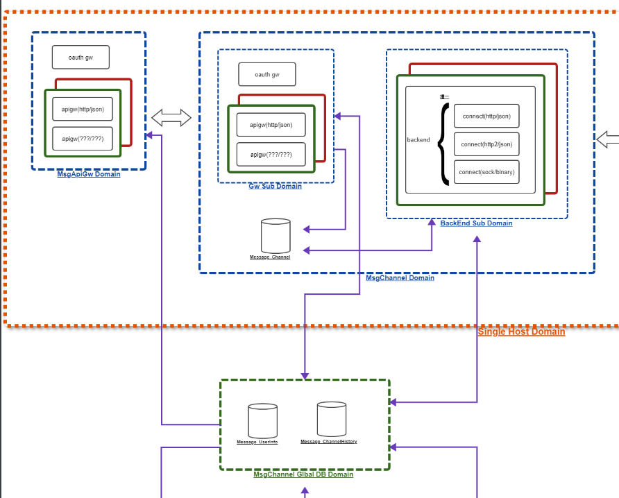

# MMS_美商怡佳_宵禁邏輯

## MMS流程圖
.png)
### Common (引用的專案)
https://gitlab01.mitake.com.tw/SMS/message/common
### Client端

* https://gitlab01.mitake.com.tw/SMS/message/apigw
* https://gitlab01.mitake.com.tw/SMS/message/server-backend
### 中心端

* https://gitlab01.mitake.com.tw/SMS/message/server-gw
* MsgServer-gw-mms-common
* MsgServer-gw-mms-json-master (Main)
* MsgServer-gw-oauth

## DB 
* Message_Channel
  * 帶有ApiDeliver都是由api發送的
  * Web發送的會到 MMSDeliverTemp(文字資料)、MMSDeliverAttachTemp (附件)
  * 發送完會執行sp Sp_MMS_ApiDeliverDataSelect、Sp_MMS_DeliverDataResendSelect、Sp_MMS_DeliverDataSelect 將資料join到最終結果
  * 最終結果都會存到 MMSDeliver、MMSAttachments


## 美商怡佳(Darphin)宵禁開發、測試方式
### 開發需求(已完成)
```
新增只針對部門為「C10880」及「美商怡佳」處理宵禁邏輯，

預計改法是在xml設定多一個bean，Processor部分也要一支新的，未來想移除比較方便，Send跟reSedn都需要增加此邏輯，

宵禁邏輯基本上參考VerifyDataProssor，

但俊宏說這有一個BUG，也麻煩修復正確，若OrderTime有中宵禁而往後延，ExpireTime應該也要往後延，

另外，多預留flag來控制是否要執行這段邏輯，我希望可以從DB資料表去update就能開關邏輯，

需求上有任何問題，都提出來討論，需求確認清楚後再開始調整，

P.S. 有改到的porject，都new一個新的branch
```
### 測試方式、流程
* 參考文件: ( API文件/MitakeMMS_API_v1.18.pdf )
* 注意: 本次測試只有測試 API -> Client ( 沒有測試中心端，如果需要請抓取 [中心端] 標題的專案 )
1. 需啟動兩個 Main (包含調整)
   1. MsgApigw-main (API)  (Conf token 時間條長一點)
   2. MsgChannel-main (Client) (Conf 調整如下:)   
```
### jetty settings
jetty.service.listener=127.0.0.1:9999
# curfew settings
channel.backend.curfew.switch = true
### File Server Settings
channel.gw.fileServer.path = C:\\Users\\arno\\Pictures\\
channel.backend.fileServer.path = C:\\Users\\arno\\Pictures\\
```
*
    3. channel-connect-mms.xml (補上這段) ，HttpApiClient 會檢查 [發送GroupID與設定不相符]
```
<entry key="MMS">
    <map>
        <entry key="clientID" value="miutest1" />
        <entry key="clientSecret" value="MTIzNDU=" />
    </map>
</entry>
```    
2. 檢查 .34 DB (Message_UserInfo) 
   1. UserMain 找發送的帳號，調整 UserCategory (改[美商怡佳])
3. 發送前先取得 accessToken
4. 發送後確認位置
   * .34 DB (Message_Channel)
     1. MMSDeliverWork (會有資料)
     2. MMSDeliverHistory (會有資料)
     3. 都要確認 OrderTime、ExpireTime 如果符合宵禁，時間會與發送時間不同