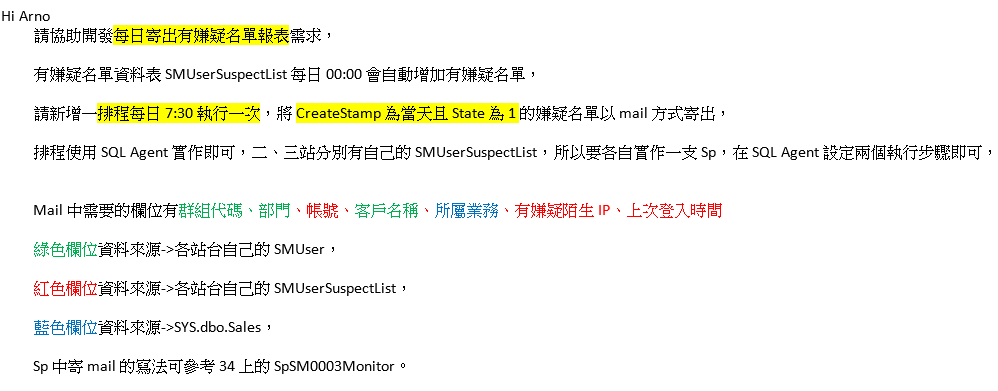

# SQL Agent (SQL排程)

## 2024/08/05 每日寄出有嫌疑名單報表需求
* ### D:\工作事項\20240805_每日寄出有嫌疑名單報表需求
* 需求如下:
> 
* 測試用sql如下:
```
-- 開發為二、三站DB
USE [SMSDB] -- 自行替換
--帳號、有嫌疑陌生IP、上次登入時間
SELECT * FROM dbo.SMUserSuspectList WITH(NOLOCK)
--群組代碼、部門、客戶名稱
SELECT * FROM dbo.SMUser WITH(NOLOCK) where UserName = 'jackliutest'
SELECT * FROM dbo.SMUser2 WITH(NOLOCK) where UserName = 'jackliutest'
--所屬業務
SELECT * FROM SYS.dbo.Sales A WITH(NOLOCK)
join SMSDB.dbo.SMUser2 B WITH(NOLOCK) ON A.EmpNo = B.SalesPerson

--假資料(未刪除)
--update SMSDB.dbo.SMUser2 set SalesPerson = 99999 where UserName = 'jackliutest'
--insert into SYS.dbo.Sales (EmpNo, EmpDept, EmpName) values (99999, 99999, 'jackliutest')

--創建暫存表(測試用)
CREATE TABLE #TEST (
    CreateStamp DATETIME
);
--寫入假數據
INSERT INTO #TEST (CreateStamp)
VALUES 
    ('2024-01-01 10:00:00'),
    ('2024-01-02 11:00:00'),
    ('2024-01-02 15:00:00'),
    ('20ㄒ24-08-05 00:00:00'),
    ('2024-08-05 23:59:59'),
    ('2024-08-05 12:00:00');
--宣告變數
Declare @startTime19 char(19), @endTime19 char(19)
--取當天日期
select @startTime19=CONVERT(CHAR(10), GETDATE(), 120) +' 00:00:00',@endTime19=CONVERT(CHAR(10), GETDATE(), 120) +' 23:59:59'
--查詢結果
SELECT * FROM #TEST WITH(NOLOCK) 
WHERE CreateStamp between @startTime19 AND @endTime19
--?除暫存表
--DROP TABLE #TEST;
--查看DB系統的mail帳號
select * FROM msdb.dbo.sysmail_profile with(nolock)
select * FROM msdb.dbo.sysmail_profileaccount with(nolock)
SELECT * FROM msdb.dbo.sysmail_mailitems with(nolock)
exec msdb.dbo.sysmail_help_account_sp
exec msdb.dbo.sysmail_help_profile_sp
--執行發送mail
exec msdb.dbo.sp_send_dbmail 
					@profile_name	= 'mo',--發送者
					@from_address = 'service@mitake.com.tw',
					@recipients = 'arno@mitake.com.tw;miumiu@mitake.com.tw', --收件者
					@subject = '【二站每日寄出有嫌疑名單報表】',  
					@body = @tablehtml,  
					@body_format = 'html'; 		
--查看mail發送狀態
SELECT * FROM msdb.dbo.sysmail_allitems
--查看發送結果訊息
SELECT * FROM msdb.dbo.sysmail_event_log;
```

