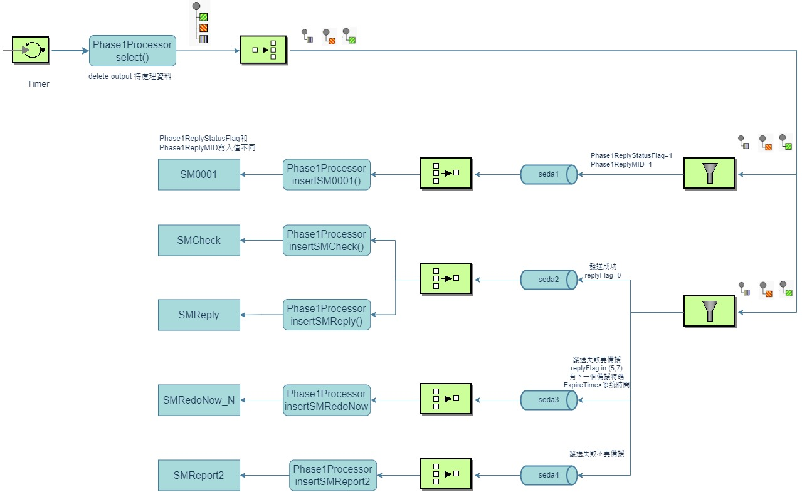
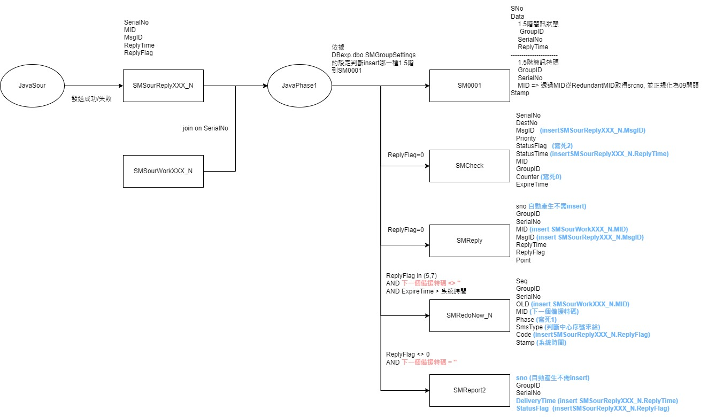
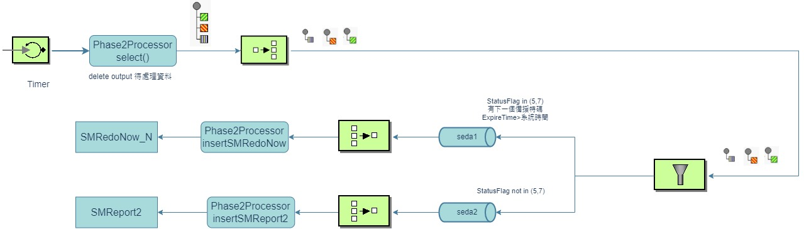
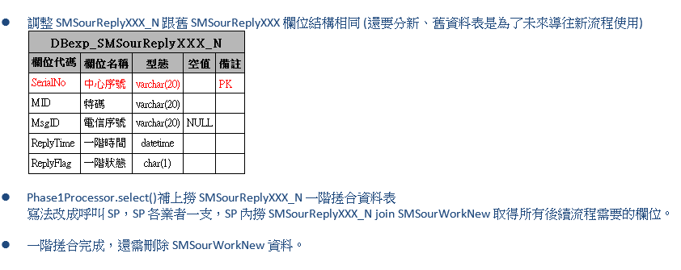

#  java改寫中心一、二階備援流程

## 流程圖
### 一階
.png).jpg)
### 二階


## 開發內容
```
Dear 俊宏
1.	Route InsertSM0001 filter條件要改成 or
2.	Route ChoiceRoute 第二個 when條件評估加上是否有下一個備援特碼和ExpireTime大於系統時間

Dear Arno
請協助開發一階搓合程式

1.	Phase1Processor.select()補上撈SMSourReplyXXX_N一階搓合資料表
      各業者會有自己的一階搓合資料表，XXX可能為CHT、FET及TWM
2.	Phase1Processor.insertSM0001()補上寫入SM0001
      	Phase1ReplyStatusFlag=1需在1.5階回報簡訊狀態
      	Phase1ReplyMID=1需在1.5階回報簡訊特碼
      	Phase1ReplyStatusFlag和Phase1ReplyMID都為1，簡訊狀態及簡訊特碼兩個都需要回報
      	Phase1ReplyStatusFlag和Phase1ReplyMID設定從SMGroupSettings來
      	未設定的不用回報1.5階
3.	Phase1Processor. insertSMCheck ()補上寫入SMCheck
4.	Phase1Processor. insertSMReply ()補上寫入SMReply
5.	Phase1Processor. insertSMRedoNow ()補上寫入SMRedoNow_N
6.	Phase1Processor. insertSMReport2 ()補上寫入SMReport2
```

[Table Schema參考文件](https://drive.mitake.com.tw/oo/r/x9EPINhvTVY7sfK7Rjv6heRyTBuae4El#tid=4)

參考舊流程 sp_match_sr
中華長訓流程 sp_smsourreply_cht

## sp_match_sr
* 第一階段送出回報搓合

## 紀錄一下 (DB存放資料)
* SM0001 -> 單筆
* SMCheck -> 單筆
* SMReply -> 單筆
* SMRedoNow -> 分則
* SMReport2 -> 單筆

## 開發流程(有調整)
* 一階取資料，因中華簡訊數量為分則，預計會拆3個main 
* 台哥、遠傳 流程一樣
* 中華流程不同，待確認

```
/**
     * 多則ReplyFlag轉為一筆ReplyFlag規則如下:
     * ReplyFlag(則)	0	5	6	7
     *              0	0	5	6	7
     *              5	5	5	6	7
     *              6	6	6	6	6
     *              7	7	7	6	7
     * @param exchange
     * @throws Exception
     */
	@SuppressWarnings("unchecked")
	public void concatenatedSMLONG(Exchange exchange) throws Exception {
        Phase1Model oldModel = null;
        List<Phase1Model> groupList = null;
        
		// 分群成筆和則
		List<Phase1Model> phase1Models = exchange.getIn().getBody(List.class);

        for (Phase1Model newModel : phase1Models) {
            if(groupList == null) {
                groupList = new ArrayList<>();
                groupList.add(newModel);
            }            
            //找相同序號
            oldModel  = groupList.stream()
                    .filter(m -> newModel.getSerialNo().equals(m.getSerialNo()))
                    .findFirst()
                    .orElse(null);

            if(oldModel == null) {
                groupList.add(newModel);
            } else {
                swapPhase1Model(oldModel, newModel);
            }
        }
		exchange.getIn().setBody(groupList);
	}

    private void swapPhase1Model(Phase1Model oldModel, Phase1Model newModel) {
        Phase1Model model = oldModel;
        String replyFlag = null;
        if(oldModel.getReplyFlag().equals("6") || newModel.getReplyFlag().equals("6")) {
            replyFlag = "6";
        } else {
            replyFlag = oldModel.getReplyFlag().compareTo(newModel.getReplyFlag()) >= 0
                    ? oldModel.getReplyFlag()
                    : newModel.getReplyFlag();
        }
        if (newModel.getReplyDT().compareTo(oldModel.getReplyDT()) > 0) {
            model = newModel;
        }
        model.setReplyFlag(replyFlag);
    }
```