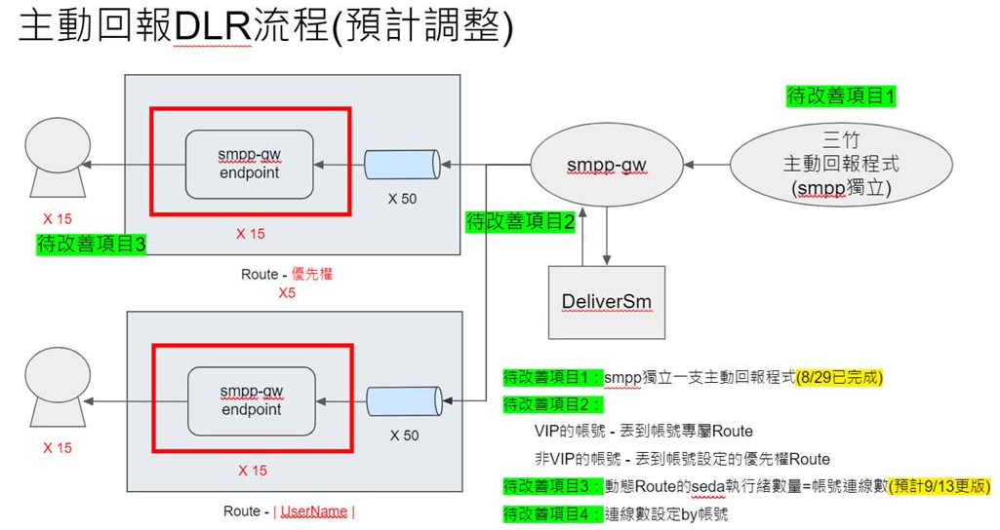

# 紀錄工作日誌

## 2023/03/01 入職

### 2023 3~4月

#### [永豐銀行]分流平台簡訊API開發作業
**開發永豐 Gateway 回覆簡訊回覆內容 (MO)，參考 draw.io (永豐主動回報系統流程)**

##### 程式作用
此程式負責接收並處理永豐銀行 Gateway 簡訊 API 的 MO（Mobile Originated）回報，當用戶回覆簡訊時，系統能正確接收、記錄並觸發後續處理。

##### 主要功能
- **接收簡訊回覆 (MO)**：從簡訊業者接收用戶回覆的簡訊內容。
- **記錄與監控**：將回覆內容記錄至系統日誌，以便後續分析。
- **業務邏輯處理**：根據回覆內容觸發相應的處理，例如交易確認。
- **資料存儲與通知**：可將回覆存入資料庫，或透過事件驅動方式通知其他系統。

##### API 設計簡介
- **Endpoint**: `POST /sms/mo`
- **請求參數**：來源手機號碼、回覆簡訊內容、回覆時間等。
- **處理流程**：接收 MO 簡訊 → 記錄日誌 → 觸發後續處理（如確認交易）。

#### 三竹簡訊API簡訊點數顯示
**此功能用於計算國內/國際簡訊的點數消耗，並顯示當前扣款額度，以便用戶掌握簡訊發送成本。**

##### 程式邏輯說明
1. **判斷簡訊區域 (國內/國外)**
    - **國內簡訊**：電話號碼以 `0` 或 `886` 開頭，計費 `1` 點/則。
    - **國際簡訊**：其他國碼，計費 `3` 點/則。

2. **計算簡訊點數**
    - **包含中文 (UTF-8 編碼，字元數與 byte 長度不同)**
        - `70` 字以內：`1` 則簡訊 `1` 點。
        - 超過 `70` 字：每 `67` 字計 `1` 則，多出部分再加 `1` 則。
    - **純英文或數字 (ASCII 編碼)**
        - `160` 字以內：`1` 則簡訊 `1` 點。
        - 超過 `160` 字：每 `153` 字計 `1` 則，多出部分再加 `1` 則。

3. **回傳計算結果**
    - **總點數 = (簡訊則數) × (區域費率)**

```java
/**
 * 計算簡訊點數
 *
 * @param mobileNo 手機號碼
 * @param message 簡訊內容
 * @return 計算後的點數
 * @throws Exception 可能拋出的異常
 */
public int smsCount(String mobileNo, String message) throws Exception {
    int area = 0;
    int smsCount = 0;
    // 判斷電話號碼, 0 開頭 1 元 (國內), 或 886 開頭 3 元 (國外)
    if (mobileNo.length() > 3) {
        if (mobileNo.charAt(0) == '0' || "886".equals(mobileNo.substring(0, 3))) {
            area = 1;
        } else {
            area = 3;
        }
    } else {
        area = 1;
    }

    if (message != null && !message.isEmpty()) {
        message = message.trim();
        // 內容是否包含中文
        if (message.getBytes("UTF-8").length != message.length()) {
            smsCount = (message.length() > 70) ? (message.length() / 67) + ((message.length() % 67 > 0) ? 1 : 0) : 1;
        } else {
            smsCount = (message.length() > 160) ? (message.length() / 153) + ((message.length() % 153 > 0) ? 1 : 0) : 1;
        }
    }
    return area * smsCount;
}
```

---

#### [國泰世華]雙向簡訊即時回覆程式開發作業
**開發國泰世華雙向簡訊即時回覆功能，確保用戶回覆簡訊能即時處理與記錄，參考 draw.io (國泰 MO 主動回報)**

##### 程式作用
本程式負責處理國泰世華銀行的雙向簡訊回覆機制，確保回覆內容能即時接收並觸發相關業務邏輯。

##### 主要功能
- **即時接收 MO 簡訊**：確保簡訊回覆內容能夠即時進入系統。
- **記錄回覆內容**：將回覆資訊儲存到資料庫，供後續分析與追蹤。
- **觸發相關業務邏輯**：根據簡訊回覆內容執行相對應的處理邏輯。
- **通知系統內部相關模組**：透過事件驅動機制，確保相關模組能即時獲取回覆資訊。

##### API 設計簡介
- **Endpoint**: `POST /sms/reply`
- **請求參數**：來源手機號碼、回覆內容、回覆時間等。
- **處理流程**：接收回覆 → 記錄回覆 → 觸發對應業務邏輯 → 通知內部系統。

---

### 2023 5月

#### 同步ERP客戶及發票相關資料
**定時下載資料並同步DB資料，參考 draw.io(同步ERP客戶及發票相關資料)，ERP: 企業資源計劃**

**做法**：使用 FTPS 協議定時每分鐘撈取資料，下載至本地後，解析檔案並將資料同步寫入資料庫（DB）。

**流程**：
1. 設置定時任務，每分鐘從FTP伺服器下載ERP客戶和發票資料。
2. 解析下載的檔案，提取必要的客戶及發票資料。
3. 將資料寫入到資料庫，實現數據的即時更新和同步。

---

### 2023 9月

#### 整合新舊企業公版API相容性調整
**根據舊版框架電文與新版差異，統一整合至新版API，確保相容性，減少影響。**

**做法**：
1. **分析電文結構差異**：對比舊版與新版 API 的請求與回應格式，找出不兼容的部分。
2. **設計相容層**：開發中介層或轉換邏輯，使舊版電文可適配新版 API。
3. **修改 API 行為**：根據需求調整新版 API，使其能兼容舊版邏輯，確保業務流程不受影響。
4. **測試與驗證**：進行回歸測試，確保所有舊版電文能正確通過新版 API 處理。

**流程**：
1. **收集舊版 API 使用情境**，確保涵蓋所有業務場景。
2. **實施轉換邏輯**，讓新版 API 可處理舊版請求，並保持回應格式一致。
3. **進行整合測試**，確保新舊系統可順利運作，無法區分新舊客戶的使用體驗。
4. **正式部署**，監控日誌與錯誤回報，確保穩定運行。  

---

### 2023 10月

#### smpp-gw DLR流程優化
**主動回報DLR，參考 draw.io(Smpp-gw(dlr 流程)**
1. 根據VIP表的優先順序回報DLR，確保重要的回報優先處理。
2. 每次接收到DLR報告後，根據VIP表進行比對並確定是否需要處理或更新。
3. 確保VIP表的更新頻率適當，避免延遲過久影響回報準確性。
4. 在報告處理過程中，檢查是否有異常或錯誤，及時進行錯誤處理和回報。
5. 若遇到無法即時處理的情況，將其排入待處理隊列，並設置適當的重試機制。
6. 定期檢視並優化DLR處理流程，確保性能和穩定性達到最佳狀態。
* 

---
### 2023 12月

**CamelF2S系統**
# 系統簡介
這是一個簡訊處理平台，主要負責簡訊的接收、驗證、處理和發送。系統通過 Apache Camel 框架構建，提供高效的簡訊處理流程，並包含異常處理和性能監控機制，確保簡訊發送的合法性、安全性和穩定性。
## 主要功能
1. **簡訊驗證**
    - 檢查簡訊是否合法，避免來自黑名單的簡訊或重複發送的情況。
2. **過濾關鍵字與檢查白名單**
    - 檢查簡訊中是否包含敏感關鍵字，並確保簡訊來自合法的客戶群組（如白名單）。
3. **異常處理**
    - 當處理過程中發生錯誤時，系統會進行異常捕獲，並根據設定進行錯誤處理或重試。
4. **日誌記錄**
    - 系統會記錄每一步處理過程中的詳細日誌，便於後期追蹤和問題排查。
## 系統架構
### 使用 Apache Camel 進行路由設計
- **Camel 路由**：每個處理步驟被設計為一個 `Processor`，通過 Camel 路由進行連接。
- **並發處理**：使用 `seda` 協議來實現消息隊列和並發處理。
- **錯誤處理**：每個處理步驟都可以捕獲異常並進行後續處理，例如重試或將錯誤信息發送到錯誤處理路由。
### 處理流程
1. **初始化處理**：
    - 進行簡訊參數的校正和檢查。
2. **黑名單檢查**：
    - 檢查簡訊中的手機號碼是否在黑名單中。
3. **重複發送檢查**：
    - 檢查是否存在客戶端重複發送相同簡訊的情況。
4. **敏感字過濾**：
    - 檢查簡訊內容是否包含敏感字或非法字符。
5. **時間檢查與國際簡訊防範**：
    - 根據不同的規則來檢查簡訊的有效期和國際簡訊發送的限制。
6. **錯誤處理與異常捕獲**：
    - 如果任何步驟出現異常，系統會自動進行錯誤處理，並將錯誤信息記錄到日誌中。
### 性能監控
- **計算處理時間**：每個步驟的處理時間都會被記錄並監控。如果某個步驟處理過長，系統會觸發警報以便進行優化。
- **日誌級別**：根據處理時間的長短，系統會分別記錄 `INFO` 或 `ERROR` 級別的日誌，幫助監控和優化系統性能。
## 總結
這個系統通過 **Apache Camel** 來處理簡訊的發送、驗證和過濾。每個處理步驟都經過精心設計，並且包含了錯誤處理和性能監控機制。這樣的架構不僅提高了簡訊處理的效率，還確保了簡訊的合法性和安全性，並且可以隨時根據需要進行調整和優化。

---

### 2024 1~3月

**網頁發送大量長訊影響長訊API效能 & 各業者交換資料**
## 背景
在過去的實現中，使用舊版的方式進行批量插入資料（batch insert），這種方式在處理大量數據時，會導致效能瓶頸，甚至出現資料卡住的情況。為了解決這個問題，我們進行了優化調整，改用 **Table-Valued Parameter (TVP)** 的方式來提升效能，並針對此進行效能測試。
原本的批量插入方式（batch insert）會在發送大量簡訊時影響長訊 API 的效能，並且造成資料處理延遲。具體表現為資料插入時，系統無法快速處理大量的簡訊發送請求，導致資料卡住或長時間無回應。
### 問題分析
- **舊版方式：** 批量插入時，每次發送都需要經過多次 round-trip，這樣會導致性能不佳。
- **影響範圍：** 當請求數量增加時，效能問題愈加明顯，特別是在資料處理和發送過程中。
### 解決方案
**優化方法：** 使用 **Table-Valued Parameter (TVP)** 進行批量資料處理。
- **TVP 的優點：** 可以將大量數據以表格形式一次性傳遞給存儲過程，避免多次呼叫存儲過程，從而提高效率。
- **效能提升：** 通過 TVP 優化後，數據處理和插入效率有顯著提升，避免了資料卡住的情況，處理速度大幅提高。
### TVP 實現
1. **創建 Table Type**
    ```sql
    CREATE TYPE dbo.MyTableType AS TABLE
    (
        ID INT,
        Name NVARCHAR(50),
        Age INT
    );
    ```
2. **創建存儲過程並使用 TVP 參數**
    ```sql
    CREATE PROCEDURE dbo.ProcessTableValuedParameter
        @MyTable dbo.MyTableType READONLY
    AS
    BEGIN
        -- 處理傳入的 TVP
        SELECT * FROM @MyTable;

        -- 批量插入數據
        INSERT INTO dbo.YourTable (ID, Name, Age)
        SELECT ID, Name, Age
        FROM @MyTable;
    END;
    ```
3. **客戶端傳遞 TVP**
    ```sql
    DECLARE @MyTable dbo.MyTableType;

    INSERT INTO @MyTable (ID, Name, Age)
    VALUES (1, 'John Doe', 30),
           (2, 'Jane Smith', 25);

    EXEC dbo.ProcessTableValuedParameter @MyTable;
    ```
### 優化結果
- **效能提升：** 通過 TVP 方式，批量插入的效能大幅提升，避免了舊版方式的瓶頸。
- **穩定性提高：** 優化後系統能夠處理更多的請求，資料卡住的問題得到有效解決。
## 結論
使用 **TVP** 的方式優化了長訊 API 的效能，使得大量資料處理能夠在較短時間內完成，並且避免了資料處理過程中的卡住問題。後續會繼續進行效能測試，確保系統能夠在更大規模下穩定運行。

### 2024 5月

**批次處理系統**

#### 1. 移除SQL Server Agent / Windows Service
- 原本依賴 SQL Server Agent 或 Windows Service 進行的批次任務，改由 Java 排程管理，降低對特定平台的依賴。

#### 2. Java 排程實作
- 透過 Java 排程機制（`ScheduledExecutorService`、Spring `@Scheduled` 或 Quartz）執行定時任務。
- 確保任務的可維護性、擴展性，提高執行效率。

#### 3. 整合數據處理
- 透過 Java 直接與 SQL Server 連接，執行批次任務，如資料同步、清理、統計等。
- 搭配多線程或批次處理技術（如 JDBC 批量更新）來提升效能。

#### 4. 錯誤處理與監控
- 增加錯誤回報機制，確保異常發生時能快速處理。
- 記錄日誌並提供通知機制，例如 Email、Webhook 或整合監控系統（如 Prometheus + Grafana）。

#### 5. 優化與擴展
- 確保系統未來可擴展，能根據業務需求靈活調整批次邏輯與執行頻率。
- 若有高併發需求，考慮使用分散式任務調度（如 Apache Camel、Spring Batch、Quartz 集群模式）。

---

### 2024 9月

**中信主動回報JAVA版**
- **舊版系統：** 使用 Delphi 開發，處理效率較低，維護困難。
- **目標：** 重構系統，將原本的 Delphi 程式轉為 Java 版本，以提升效能、可擴展性及維護性。
### 解決方案
1. **系統重構：** 將舊版 Delphi 程式的邏輯轉換為 Java 系統，重購新的 JAVA 系統架構。
2. **技術選擇：** 使用 Java 的最新技術來優化效能，改進系統可維護性，並提升穩定性。
### 優化重點
- **效能提升：** Java 版本可以更好地處理高並發請求，優化了系統的執行效率。
- **可維護性：** 使用現代化的 Java 開發框架，減少了 Delphi 舊版程式的維護成本。
- **擴展性：** 新系統更容易進行功能擴展和集成其他模組。
### 結果
- 成功將舊版 Delphi 系統重構為 Java 系統。
- 系統效能穩定，能處理更多並發請求，提升了運行效率。
- 提高了維護性，未來能夠更靈活地進行功能擴展。
## 結論
透過重構為 Java 版本，系統效能得到顯著提升，維護性和擴展性也獲得了改善。

---
### 2024 10月

**研究Caffeine 記憶體限制大小**
為了測試 Caffeine 緩存的記憶體使用量，根據不同的 JDK 版本、Pattern 數量及 Domain 數量進行了測試。測試的主要目的是了解不同配置下的記憶體使用情況，並優化系統的效能。

### 測試結果

| NO | JDK版本 | Pattern數量 | Domain數量 | 記憶體使用量 (平均值)     | 備註                               |
|----|---------|-------------|------------|--------------------------|------------------------------------|
| 1  | JDK8    | 100         | 200        | 11 MB                    | Pattern為256中文字, Domain長度30   |
| 2  | JDK8    | 100         | 200        | 14 MB                    | Pattern為512隨機英數字, Domain長度30 |
| 3  | JDK8    | 200         | 400        | 11 MB                    | Pattern為256中文字, Domain長度30   |
| 4  | JDK8    | 200         | 400        | 16 MB                    | Pattern為512隨機英數字, Domain長度30 |
| 5  | JDK8    | 1000        | 2000       | 11 MB                    | Pattern為256中文字, Domain長度30   |
| 6  | JDK8    | 1000        | 2000       | 38 MB                    | Pattern為512隨機英數字, Domain長度30 |
| 7  | JDK11   | 100         | 200        | 2 MB                     | Pattern為256中文字, Domain長度30   |
| 8  | JDK11   | 100         | 200        | 1 MB                     | Pattern為512隨機英數字, Domain長度30 |
| 9  | JDK11   | 200         | 400        | 2 MB                     | Pattern為256中文字, Domain長度30   |
| 10 | JDK11   | 200         | 400        | 1 MB                     | Pattern為512隨機英數字, Domain長度30 |
| 11 | JDK11   | 1000        | 2000       | 1 MB                     | Pattern為256中文字, Domain長度30   |
| 12 | JDK11   | 1000        | 2000       | 2 MB                     | Pattern為512隨機英數字, Domain長度30 |

### 結論

- **JDK8**: 記憶體使用量相對較高，尤其是在處理大量 `Pattern` 和 `Domain` 時，記憶體使用量可達 38 MB。
- **JDK11**: 記憶體使用量大幅降低，無論是處理 100 或 1000 的 `Pattern` 和 `Domain`，記憶體使用量基本保持在 1 MB 到 2 MB 之間。
- **Pattern**: 以 `512 隨機英數字` 作為 Pattern 時，JDK8 的記憶體消耗顯著高於 JDK11。

這些測試結果顯示，JDK11 在 Caffeine 緩存的記憶體使用上有顯著優勢。對於大量資料的處理，JDK11 更適合用於優化記憶體使用。
