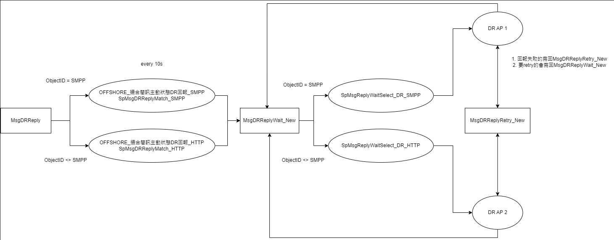

# 國外客戶GW_DR優化流

## 測試目的

> Dear Arno
> 
> 幫忙測試國外客戶GW DR主動回報程式，程式簡易流程圖請參考附件，
> 測試DB使用36的OFFSHORE_N，DB帳號使用舜基同步完的OFFSHORE。
> 要列測試案例。
> 
> OFFSHORE(角色)會用到的 table 權限，要記錄
> 
> git@gitlab01.mitake.com.tw:SMS/gw/camel_pushclient_replier.git
> branch:offshore

## 測試方式
### Step1. 啟動 MitakeApi，DB 設定如下:
> db.ip = 10.99.0.36
> 
> db.port = 1433
> 
> db.user = OFFSHORE
> 
> db.num = MTIzNDU
> 
> db.dbname = OFFSHORE_N
### Step2. 啟動 GeneralChannel，需調整群組、DB、群組設定如下:
* (因為在開發環境啟動 gw  不會 final statusflag) 只能手動搓合狀態
> app.global.groupId = ARNO
> 
> DB 參照第一點
> 
>  gw.connector.loc1.groupId = ARNO
> 
>  gw.connector.loc1.userName = ARNO_GW
> 
>  gw.connector.loc1.groupNum = NDMxNjQ5MDkyOQ
> 
>  gw.connector.loc1.addrinfo1.ip = 10.99.0.34
> 
>  gw.connector.loc1.addrinfo1.port = 5004
### Step3. 啟動 Camel_PushClient_Replier 的 DR_Main
### Step4. 確認特碼對應的業者指令如下:
```
-- 查看群組
--SELECT * FROM DBexp.dbo.SMUser WITH(NOLOCK) WHERE GroupID ='ARNO'

-- 查看群組Route
--SELECT * FROM DBexp.dbo.SMGroupRoute WITH(NOLOCK) WHERE GroupID ='ARNO'

-- 查看 Route 對應的特碼
SELECT * FROM DBexp.dbo.SMRoute WITH(NOLOCK) WHERE Route ='B2CMix_GN'AND MobileNo LIKE '852%'

--需要新增群組在這設定內，CamelF2S會建立Route
--SELECT * FROM DBexp.dbo.CamelF2SGroupIDConfig WITH(NOLOCK)

--找對應的 PartKey 確認是哪台業者可以到.36上面看，如果沒有對應可調整
SELECT * FROM DBexp.dbo.MidSMSourConfig WITH(NOLOCK) WHERE Mid IN ('TW821','10694','18329')

--確認業者端有無回傳資訊
SELECT * FROM DBexp.dbo.ARNO WITH(NOLOCK)
```
### Step5. 發送簡訊測試:
> http://localhost:7313/SmSend?username=arno&password=12345&dstaddr=85236690084&smbody=test_20240620_4&response=http://127.0.0.1:7777/callbackurl
### Step6. 確認DB.MsgInfo有無資料
```
--先下指令查看
SELECT * FROM OFFSHORE_N.dbo.MsgInfo WITH(NOLOCK) order by SerialNo desc

--如果有資料，按照Step2.的說明手動final狀態
update OFFSHORE_N.dbo.MsgInfo set StatusFlag = '4' where SerialNo = 'A0000000016' AND UserName = 'arno'

--會用到的table
SELECT * FROM OFFSHORE_N.dbo.MsgInfo WITH(NOLOCK) order by SerialNo desc
SELECT * FROM OFFSHORE_N.dbo.MsgDRReply WITH(NOLOCK)
SELECT * FROM OFFSHORE_N.dbo.MsgDRReplyWait_New WITH(NOLOCK)
SELECT * FROM OFFSHORE_N.dbo.MsgDRReplyRetry_New WITH(NOLOCK)
SELECT * FROM OFFSHORE_N.dbo.MsgReply WITH(NOLOCK)
SELECT * FROM OFFSHORE_N.dbo.MsgSourNew WITH(NOLOCK)
```
### Step7. Response url 回覆
> 目前自己寫在 MyProject CamelExample 作為接收端模擬回覆狀態

> Table 流程，GW端 final 的狀態會有 SP0001來處理(SQL Agent)
> 
> MsgSourRoute -> MsgSour -> MsgSourWork -> MsgInfo

## 流程圖


## Table
> OFFSHORE_N.dbo.MsgDRReply -> 資料來源 dbo.MsgInfo(trigger)，SourceType='A'
> OFFSHORE_N.dbo.MsgDRReplyWait_New
> OFFSHORE_N.dbo.MsgDRReplyRetry_New

## SP 
> SpMsgDRReplyMatch_HTTP (撮合SMPP第二階段回報) //SQL Server Agent 排程 (OFFSHORE_N_撮合簡訊主動狀態DR回報_HTTP)
> ```
> 檢查 dbo.MsgDRReply ObjectID <> 'SMPP' 
> 匯入 MsgReplyWait_New
> 刪除 MsgReply
> ``` 
> SpMsgDRReplyMatch_SMPP (撮合SMPP第二階段回報) //SQL Server Agent 排程 (OFFSHORE_N_撮合簡訊主動狀態DR回報_SMPP)
> ```
> 檢查 dbo.MsgDRReply ObjectID = 'SMPP' 
> 匯入 MsgReplyWait_New
> 刪除 MsgReply
> ```
> SpMsgReplyWaitSelect_DR_HTTP
> ```
> 檢查 dbo.MsgDRReplyWait_New ObjectID <> 'SMPP'
> DELETE OUTPUT
> ```
> SpMsgReplyWaitSelect_DR_SMPP
> ```
> 檢查 dbo.MsgDRReplyWait_New ObjectID = 'SMPP'
> DELETE OUTPUT
> ```
