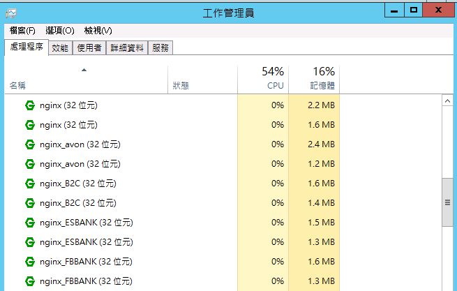
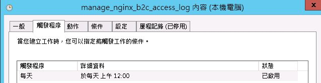

# nginx建置流程以及說明

## [專案架構說明]
* nginx_server：線上Nginx Server的conf檔、SSL pem檔、雙向SSL pem檔、bat檔。
    * 相關服務，可參閱 nginx.zip 裡面的conf檔
* origin_cer：有使用SSL雙向驗證的客戶，原始憑證檔
    * aexp ：美國運通雙向SSL驗證憑證檔
    * avon ：雅芳雙向SSL驗證憑證檔
    * tmnewa：新安東京海上雙向SSL驗證憑證檔

##　[線上配置環境說明]
* Nginx版本：1.12.1 ( windows版 )
* 程式位置：一般在 C:/nginx_server 下面
* 線上環境
    * 士林：192.168.2.95, 192.168.2.96
    * 三重：192.168.131.1, 192.168.131.2

## [如何建置 Nginx Server]
* 先複製全新 Nginx 1.12.1版本至新專案目錄，例如：【C:/nginx_server/nginx-1.12.1-NewServer】
* 調整執行檔名稱，例如：【 nginx_NewServer.exe】，方便在工作管理員區別是否已啟動
* 複製以下指令檔至專案目錄，並替換所有檔案內的執行檔名稱為【步驟 2】的新名稱
```
   start-nginx.bat：啟動 nginx server
   stop-nginx.bat：關閉 nginx server
   reload-nginx.bat：使得 nginx server 重新讀取 conf 設定
   reopen-nginx.bat：使得 nginx server 更換 log 檔案
   split_log.bat：分割 nginx 檔案，請參閱【檔案分割說明】。
```
* 更新 / 替換 conf 設定檔內容 ( conf目錄下的nginx.conf )
* 執行 start-nginx.bat，並確認以下事項
    * logs目錄下正常產生 nginx.pid
    * 查看logs/error.log，沒有錯誤訊息，且有顯示【signal process started】
    * 確認工作管理員是否有程式執行檔(如圖)
      
    * 使用語法：```【netstat -an | find "port名稱"】```，確認服務port已正確監聽

## [來源IP驗證說明]
* X-Forwarded-For表頭說明：
* 因為nginx進行反向代理時，被代理的伺服器端來源IP位置會變成nginx server主機所在的IP，而不是客戶端原始的來源IP，所以必須在nginx的location區塊，設定【X-Forwarded-For】表頭。
* 範例如下：
```
location / {	
	        default_type text/plain;
			proxy_pass http://xxx.com;
			proxy_redirect     off;
			proxy_http_version 1.1;
			proxy_set_header Connection "";
			proxy_set_header        Host            $host;
	        proxy_set_header        X-Real-IP       $remote_addr;
	        proxy_set_header        X-Forwarded-For $proxy_add_x_forwarded_for;		
       }
```
* NGINX SERVER 設定來源IP白名單：
* 但是如果被代理的伺服器，不會自動使用【X-Forwarded-For】表頭替換來源IP，但是又有必須驗證來源IP的必要時，則必須改為在 nginx server 手動設定來源IP白名單( 使用白名單記得最後必須加入deny all，使得不在名單內預設禁止訪問 )。
* 範例如下：
```
location / {	
	        default_type text/plain;
			allow 111.222.333.444;
			allow 111.222.333.555;
			allow 111.222.333.666;
			deny all;        
			proxy_pass http://xxx.com;	
       }
```
* 如果發現要驗證的來源IP過多的話，可以將所有的要驗證來源IP位置獨立為單一檔案如下：
```
allow 111.222.333.444;
allow 111.222.333.555;
allow 111.222.333.666;
```
* 在nginx 設定檔內，則可以改用include語法，匯入外部檔案：
```
	location / {	
	        default_type text/plain;
			include includes/allow-ips;
			deny all;        
			proxy_pass http://xxx.com;	
       }
```
* 目前線上有使用來源IP白名單設定的NGINX SERVER資訊如下
    * FBBANK富邦銀行 - Nginx Server ： includes/fbank-ips檔案內，有設定所有可以訪問的來源IP清單

## [檔案分割說明]
* 確認 nginx.conf設定檔，已調整檔案格式為gz壓縮檔，如下範例會設定
  * 檔案名稱：access.log.gz
  * gzip壓縮等級：5
  * 檔案會使用非同步方式寫入檔案( 32k緩衝已滿或是距離上次寫入滿1分鐘 )。
```
		conf範例： 
		access_log logs/access.log.gz main gzip=5 buffer=32k flush=1m;
```
* 確認  split_log.bat中，所有檔名前綴字與設定相符，如下圖綠色標記

* 建置備份資料夾【bak】於【logs】目錄下
* 執行  split_log.bat，確認bak目錄下是否有產生，當日的分割檔【 access.yyyy-mm-dd.log.gz 】
* 使用Administrator身份，建置【每日切檔系統排程】，排程設置為每天凌晨0點執行，執行cmd語法為【/c C:/nginx_server/XXX/split_log.bat -1】，
* 參數-1代表設定分割檔日期為前1日，如下圖範例。



* 排程建置完成後，可以手動執行，驗證是否可正確產生前日分割檔案。


## [雙向SSL驗證說明]
* 使用 NGINX SERVER 雙向SSL驗證，需要於 nginx.conf 加入以下參數，效果可以參考【~~NGINX 雙向SSL測試~~】(我沒有權限可以看)，

|參數名稱|說明|
|---|---|
|ssl_client_certificate|指定雙向憑證檔案位置，裡面可以包含多組雙向憑證|
|ssl_verify_client|驗證方式，可以是(on, off, optional, optional_no_ca)，參閱 [官網說明](https://nginx.org/en/docs/http/ngx_http_ssl_module.html#ssl_verify_client)|
|ssl_verify_depth|指定搜尋憑證鍊( certificates chain ) 的深度|

* 設定範例如下，表示使用檔案位置【ssl/mitake_server.pem】進行雙向驗證，指定搜尋憑證鍊深度為5層，且不強制雙向驗證，只有client端有要求雙向SSL認證時，才會進入雙向SSL驗證階段。
```
ssl_client_certificate ssl/mitake_server.pem;
	ssl_verify_client optional;
	ssl_verify_depth 5;
```
* 如果要在access.log內，記錄客戶請求的雙向驗證相關資訊的話，需要調整設定檔 log_format 如下，加入$ssl_client_verify、$ssl_client_i_dn、$ssl_client_raw_cert，可以在access.log添加憑證相關資訊
```
log_format main '$remote_addr - $remote_user [$time_local] "$request" $status $body_bytes_sent "$http_referer" "$http_user_agent" $http_x_forwarded_for | $ssl_client_verify | $ssl_client_i_dn';
```

* 目前線上有使用雙向SSL設定的NGINX SERVER資訊如下
  * B2C平台 - Nginx Server ： 憑證檔案內包含【美國運通】以及【新安東京海上】的雙向驗證憑證鍊。
  * AVON 雅芳 - Nginx Server：憑證檔案內包含【雅芳】的雙向驗證憑證鍊。

## [製作雙向SSL驗證憑證檔]
* nginx使用的雙向SSL驗證憑證檔案，需要使用PEM格式，通常依據以下兩種狀況產生檔案
  * 使用已經過第三方驗證的合格憑證 ：若是要掛載已經過第三方認證的憑證，可依照以下步驟產生
    * 檢視憑證檔案格式，若是cer可以直接改副檔名為pem， 其餘則需要轉換為PEM格式
    * 若有中繼憑證( 如下圖 )，必須將完整憑證鍊( ROOT、中繼 )，都放在檔案內
    
  * 使用自簽憑證 ：若是服務要掛載自己的SSL憑證，可依照以下步驟產生
    * 可使用【KeyStore Explorer】打開 .jks檔案
    
    * 在檢視憑證資訊頁面，選擇【PEM】並匯出檔案即可
    
  * 若是同一服務要掛載多組憑證 ：將上述PEM格式檔案，統一放置在相同檔案內即可，順序不限制