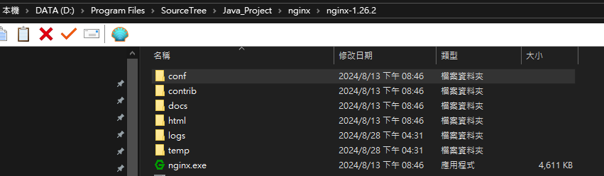
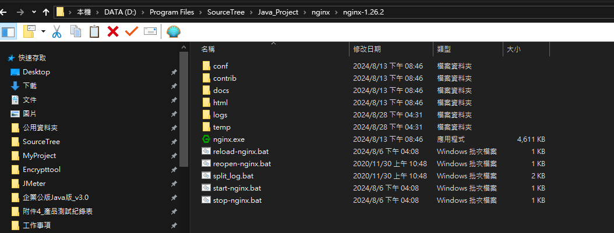

# Nginx(非同步框架的網頁伺服器)

## 連結
[Nginx](https://nginx.org/en/)
Mainline version (測試版本) 版號尾數是奇數
Stable version (此版本較為穩定) 版號尾數是偶數
* 安裝完解壓縮會如下圖: 

* 可以將 [bat](bat) 的腳本都加入進去

* 啟動後工具管理員可以查看到
* 也可以進到首頁確認啟動成功 -> http://localhost/
* 設定調整只有 nginx.conf 要改(以下標題有範例)
> ```
> 常用指令 
> 1. netstat -an | find "port" (查看執行續)
> 2. tasklist /fi "imagename eq nginx.exe" (查看 nginx 是否存在)
> 3. 以下指令請到 nginx 目錄底下執行
> 4. nginx -v (查看版本)
> 5. curl -I http://10.99.0.38:8002 (測試設定有無通)
> ```


### nginx.conf 範本
```
#user  nobody;
worker_processes  1;

#error_log  logs/error.log;
#error_log  logs/error.log  notice;
#error_log  logs/error.log  info;

#pid        logs/nginx.pid;


events {
    worker_connections  1024;
	multi_accept on;
}


http {
    include       mime.types;
    default_type  application/octet-stream;

	log_format main '$remote_addr:$remote_port - $remote_user [$time_local] "$request" $status $body_bytes_sent "$http_referer" "$http_user_agent" "$http_x_forwarded_for" | $ssl_protocol/$ssl_cipher';						
	
    access_log off;
    log_not_found off;
    sendfile        on;
    keepalive_timeout  60;

	#clinet content size settings
	client_header_buffer_size 8k;
	large_client_header_buffers 4 16k;
	client_body_buffer_size 1m;
	client_max_body_size 1m;
	client_body_in_single_buffer on;
	
	#gzip settings
    gzip               on;
    gzip_vary          on;
    gzip_comp_level    6;
    gzip_buffers       16 8k;
    gzip_min_length    1000;
    gzip_proxied       any;
    gzip_disable       "msie6";
    gzip_http_version  1.0;
    gzip_types         text/plain text/css application/json application/x-javascript text/xml application/xml application/xml+rss text/javascript application/javascript;
	
	map $time_iso8601 $logdate {
        #'~^(?<ymdh>\d{4}-\d{2}-\d{2}T\d{2})' $ymdh;
        '~^(?<ymd>\d{4}-\d{2}-\d{2})' $ymd;
        default 'date-not-found';
    }
	
	#隱藏nginx版號
	server_tokens off;
			
	upstream http_backend_citic {
		server 127.0.0.1:9088;
		keepalive 50;
	}
	
	upstream http_backend_idea {
		server 127.0.0.1:7311;
		keepalive 50;
	}
	
	upstream http_backend {
		server 127.0.0.1:7316;
		keepalive 50;
	}
	
	upstream http_queryDelivery_backend {
		server 127.0.0.1:7314;
		keepalive 10;
	}	

  	upstream https_qmsg_backend {
		server 10.99.0.34:7602;		
	}

    server {

		open_log_file_cache max=1000 inactive=20s valid=1m min_uses=2; 
		access_log logs/http_api_access-$logdate.log.gz main;
		
        listen       8002;
        server_name  localhost;
		
		location /idea/mtk/ {
			rewrite /idea/mtk/(.*) /$1 break;
			proxy_pass http://http_backend_idea;
			proxy_http_version 1.1;
			proxy_set_header Connection "";
			proxy_set_header        Host            $host;
            proxy_set_header        X-Real-IP       $remote_addr;
            proxy_set_header        X-Forwarded-For $proxy_add_x_forwarded_for;			
        }
		
		location /api/mtk/ {
			rewrite /api/mtk/(.*) /$1 break;
			proxy_pass http://http_backend;
			proxy_http_version 1.1;
			proxy_set_header Connection "";
			proxy_set_header        Host            $host;
            proxy_set_header        X-Real-IP       $remote_addr;
            proxy_set_header        X-Forwarded-For $proxy_add_x_forwarded_for;			
        }

        location /SpLmGet {
			proxy_pass http://http_backend/SmSend;
			proxy_http_version 1.1;
			proxy_set_header Connection "";
			proxy_set_header        Host            $host;
            proxy_set_header        X-Real-IP       $remote_addr;
            proxy_set_header        X-Forwarded-For $proxy_add_x_forwarded_for;			
        }

        location /SpLmPost {
			proxy_pass http://http_backend/SmBulkSend;
			proxy_http_version 1.1;
			proxy_set_header Connection "";
			proxy_set_header        Host            $host;
            proxy_set_header        X-Real-IP       $remote_addr;
            proxy_set_header        X-Forwarded-For $proxy_add_x_forwarded_for;			
        }		
		
        location /SmQueryGet.asp {
			proxy_pass http://http_backend/SmQuery;
			proxy_http_version 1.1;
			proxy_set_header Connection "";
			proxy_set_header        Host            $host;
            proxy_set_header        X-Real-IP       $remote_addr;
            proxy_set_header        X-Forwarded-For $proxy_add_x_forwarded_for;			
        }			
		
		location /SmCancel.asp {
			proxy_pass http://http_backend/SmCancel;
			proxy_http_version 1.1;
			proxy_set_header Connection "";
			proxy_set_header        Host            $host;
            proxy_set_header        X-Real-IP       $remote_addr;
            proxy_set_header        X-Forwarded-For $proxy_add_x_forwarded_for;			
        }	

		location /WebStatus {
			proxy_pass http://http_backend/WebStatus;
			proxy_http_version 1.1;
			proxy_set_header Connection "";
			proxy_set_header        Host            $host;
            proxy_set_header        X-Real-IP       $remote_addr;
            proxy_set_header        X-Forwarded-For $proxy_add_x_forwarded_for;			
        }		
		
        #error_page  404              /404.html;

        # redirect server error pages to the static page /50x.html
        #
        error_page   500 502 503 504  /50x.html;
        location = /50x.html {
            root   html;
        }
    }

    # HTTPS server
    
    server {
		
		open_log_file_cache max=1000 inactive=20s valid=1m min_uses=2; 
		access_log logs/https_api_access-$logdate.log.gz main;
	
        listen       8102 ssl;
        server_name  localhost;

        ssl_certificate      C:\\mitake_cert\\nginx\\2022_cert.pem;
        ssl_certificate_key  C:\\mitake_cert\\nginx\\2022_key.pem;

        ssl_session_cache    shared:SSL:20m;
        ssl_session_timeout  20m;

	ssl_protocols TLSv1 TLSv1.1 TLSv1.2;
	ssl_ciphers EECDH+ECDSA+AESGCM:EECDH+aRSA+AESGCM:EECDH+ECDSA+SHA512:EECDH+ECDSA+SHA384:EECDH+ECDSA+SHA256:ECDH+AESGCM:ECDH+AES256:DH+AESGCM:DH+AES256:RSA+AESGCM:HIGH:!aNULL:!eNULL:!RC4:!MD5:!EXP:!PSK:!SRP:!DSS;
        ssl_prefer_server_ciphers  on;
				
		location /citic {
			rewrite /citic/(.*) /$1 break;
			proxy_pass http://http_backend_citic;
			proxy_http_version 1.1;
			proxy_set_header Connection "";
			proxy_set_header        Host            $host;
            proxy_set_header        X-Real-IP       $remote_addr;
            proxy_set_header        X-Forwarded-For $proxy_add_x_forwarded_for;			
        }
		
		location /idea/mtk/ {
			rewrite /idea/mtk/(.*) /$1 break;
			proxy_pass http://http_backend_idea;
			proxy_http_version 1.1;
			proxy_set_header Connection "";
			proxy_set_header        Host            $host;
            proxy_set_header        X-Real-IP       $remote_addr;
            proxy_set_header        X-Forwarded-For $proxy_add_x_forwarded_for;			
        }
		
		location /api/mtk/QueryDelivery {			
			proxy_pass http://http_queryDelivery_backend;
			proxy_http_version 1.1;
			proxy_set_header Connection "";
			proxy_set_header        Host            $host;
            proxy_set_header        X-Real-IP       $remote_addr;
            proxy_set_header        X-Forwarded-For $proxy_add_x_forwarded_for;			
        }
				
		location /api/mtk/ {
			rewrite /api/mtk/(.*) /$1 break;
			proxy_pass http://http_backend;
			proxy_http_version 1.1;
			proxy_set_header Connection "";
			proxy_set_header        Host            $host;
            proxy_set_header        X-Real-IP       $remote_addr;
            proxy_set_header        X-Forwarded-For $proxy_add_x_forwarded_for;			
        }

        location /SpLmGet {
			proxy_pass http://http_backend/SmSend;
			proxy_http_version 1.1;
			proxy_set_header Connection "";
			proxy_set_header        Host            $host;
            proxy_set_header        X-Real-IP       $remote_addr;
            proxy_set_header        X-Forwarded-For $proxy_add_x_forwarded_for;			
        }

        location /SpLmPost {
			proxy_pass http://http_backend/SmBulkSend;
			proxy_http_version 1.1;
			proxy_set_header Connection "";
			proxy_set_header        Host            $host;
            proxy_set_header        X-Real-IP       $remote_addr;
            proxy_set_header        X-Forwarded-For $proxy_add_x_forwarded_for;			
        }		
		
        location /SmQueryGet.asp {
			proxy_pass http://http_backend/SmQuery;
			proxy_http_version 1.1;
			proxy_set_header Connection "";
			proxy_set_header        Host            $host;
            proxy_set_header        X-Real-IP       $remote_addr;
            proxy_set_header        X-Forwarded-For $proxy_add_x_forwarded_for;			
        }			
		
		location /SmCancel.asp {
			proxy_pass http://http_backend/SmCancel;
			proxy_http_version 1.1;
			proxy_set_header Connection "";
			proxy_set_header        Host            $host;
            proxy_set_header        X-Real-IP       $remote_addr;
            proxy_set_header        X-Forwarded-For $proxy_add_x_forwarded_for;			
        }	

		location /WebStatus {
			proxy_pass http://http_backend/WebStatus;
			proxy_http_version 1.1;
			proxy_set_header Connection "";
			proxy_set_header        Host            $host;
            proxy_set_header        X-Real-IP       $remote_addr;
            proxy_set_header        X-Forwarded-For $proxy_add_x_forwarded_for;			
        }			
	
		
    }
	
	# MSG HTTPS QUERYSERVER
    
	server {
		open_log_file_cache max=1000 inactive=20s valid=1m min_uses=2; 
		access_log logs/access-$logdate.log.gz main;
		proxy_intercept_errors on;
		
        listen       8112 ssl;
        server_name  localhost;

        ssl_certificate      C:\\mitake_cert\\nginx\\2022_cert.pem;
        ssl_certificate_key  C:\\mitake_cert\\nginx\\2022_key.pem;

        ssl_session_cache    shared:SSL:20m;
        ssl_session_timeout  20m;

		ssl_protocols  TLSv1 TLSv1.1 TLSv1.2;
        ssl_ciphers  ECDHE-RSA-AES256-SHA384:AES256-SHA256:RC4:HIGH:!MD5:!aNULL:!eNULL:!NULL:!DH:!EDH:!AESGCM;
        ssl_prefer_server_ciphers  on;

        location / {
			proxy_pass http://https_qmsg_backend ;
			proxy_http_version 1.1;
			proxy_set_header Connection "";
			proxy_set_header        Host            $host;
            proxy_set_header        X-Real-IP       $remote_addr;
            proxy_set_header        X-Forwarded-For $proxy_add_x_forwarded_for;						
        }
		
        error_page   500 502 503 504  /50x.html;
        location = /50x.html {
            root   html;
        }		
    }

}
```
