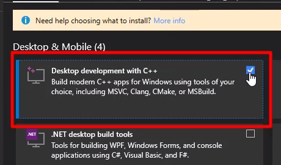
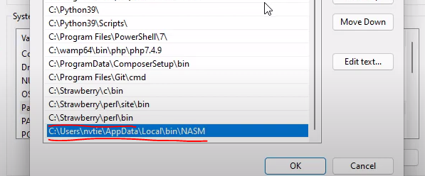
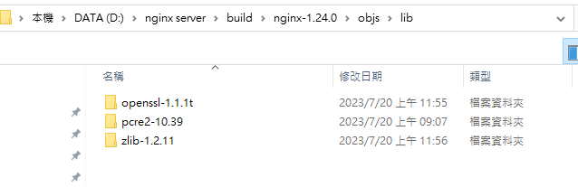
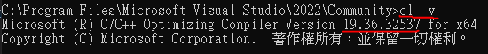

# Windows Nginx包版流程 (參考三竹)

## Step1 環境建置
1. 安裝visul studio 選擇Desktop with C++

2. 安裝git，後面用git的bash來執行包版 https://git-scm.com/download/win
3. 安裝strawberryperl https://strawberryperl.com/
4. 安裝NASM https://www.nasm.us/pub/nasm/releasebuilds/?C=M;O=D
5. 環境變數配置


## Step2 下載nginx所需lib
1. nginx souce code https://github.com/nginx/nginx/tags
2. openssl https://github.com/openssl/openssl/releases
3. zlib https://www.zlib.net/
4. pcre https://github.com/PCRE2Project/pcre2/releases

## Step3 包版
1. 在nginx souce code資料夾下建立objs/lib資料夾
2. 把第Step2下載的lib放到objs/lib內，如圖所示

3. 修改 nginx souce code \auto\cc\msvc
   1. 調整CFLAGS="$CFLAGS -W4" -> CFLAGS="$CFLAGS -W3"
   2. 在最上方註解的部分添加visul studio版號資訊 以2022版本為範例 -> #MSVC 2022 (17.0) cl 19.36，需要知道版本號用Native Tools Command Prompt for VS 2022下cl -v
   
   3. 修改NGX_MSVC_VER成visul studio版號 NGX_MSVC_VER=19.36
4. 將auto/configure複製到上一層
5. 用git bash建立MakeFile，指令如下 
```
./configure --with-cc=cl --builddir=objs --with-debug --prefix= --conf-path=conf/nginx.conf --pid-path=logs/nginx.pid --http-log-path=logs/access.log --error-log-path=logs/error.log --sbin-path=nginx.exe --http-client-body-temp-path=temp/client_body_temp --http-proxy-temp-path=temp/proxy_temp --http-fastcgi-temp-path=temp/fastcgi_temp --http-scgi-temp-path=temp/scgi_temp --http-uwsgi-temp-path=temp/uwsgi_temp --with-cc-opt=-DFD_SETSIZE=4096 --with-pcre=objs/lib/pcre2-10.39 --with-zlib=objs/lib/zlib-1.2.11 --with-http_v2_module --with-http_realip_module --with-http_addition_module --with-http_sub_module --with-http_dav_module --with-http_stub_status_module --with-http_flv_module --with-http_mp4_module --with-http_gunzip_module --with-http_gzip_static_module --with-http_auth_request_module --with-http_random_index_module --with-http_secure_link_module --with-http_slice_module --with-mail --with-stream --with-openssl=objs/lib/openssl-1.1.1t --with-openssl-opt='no-asm no-tests -D_WIN32_WINNT=0x0501' --with-http_ssl_module --with-mail_ssl_module --with-stream_ssl_module
```
* 4個地方需要調整
```
--with-pcre=objs/lib/pcre2-10.39
--with-zlib=objs/lib/zlib-1.2.11
--with-openssl=objs/lib/openssl-1.1.1t
--with-cc-opt=-DFD_SETSIZE=4096
```
6. Build ngninx.exe 用Native Tools Command Prompt for VS 2022 到nginx\objs 執行 ```nmake /f MakeFile``` 等程式build好
7. 確認nginx版本號和lib資訊 ```nginx.exe -v```

參考連結 : https://www.youtube.com/watch?v=M-cj-p4rZtU&ab_channel=ADTSolutions