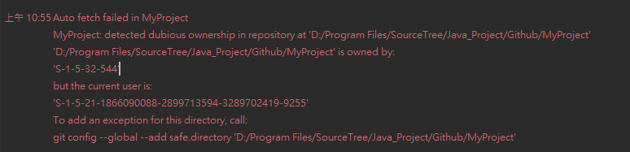

# git 功能

## safe.directory
* 當 git 位子不同會出現以下圖示內容
* 
```
* 解決方式
1. 打開 git bash
2. 輸入 git config --global --add safe.directory '專案目錄'
ex.git config --global --add safe.directory 'D:/Program Files/SourceTree/Java_Project/Github/MyProject'
3. 重開 ide 就可看到 git commit 
```