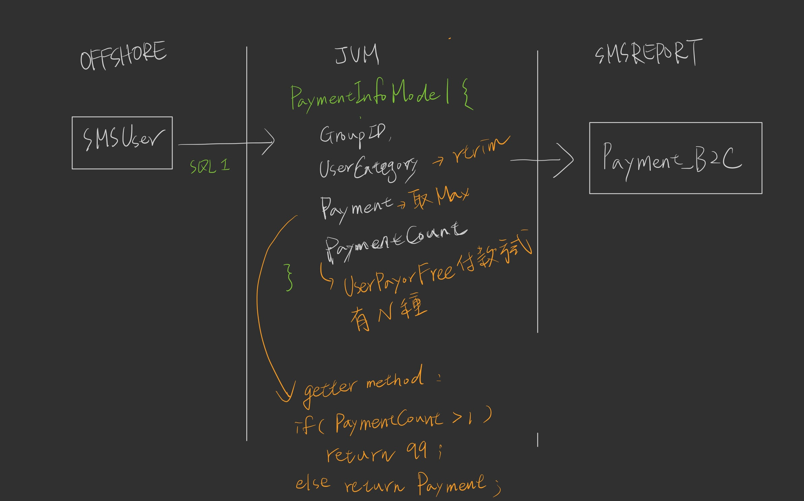

# 定時同步付款資訊

## 需求說明:
> 需要統計出 GroupID DB 的 SMUser table 所有部門支付方式並寫入另一張表

## 開發內容:

> 1. (~~排程定時批次~~先改一次撈取) 去撈取群組DB的SMUser 
>  ``` 
>   -- SQL 1
>   SELECT GroupID, RTRIM(UserCategory)
>    , COUNT(DISTINCT CASE WHEN UserPayorFree='0' THEN 0 ELSE 1 END)
>    FROM dbo.SMUser with(nolock)
>    WHERE UserStatus=0
>    GROUP BY UserCategory, GroupID
>  ``` 
> 2. 做JVM邏輯處裡
> 3. 將處理結果寫入 Payment_B2C
> 4. 每次觸發job寫入Payment_B2C前，先刪除Payment_B2C裡面與本次要寫入的GroupID，在寫入
